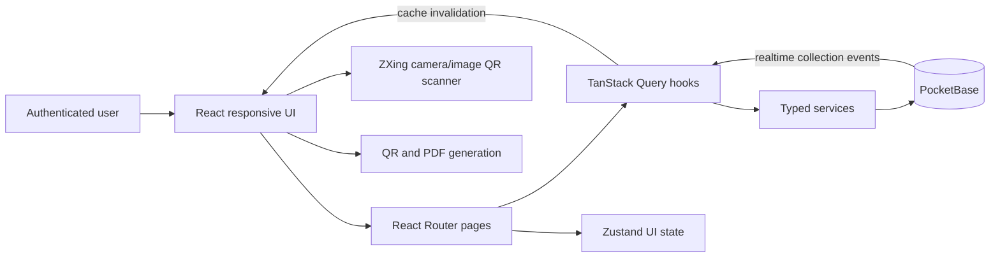
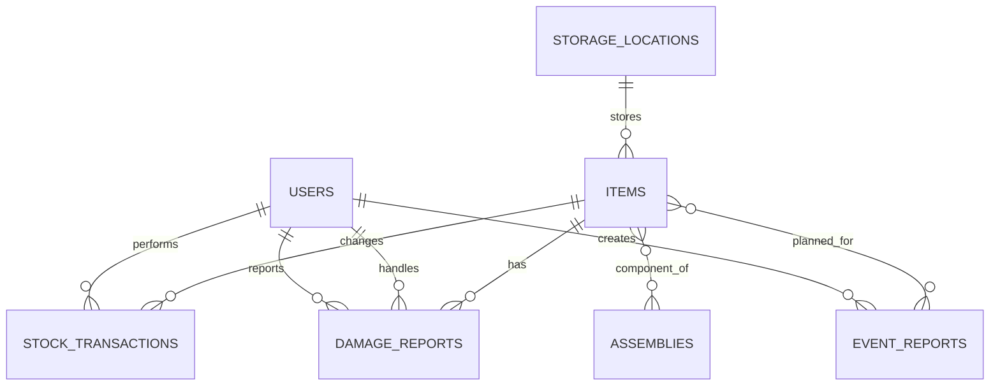
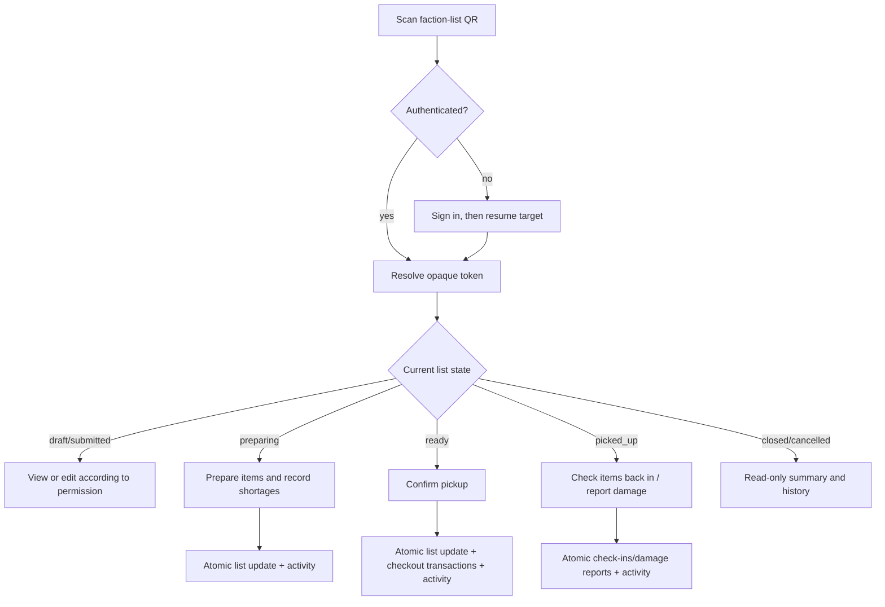
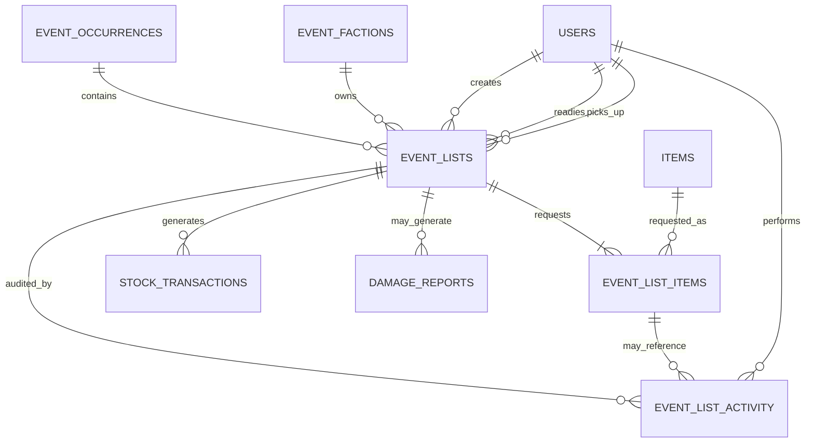

# Inventory Application Requirements and Architecture

> Living implementation checklist generated from the application source and its refreshed Graphify graph on 2026-08-27.

## 1. Purpose

This document has two clearly separated purposes:

1. Record the functionality that is currently implemented and visible in the application.
2. Track the requested faction event-list workflow, including what is now implemented and what remains.

The requirement IDs are intended to be used in issues, pull requests, tests, and release checklists. A requirement is only complete when its acceptance criteria are met on both desktop and mobile where applicable.

### Implementation update — 2026-08-28

The first complete faction-order workflow is now implemented in the application:

- fixed event-scoped faction catalogue;
- responsive faction overview and dated order-list history;
- create/edit drafts with any inventory item;
- tag assemblies for events and add them to faction lists as component-aware quantities;
- copy the most recent list and show quantity differences;
- partial preparation with availability and reservations from other open lists;
- ready, pickup, full-list return, cancellation, and actor/time history;
- list QR generation and state-aware routing through the existing scanner;
- atomic pickup/return stock transactions linked back to the faction order.

The current implementation deliberately uses one PocketBase aggregate collection, `inventory_faction_orders`, with JSON quantity maps and history. Section 10 retains the normalized target architecture for future fine-grained line audit, partial returns, damage-at-return, opaque QR tokens, stronger permissions, and backend-enforced idempotency.

## 2. Sources and status legend

### Source baseline

- Source tree: `src/`, `pb_schema.json`, `package.json`, Docker configuration, and runtime configuration.
- Graphify snapshot: 85 files, 487 graph nodes, 1,377 edges, and 31 detected communities.
- Graphify output: `graphify-out/GRAPH_REPORT.md`, `graphify-out/graph.json`, and `graphify-out/graph.html`.
- Main graph hubs: translation, UI state, items, item queries, transactions, damage reports, navigation, assemblies, events, and storage locations.
- No import cycles were reported by Graphify.

### Status legend

| Status | Meaning |
|---|---|
| **Implemented** | Present in the current source and user interface. |
| **Partial** | Some supporting behavior exists, but the complete requirement does not. |
| **Required** | New behavior requested for the faction event-list workflow. |
| **Known gap** | Current behavior that should be corrected or deliberately accepted. |

## 3. Product scope and terminology

- **Item**: An inventory type with a total quantity, rather than one serialized physical unit.
- **Transaction**: A quantity-changing checkout, check-in, stock addition, repair, or write-off.
- **Assembly**: A reusable set of inventory items and their required quantities.
- **Damage report**: A report against a quantity of one item, which can be handled in parts.
- **Event type**: One of DE, LightSim (`LS` in current data), TNO, ASD, or M24.
- **Event occurrence**: One dated instance of an event type.
- **Faction**: A group participating in an event type.
- **Faction list**: The inventory request belonging to one faction for one event occurrence.
- **Prepared**: Physical items have been gathered and verified for the list.
- **Ready**: Preparation is complete and the list can be picked up.
- **Picked up**: Custody has passed to the collecting user and checkout transactions have been recorded.

## 4. Current system overview



### Current technology and deployment

| Concern | Current implementation |
|---|---|
| Runtime/package manager | Bun |
| Front end | React 19, TypeScript, Vite |
| Component system | Material UI |
| Routing | React Router |
| Server state | TanStack Query with PocketBase realtime invalidation |
| Local UI state | Zustand |
| Backend | PocketBase |
| QR scanning | ZXing browser scanner, camera, and uploaded images |
| QR/PDF output | QR code generation and jsPDF |
| Charts | Recharts |
| Authentication | PocketBase OAuth2 through Authentik/OIDC |
| Container deployment | Bun build stage and Nginx runtime image |
| Runtime backend URL | `window.__ENV__.POCKETBASE_URL` with build-time fallback |

## 5. Current navigation and screens

| Route | Screen | Current purpose | Status |
|---|---|---|---|
| `/` | User dashboard | Personal loans, quick return, direct damage reporting, and recent activity | Implemented |
| `/global-dashboard` | Global dashboard | Inventory-wide metrics, alerts, and recent activity | Implemented |
| `/items` | Items | Search, filter, view, create, edit, and delete inventory | Implemented |
| `/items/:itemId` | Item detail | Stock, history, QR, transactions, metadata, and editing | Implemented |
| `/assemblies` | Assemblies | Search and manage reusable item sets | Implemented |
| `/assemblies/:assemblyId` | Assembly detail | Inspect components and perform assembly checkout | Implemented |
| `/events` | Events | Event-type planning, completed reports, and entry to faction lists | Implemented |
| `/events/orders` | Faction orders | Event/faction overview, create list, and previous-list history | Implemented |
| `/events/orders/:orderId` | Faction order detail | Edit, prepare, mark ready, scan/print QR, pick up, return, and audit | Implemented |
| `/checkout` | QR checkout | Scan an item or assembly QR code | Implemented |
| `/checkout/:itemId` | Scanned item action | Perform an item transaction after scanning | Implemented |
| `/transactions` | Transaction history | Filter and inspect all stock transactions | Implemented |
| `/checked-out` | Checked-out items | Inspect outstanding loans and return items | Implemented |
| `/print-qr` | Print QR codes | Select inventory and create printable QR sheets | Implemented |
| `/damage-reports` | Damage reports | Report, review, partially repair/write off, and audit damage | Implemented |
| `/storage-locations` | Storage locations | Manage locations and inspect their items | Implemented |

Desktop uses a persistent navigation drawer. Mobile uses a bottom navigation bar with primary Home, Scan, Items, Return, and More destinations. The layout includes safe-area and touch-target adjustments, and print-specific styling.

## 6. Current functional requirements

### 6.1 Authentication, identity, and language

- [x] **AUTH-001 — Authenticated access.** The application shall prevent the inventory routes from rendering until a PocketBase user is authenticated. **Implemented.**
- [x] **AUTH-002 — Single sign-on.** A user shall be able to sign in with the configured Authentik/OIDC OAuth2 provider. **Implemented.**
- [x] **AUTH-003 — Sign out.** An authenticated user shall be able to sign out from the application shell. **Implemented.**
- [x] **AUTH-004 — Actor identity.** Transactions, damage actions, and event reports shall retain a relation to the acting user where the current schema supports it. **Implemented.**
- [x] **I18N-001 — Languages.** The interface shall support German and English. **Implemented.**
- [x] **I18N-002 — Persistence.** The selected language shall survive navigation and reloads through persisted client configuration. **Implemented.**
- [ ] **AUTH-005 — Enforced authorization.** Admin, manager, and user roles exist, but collection rules currently grant broad access to any authenticated account with a non-empty role. Fine-grained role or faction permissions are a **known gap**.

### 6.2 Navigation and cross-device UX

- [x] **NAV-001 — Desktop navigation.** All primary modules shall be reachable through the desktop drawer. **Implemented.**
- [x] **NAV-002 — Mobile navigation.** High-frequency actions shall be reachable through a mobile bottom bar, with secondary destinations under More. **Implemented.**
- [x] **NAV-003 — Responsive records.** Dense desktop tables shall switch to readable mobile cards or responsive layouts on narrow screens. **Implemented across the main lists.**
- [x] **NAV-004 — Feedback.** Successful and failed operations shall show user-visible snackbar feedback. **Implemented.**
- [x] **NAV-005 — Error containment.** Rendering failures shall be caught by an application error boundary. **Implemented.**
- [x] **NAV-006 — Touch use.** Interactive mobile controls shall account for touch targets and device safe areas. **Implemented.**

### 6.3 User dashboard

- [x] **UD-001 — Personal summary.** A user shall see the number of distinct items and total units currently checked out to them. **Implemented.**
- [x] **UD-002 — Personal activity.** A user shall see their recent transactions and be able to open the full history. **Implemented.**
- [x] **UD-003 — Personal open damage.** A user shall see their relevant open damage-report count. **Implemented.**
- [x] **UD-004 — Outstanding items.** A user shall see the items and quantities currently checked out to them. **Implemented.**
- [x] **UD-005 — Direct return.** A user shall be able to return a checked-out item from the dashboard. **Implemented.**
- [x] **UD-006 — Direct damage reporting.** A user shall be able to report damage next to the return action, limited to the quantity they currently hold. **Implemented.**
- [x] **UD-007 — Mobile quick actions.** Scan and return shall be prominent actions on mobile. **Implemented.**

### 6.4 Global dashboard

- [x] **GD-001 — Stock metrics.** The global dashboard shall show inventory item count, available stock, low-stock count, recent transaction count, and open damage count. **Implemented.**
- [x] **GD-002 — Recent activity.** The global dashboard shall show the ten most recent transactions. **Implemented.**
- [x] **GD-003 — Operational links.** Dashboard cards and alerts shall link to the relevant working views. **Implemented.**

### 6.5 Inventory items

- [x] **INV-001 — Browse.** Users shall be able to view inventory in desktop-table and mobile-card forms. **Implemented.**
- [x] **INV-002 — Search.** Users shall be able to search by item name and category. **Implemented.**
- [x] **INV-003 — Filter.** Users shall be able to filter items by event type. **Implemented.**
- [x] **INV-004 — Sort.** Users shall be able to sort by stock and value. **Implemented.**
- [x] **INV-005 — Create/edit/delete.** Users shall be able to create, edit, and delete an item. **Implemented.**
- [x] **INV-006 — Duplicate validation.** Item names shall be checked to prevent accidental duplicates. **Implemented.**
- [x] **INV-007 — Core metadata.** An item shall store name, base amount, minimum stock, monetary value, category, subcategory, event tags, and status. **Implemented.**
- [x] **INV-008 — Location metadata.** An item shall be assignable to a storage location and carry free-form position/location details used by the current UI. **Implemented.**
- [x] **INV-009 — Container quantities.** An item may use container size, container count, opened-container count, and remaining percentage to calculate its amount. **Implemented.**
- [x] **INV-010 — Stock presentation.** Item lists and details shall show total, checked-out, damaged, and remaining quantities. **Implemented.**
- [x] **INV-011 — Low stock.** Remaining stock shall be compared with minimum stock and visibly flagged. **Implemented.**
- [x] **INV-012 — Item detail.** A detail page shall show metadata, storage, value, container information, stock metrics, QR, and history. **Implemented.**
- [x] **INV-013 — Quick location creation.** A storage location may be created while editing an item. **Implemented.**

### 6.6 Stock calculation and transactions

- [x] **STK-001 — Central calculation.** All primary inventory views shall use the shared stock calculator. **Implemented.**
- [x] **STK-002 — Added stock.** Added transactions increase total stock. If no added transaction exists, the item's stored initial amount is the starting total. **Implemented.**
- [x] **STK-003 — Checkout balance.** Outstanding checkout equals checkout quantities minus check-in quantities. **Implemented.**
- [x] **STK-004 — Damage balance.** Unresolved damaged quantities reduce available stock. **Implemented.**
- [x] **STK-005 — Repair.** A repaired damaged quantity returns to available stock and is recorded as a repaired stock transaction. **Implemented.**
- [x] **STK-006 — Write-off.** A written-off damaged quantity permanently reduces total stock and is recorded as a written-off stock transaction. **Implemented.**
- [x] **TX-001 — Manual operations.** Users shall be able to check out, check in, and add stock manually. **Implemented.**
- [x] **TX-002 — Quantity validation.** Quantities shall be positive integers; checkout cannot exceed remaining stock; check-in cannot exceed the user's outstanding quantity. **Implemented.**
- [x] **TX-003 — Transaction context.** A transaction shall capture item, type, quantity, user, reason, notes, and timestamp. **Implemented.**
- [x] **TX-004 — History filtering.** Transaction history shall be filterable by item, user, type, and date. **Implemented.**
- [x] **TX-005 — Safe editing.** Normal transactions may be edited; system-generated repair/write-off transactions shall not be edited through the normal transaction form. **Implemented.**
- [x] **TX-006 — Realtime.** Item and transaction views shall refresh following PocketBase realtime changes. **Implemented.**
- [ ] **STK-007 — Complete chart calculation.** The item stock chart currently applies additions, checkouts, and check-ins, but not repair/write-off changes. This is a **known gap** even though those changes appear in transaction history and the current stock calculation.

### 6.7 QR workflows

- [x] **QR-001 — Camera scan.** Users shall be able to scan with an environment-facing camera. **Implemented.**
- [x] **QR-002 — Image scan.** Users shall be able to scan a QR code from an uploaded or captured image. **Implemented.**
- [x] **QR-003 — Manual fallback.** Users shall be able to enter an item identifier or supported link manually. **Implemented.**
- [x] **QR-004 — Resource routing.** A valid item QR shall open the scanned item transaction flow; a recognized assembly link shall open the assembly. **Implemented.**
- [x] **QR-005 — Repeated use.** After a successful scanned transaction, the scan screen shall be ready for the next item. **Implemented.**
- [x] **QR-006 — Item QR output.** Users shall be able to view and download an item's QR code. **Implemented.**
- [x] **QR-007 — Bulk printing.** Users shall be able to search/select inventory and create printable QR-code PDF sheets. **Implemented.**

### 6.8 Checked-out inventory

- [x] **OUT-001 — Outstanding calculation.** The checked-out view shall calculate outstanding quantities from checkout and check-in transactions. **Implemented.**
- [x] **OUT-002 — Global visibility.** Users shall be able to inspect currently checked-out inventory across users. **Implemented.**
- [x] **OUT-003 — Quick return.** Users shall be able to return one unit quickly from the checked-out view. **Implemented.**
- [x] **OUT-004 — Responsive display.** Outstanding items shall use a table on desktop and cards on mobile. **Implemented.**

### 6.9 Assemblies

- [x] **ASM-001 — Assembly CRUD.** Users shall be able to create, edit, view, search, and delete assemblies. **Implemented.**
- [x] **ASM-002 — Components.** An assembly shall contain selected item IDs and a quantity per component. **Implemented.**
- [x] **ASM-003 — Summary.** The assembly list/detail shall show component count and total value. **Implemented.**
- [x] **ASM-004 — Availability.** Assembly detail shall show component stock, shortages, and the maximum number of complete assemblies currently possible. **Implemented.**
- [x] **ASM-005 — Quick editing.** Users shall be able to add or remove components from the detail view. **Implemented.**
- [x] **ASM-006 — Bulk checkout.** Checking out an assembly shall create an individual checkout transaction for every component, multiplied by the requested assembly count. **Implemented.**
- [x] **ASM-007 — Checkout validation.** Assembly checkout shall be blocked when any required component is unavailable. **Implemented.**
- [x] **ASM-008 — Event tags.** Assemblies shall be taggable for DE, TNO, LS, M24, and ASD from the assembly form, with tags visible in assembly views. **Implemented.**
- [x] **ASM-009 — Faction-list selection.** Event-tagged assemblies shall be selectable and quantity-controlled on faction order lists. **Implemented.**
- [x] **ASM-010 — Component-aware orders.** Assembly quantities in faction lists shall reserve, check out, and check in each component multiplied by its per-assembly quantity. **Implemented.**

### 6.10 Damage reports

- [x] **DMG-001 — Create report.** Users shall be able to report an item, quantity, severity, and description. **Implemented.**
- [x] **DMG-002 — Reporter identity.** A report shall record and display who reported it. **Implemented.**
- [x] **DMG-003 — Handler identity.** Handling actions shall record and display who handled the report and when. **Implemented.**
- [x] **DMG-004 — Workflow.** Reports shall support reported, in-review, repaired, written-off, and resolved outcomes. **Implemented.**
- [x] **DMG-005 — Partial repair.** A handler shall be able to repair only part of a report's still-open quantity. **Implemented.**
- [x] **DMG-006 — Partial write-off.** A handler shall be able to write off only part of a report's still-open quantity. **Implemented.**
- [x] **DMG-007 — Mixed resolution.** The same report may contain both repaired and written-off portions and shall close only when no quantity remains unresolved. **Implemented.**
- [x] **DMG-008 — Atomic stock history.** Repair/write-off shall update the damage report and create the corresponding stock transaction as one backend batch. **Implemented.**
- [x] **DMG-009 — Report history.** Users shall be able to see open reports separately from completed history, including the status/action history. **Implemented.**
- [x] **DMG-010 — Responsive handling.** Damage reports and actions shall be usable from desktop tables and mobile cards/dialogs. **Implemented.**

### 6.11 Storage locations

- [x] **LOC-001 — Location CRUD.** Users shall be able to create, edit, search, and delete storage locations. **Implemented.**
- [x] **LOC-002 — Location fields.** A location shall store name, description, area, location, and position. **Implemented.**
- [x] **LOC-003 — Contents.** Users shall see the number of linked items and inspect those items with stock/status information. **Implemented.**
- [x] **LOC-004 — Navigation.** A listed location item shall link to its item detail. **Implemented.**
- [x] **LOC-005 — Delete warning.** Deleting a location shall warn that links from items will be removed. **Implemented.**

### 6.12 Existing event reports

- [x] **EVT-001 — Event types.** Planning shall support DE, TNO, LS, M24, and ASD. **Implemented.**
- [x] **EVT-002 — Event-tagged inventory.** Selecting an event type shall show items tagged for that event. **Implemented.**
- [x] **EVT-003 — Planning quantities.** Users shall be able to enter a planned quantity for each event item. **Implemented.**
- [x] **EVT-004 — Used quantities.** Users shall be able to record actual used quantities for a completed event. **Implemented.**
- [x] **EVT-005 — Previous baseline.** The most recent completed event shall prefill the next plan from its used quantities, falling back to its planned quantities. **Implemented.**
- [x] **EVT-006 — Event report history.** Users shall see past report date, status, planned total, used total, and notes. **Implemented.**
- [x] **EVT-007 — Event report author.** An event report shall record the user who created it. **Implemented in the schema/service.**
- [ ] **EVT-008 — Event occurrences.** Current records are event-type-wide planning reports, not a first-class event occurrence with factions and operational list states. **Required.**
- [x] **EVT-009 — Faction lists.** Event-scoped factions and dated faction order lists are available. **Implemented.**
- [x] **EVT-010 — Preparation and pickup.** Lists record readiness, preparer, pickup actor, and milestone timestamps. **Implemented.**
- [x] **EVT-011 — List QR.** A complete faction list has its own QR route and state-aware detail screen. **Implemented.**
- [x] **EVT-012 — Previous-list comparison.** Lists can copy the most recent same-faction list and display item quantity differences. **Implemented.**

## 7. Current data model



### Current collections

| Collection | Important fields and behavior |
|---|---|
| `users` | PocketBase auth record: name, username/email, and `admin \| manager \| user` role. |
| `inventory_items` | Item identity, location, amount/minimum/value, categories, event tags, status, QR, and container fields. |
| `inventory_stock_transactions` | Item, transaction type, quantity, user, optional damage report, reason, notes, and timestamp. Types: checkout, checkin, added, repaired, written_off. |
| `inventory_damage_reports` | Item, reporter, handler, handler time, description, severity, total/repaired/written-off quantities, status, and JSON status history. |
| `inventory_assemblies` | Name, description, event tags, item relations, and JSON item quantities. |
| `inventory_event_reports` | Event type/date/status, item relations, JSON planned/used quantities, notes, and creator. |
| `inventory_faction_orders` | Event/faction/date, status, requested/prepared item and assembly quantity maps, item/assembly relations, milestone actors/times, notes, and lifecycle history. |
| `inventory_storage_locations` | Name, description, area, location, position, and timestamps. |

Relations to `users` are configured as external relations because the auth collection is not created by `pb_schema.json`.

## 8. Required event, faction, and list functionality

### 8.1 Faction catalogue

Faction identity must be scoped to an event type. In particular, `Militär` appears in both TNO and M24 and must not be treated as one global faction.

| Event type | Canonical code | Factions |
|---|---|---|
| DE | `DE` | KGG, GOF, Enklave, Miliz |
| LightSim | `LS` | UCRF, TERA |
| TNO | `TNO` | Militär, Freiheit, Stalker, Banditen, Wissenschaftler |
| ASD | `ASD` | Delta, Ghost |
| M24 | `M24` | Hondra, Militär, Kartell |

- [x] **FAC-001 — Seed catalogue.** The application exposes all specified event/faction combinations from the typed catalogue. **Implemented.**
- [x] **FAC-002 — Scoped uniqueness.** Factions are selected and compared within an event type, so the two `Militär` factions remain distinct. **Implemented.**
- [ ] **FAC-003 — Configurability.** Authorized users shall be able to activate/deactivate factions or add future factions without changing application code. **Required.**
- [ ] **FAC-004 — Historic integrity.** Deactivating a faction shall not delete or rename its old lists and audit records. **Required.**

### 8.2 Event occurrences

- [ ] **EVO-001 — Dated occurrence.** Users shall be able to create a named and dated occurrence of an event type. **Required.**
- [ ] **EVO-002 — Occurrence states.** An occurrence shall support `planned`, `preparing`, `ready`, `in_progress`, `completed`, and `cancelled`. **Required.**
- [ ] **EVO-003 — Faction overview.** An event occurrence shall show every configured faction and the state of its list. **Required.**
- [ ] **EVO-004 — Operational summary.** The overview shall show requested, prepared, shortage, picked-up, and returned quantities, plus the last relevant actor/time. **Required.**
- [ ] **EVO-005 — Completion guard.** Completing an occurrence shall require all non-cancelled lists to be closed or an explicit authorized override with a reason. **Required.**

### 8.3 Faction-list creation and editing

- [x] **LST-001 — Create list.** An authenticated inventory user can create a dated list for every configured faction. **Implemented.**
- [x] **LST-002 — Add items.** A list contains individual inventory items and/or assemblies, requested quantities, and list notes. **Implemented.**
- [x] **LST-003 — Validation.** Requested quantities are positive integers stored once per item ID. **Implemented.**
- [x] **LST-004 — Draft editing.** Draft lists can be edited without changing stock. **Implemented.**
- [x] **LST-005 — Submission.** Starting preparation freezes draft editing and appends the transition to history. **Implemented as the draft-to-preparing transition.**
- [x] **LST-006 — Controlled changes.** Non-draft item changes are blocked; preparation and lifecycle changes are actor-audited. **Implemented.**
- [x] **LST-007 — Copy previous.** The most recent compatible same-event/same-faction list can be copied. **Implemented.**
- [ ] **LST-008 — Select older baseline.** A user shall be able to choose an older completed occurrence when the most recent list is not the right baseline. **Required.**
- [x] **LST-009 — Explicit diff.** Copy/edit and detail views show before/after quantities for changed lines. **Implemented.**
- [x] **LST-010 — Immutable old events.** Copying creates a new faction-order record and does not modify its source. **Implemented.**
- [x] **LST-011 — Independent resources.** Items and assemblies can be removed individually; a valid list may contain only items or only assemblies. **Implemented.**

### 8.4 Availability, preparation, and readiness

- [ ] **PREP-001 — Line state.** Each list line shall expose requested, available-to-promise, prepared, shortage, picked-up, and returned quantities. **Required.**
- [x] **PREP-002 — Availability snapshot.** Preparation uses the shared stock calculator and displays shortages. **Implemented.**
- [x] **PREP-003 — Reservations.** Prepared quantities on other preparing/ready lists reduce the amount another list may prepare. **Implemented.**
- [x] **PREP-004 — Availability formula.** `availableToPromise = currentRemaining - quantitiesReservedForOtherOpenLists`. **Implemented.**
- [x] **PREP-005 — Partial preparation.** Prepared quantities can be saved independently below the requested amount. **Implemented.**
- [x] **PREP-006 — Actor audit.** Preparation saves record actor, time, and the complete prepared quantity snapshot. **Implemented.**
- [x] **PREP-007 — Ready guard.** Ready is blocked until every requested quantity is fully prepared; shortage overrides remain outstanding. **Implemented without overrides.**
- [x] **PREP-008 — Ready information.** The list displays preparer, ready actor/time, and lifecycle history. **Implemented.**
- [x] **PREP-009 — Storage guidance.** Each preparation line displays the item's expanded storage location. **Implemented.**
- [ ] **PREP-010 — Efficient ordering.** Lines shall be sortable/groupable by storage location and position. **Required.**
- [x] **PREP-011 — Reversible readiness.** Lists can move between preparing and ready in either direction; each transition records its actor, time, quantity snapshot, and an optional explanation. **Implemented.**

### 8.5 Pickup, return, and stock history

- [x] **PICK-001 — Pickup guard.** Pickup is only shown/accepted for a ready list. **Implemented.**
- [x] **PICK-002 — Identity and time.** Pickup records the authenticated collecting user and timestamp. **Implemented.**
- [x] **PICK-003 — Atomic checkout.** A PocketBase batch updates the list and creates all checkout transactions. **Implemented.**
- [x] **PICK-004 — Traceable transactions.** Generated checkout/check-in records carry `factionOrderId` and link to the list from stock history. **Implemented.**
- [ ] **PICK-005 — Idempotency.** Repeating the same scan or retrying after a network interruption shall not create duplicate stock transactions. **Required.**
- [x] **RET-001 — List return.** A picked-up list supports a confirmed full-list check-in through its detail/QR route. **Implemented.**
- [ ] **RET-002 — Partial return.** Returns shall support partial quantities and retain outstanding quantities per line. **Required.**
- [ ] **RET-003 — Damage during return.** The return workflow shall allow damaged quantities to create linked damage reports while undamaged quantities are checked in. **Required.**
- [ ] **RET-004 — Close guard.** A list can close when all picked-up quantities are returned, linked to an open damage report, or resolved by an authorized write-off/exception. **Required.**

### 8.6 List QR workflow

- [x] **LQR-001 — One list QR.** Each faction list has one stable, downloadable QR URL distinct from item/assembly routes. **Implemented.**
- [ ] **LQR-002 — Safe token.** The QR shall contain an opaque list token or application URL, not mutable quantities or trusted action instructions. **Required.**
- [x] **LQR-003 — Authentication.** Application route gating requires authentication before the list loads. **Implemented.**
- [x] **LQR-004 — State-aware landing.** The list detail exposes only actions valid for its current lifecycle state. **Implemented.**
- [x] **LQR-005 — Preparation scan.** The scanned list shows its pick checklist, locations, availability, and preparation inputs. **Implemented.**
- [x] **LQR-006 — Pickup scan.** A ready scan shows preparation/ready identity and a prominent pickup confirmation. **Implemented.**
- [x] **LQR-007 — Return scan.** The same QR opens full-list return after pickup. **Implemented.**
- [x] **LQR-008 — Closed scan.** Returned/cancelled lists are read-only and retain their summary/history. **Implemented.**
- [ ] **LQR-009 — Manual fallback.** A short human-readable list code shall allow lookup when the camera or printed QR is unavailable. **Required.**



### 8.7 History and comparison

- [ ] **HIS-001 — Append-only activity.** Every list transition and quantity change shall append an immutable history entry. **Required.**
- [x] **HIS-002 — Actor and time.** Each implemented lifecycle entry displays actor and timestamp. **Implemented.**
- [ ] **HIS-003 — Before/after.** Quantity/status changes shall retain before and after values plus a reason when required. **Required.**
- [ ] **HIS-004 — Full lifecycle.** History shall include creation, submission, edits, preparation, shortage acceptance, ready, pickup, return, damage links, closure, and cancellation. **Required.**
- [x] **HIS-005 — Previous events.** Event/faction views retain dated lists in descending order. **Implemented.**
- [x] **HIS-006 — Comparison.** The current list is compared line-by-line with the most recent compatible list. **Implemented for the automatic previous baseline.**
- [ ] **HIS-007 — Change categories.** Comparison shall distinguish added, removed, increased, decreased, and unchanged lines. **Required.**
- [ ] **HIS-008 — Export/print.** A list and its QR shall have a print-friendly representation; history export is desirable but not required for the first release. **Required/optional as stated.**

## 9. Proposed lifecycle

### Event occurrence

```text
planned -> preparing -> ready -> in_progress -> completed
    \          \          \          \
     +----------+----------+-----------> cancelled
```

### Faction list

```text
draft -> submitted -> preparing -> ready -> picked_up -> returned -> closed
  \          \           \         \          \
   +----------+-----------+---------+-----------> cancelled
```

Rules:

1. `draft` is editable and does not reserve inventory.
2. `submitted` is the comparison/audit baseline.
3. `preparing` allows partial preparation and reservations.
4. `ready` means preparation is complete or shortages were explicitly accepted.
5. `picked_up` is coupled to atomic checkout transactions.
6. `returned` means no ordinary return action remains, but closure checks may still be pending.
7. `closed` is read-only except for an explicitly audited administrative correction.

## 10. Proposed data architecture

The existing `inventory_event_reports` collection can be migrated into the event-occurrence aggregate. Keeping old report IDs during migration reduces broken references and preserves history.



### 10.1 `inventory_event_factions` — new

| Field | Type | Notes |
|---|---|---|
| `eventType` | select | DE, LS, TNO, ASD, M24 |
| `name` | text | Display name including umlauts |
| `slug` | text | Stable URL-safe identifier |
| `active` | bool | Hidden from new occurrences when false |
| `sortOrder` | number | Stable display order |
| `created`, `updated` | timestamps | PocketBase managed |

Unique index: `(eventType, slug)`.

### 10.2 `inventory_event_reports` → event occurrence — evolve

| New/evolved field | Type | Notes |
|---|---|---|
| `name` | text | Human-readable event occurrence name |
| `eventType` | select | Existing field retained |
| `startsAt`, `endsAt` | date/time | Replace or extend the single event date |
| `status` | select | Expanded occurrence lifecycle |
| `createdBy` | user relation | Existing field retained |
| `notes` | text | Existing field retained |
| `legacyPlannedQuantities`, `legacyUsedQuantities` | JSON or migration archive | Preserve old data until line migration is verified |

The current many-item relation and JSON quantity maps should be migrated to typed list-line records. JSON maps cannot safely enforce uniqueness, relations, per-line audit, or concurrent partial updates.

### 10.3 `inventory_event_lists` — new

| Field | Type | Notes |
|---|---|---|
| `eventReportId` | relation | Parent event occurrence |
| `factionId` | relation | Event-scoped faction |
| `name` | text | Defaults to faction name; allows an explicit operational label |
| `listCode` | text | Short unique manual lookup code |
| `qrTokenHash` | text | Store a token hash if bearer-style QR tokens are used |
| `status` | select | List lifecycle |
| `revision` | number | Optimistic concurrency/version display |
| `createdBy`, `submittedBy`, `readyBy`, `pickedUpBy`, `returnedBy`, `closedBy` | user relations | Summary actors |
| matching `...At` fields | date/time | Server timestamps for summary milestones |
| `shortageAcceptedBy`, `shortageAcceptedAt`, `shortageReason` | relation/date/text | Required when readiness has shortages |
| `notes` | text | List-wide notes |
| `created`, `updated` | timestamps | PocketBase managed |

Recommended unique index for the first release: `(eventReportId, factionId)`, meaning one primary list per faction per occurrence. If multiple lists are later needed, replace it with `(eventReportId, factionId, name)` and retain a primary-list marker.

### 10.4 `inventory_event_list_items` — new

| Field | Type | Notes |
|---|---|---|
| `listId` | relation | Parent faction list |
| `itemId` | relation | Inventory item |
| `requestedQuantity` | number | Required amount |
| `preparedQuantity` | number | Currently reserved/prepared |
| `pickedUpQuantity` | number | Quantity checked out through pickup |
| `returnedQuantity` | number | Quantity checked in through list return |
| `damagedReturnQuantity` | number | Quantity linked to return damage reports |
| `status` | select | Derived/cacheable line state |
| `note` | text | Faction or preparation note |
| `substitutionForItemId` | optional relation | Makes substitutions explicit |
| `created`, `updated` | timestamps | PocketBase managed |

Unique index: `(listId, itemId)` unless explicit substitute lines require a separate stable line ID and duplicate item policy.

### 10.5 `inventory_event_list_activity` — new, append-only

| Field | Type | Notes |
|---|---|---|
| `listId` | relation | Required parent list |
| `listItemId` | optional relation | Present for a line action |
| `action` | select/text | Machine-readable event name |
| `actorId` | user relation | Authenticated actor |
| `occurredAt` | date/time | Server timestamp |
| `fromStatus`, `toStatus` | text | Transition when applicable |
| `quantity` | number | Delta/affected quantity when applicable |
| `reason` | text | Required for exceptions and post-submit edits |
| `metadata` | JSON | Before/after snapshot and transaction/damage IDs |
| `idempotencyKey` | text | Unique key for retry-safe scan actions |

Clients shall not update or delete these records. Corrections append compensating activity.

### 10.6 Existing collection changes

- Add optional `eventListId` and `eventListItemId` relations to `inventory_stock_transactions`.
- Add optional `eventListId` and `eventListItemId` relations to `inventory_damage_reports`.
- Keep `damageReportId` on stock transactions for the current repair/write-off trace.
- Retain existing records and null relations for transactions that predate faction lists.

## 11. Proposed application architecture

### Pages and routes

| Route | Purpose |
|---|---|
| `/events` | Event-occurrence list, create action, and cross-event history |
| `/events/:eventId` | Event overview with faction cards, progress, shortages, and ready/pickup state |
| `/events/:eventId/factions/:factionId/list` | Edit/prepare/operate the faction list |
| `/event-lists/:listId/history` | Full lifecycle audit and previous-event comparison |
| `/event-list-scan/:token` | State-aware QR entry point |
| `/event-lists/:listId/print` | Print-friendly pick list and QR |

### Front-end modules

```text
src/
  pages/
    Events.tsx
    EventOccurrenceDetail.tsx
    EventFactionList.tsx
    EventListHistory.tsx
    EventListScan.tsx
  components/events/
    EventOccurrenceForm.tsx
    FactionStatusCard.tsx
    FactionListEditor.tsx
    PreparationChecklist.tsx
    PickupConfirmation.tsx
    ListReturnForm.tsx
    EventListDiff.tsx
    EventListTimeline.tsx
    EventListQRCode.tsx
  hooks/
    useEventOccurrences.ts
    useEventFactions.ts
    useEventLists.ts
    useEventListActivity.ts
  services/
    eventOccurrenceService.ts
    eventFactionService.ts
    eventListService.ts
  types/
    event.ts
    eventFaction.ts
    eventList.ts
```

The exact file split may change, but state transitions and atomic mutations must live in service/domain functions, not be duplicated across pages.

### Query and realtime behavior

- Event overview queries subscribe to occurrence, list, list-line, transaction, and relevant damage changes.
- Mutations invalidate the occurrence, list detail, items, transactions, checked-out inventory, and dashboards as applicable.
- Realtime events are a refresh mechanism, not the authority for transition validation.
- Mutation responses return the authoritative server state so the scanning user receives immediate confirmation.

### Atomic operations

The following operations must be server-validated and atomic, using PocketBase batch support or backend hooks/endpoints:

1. Reserve or release a prepared quantity.
2. Mark a list ready and append activity.
3. Pick up a list, create all checkout transactions, update lines, update the list, and append activity.
4. Return list quantities, create check-ins and optional damage reports, update lines/list, and append activity.
5. Cancel a prepared list and release its reservations.

Client-side validation improves UX but is not sufficient for stock correctness because two preparers may act concurrently.

## 12. Permissions and audit requirements

Recommended capability model:

| Capability | User/faction member | Manager | Admin |
|---|---:|---:|---:|
| View permitted event/list data | Yes | Yes | Yes |
| Create/edit own faction draft | Yes | Yes | Yes |
| Submit own faction list | Yes | Yes | Yes |
| Prepare inventory | Optional assignment | Yes | Yes |
| Accept shortage / mark ready | No by default | Yes | Yes |
| Confirm pickup as collector | Yes | Yes | Yes |
| Correct closed records | No | No by default | Append-only admin correction |
| Configure factions | No | Optional | Yes |

- [ ] **SEC-001 — Server enforcement.** PocketBase collection rules/hooks shall enforce every capability; hiding a button is not authorization. **Required.**
- [ ] **SEC-002 — Faction membership.** If faction members should see/edit only their faction, introduce an explicit user-to-faction membership collection scoped to event type. **Required when restricted faction access is desired.**
- [ ] **SEC-003 — Server timestamps.** Audit and custody timestamps shall be created by the backend, not trusted from the device clock. **Required.**
- [ ] **SEC-004 — Immutable audit.** Normal clients shall not edit/delete list activity or system-created stock history. **Required.**
- [ ] **SEC-005 — QR permission safety.** Possessing a QR token shall locate a list but shall not grant permissions. **Required.**

## 13. Desktop and mobile UX requirements

### Mobile-first operational flow

- [ ] **UX-001 — Three-tap target.** From opening Scan, a user should reach the valid list action and its confirmation in no more than three intentional taps after a successful scan. **Required.**
- [ ] **UX-002 — Primary action placement.** Prepare, Ready, Pick up, and Return actions shall be large, thumb-reachable, and state-specific; irrelevant actions shall not compete visually. **Required.**
- [ ] **UX-003 — Scan continuity.** Authentication shall return the user to the scanned list rather than the home page. **Required.**
- [ ] **UX-004 — Dense content.** Mobile list lines shall use cards or a compact checklist with item, quantity, location, shortage, and action visible without horizontal scrolling. **Required.**
- [ ] **UX-005 — Sticky progress.** Preparation/pickup screens shall keep progress and the next primary action visible while scrolling. **Required.**
- [ ] **UX-006 — Fast quantities.** Common actions shall offer one-unit plus/minus and “all remaining” controls, with a numeric input fallback. **Required.**
- [ ] **UX-007 — Confirmation design.** Bulk pickup/return confirmation shall summarize affected line and unit counts without requiring the user to re-read every line. **Required.**
- [ ] **UX-008 — Recovery.** Network errors shall preserve entered quantities and make retries safe through idempotency keys. **Required.**
- [ ] **UX-009 — Accessible state.** Color shall not be the only indicator of ready, shortage, prepared, or overdue state. **Required.**
- [ ] **UX-010 — Scanner fallback.** Camera permission failure shall immediately expose image upload and manual list-code entry. **Required.**

### Desktop operational flow

- [ ] **UX-011 — Overview density.** Desktop event overview shall show all factions, status, progress, shortages, preparer, ready time, collector, and pickup time without opening every list. **Required.**
- [ ] **UX-012 — Bulk preparation.** Desktop preparation shall support efficient multi-line quantity entry and a single audited save. **Required.**
- [ ] **UX-013 — Keyboard use.** Core list editing and quantity entry shall be keyboard operable with visible focus. **Required.**
- [ ] **UX-014 — Responsive parity.** Every required operation shall be available on both desktop and mobile; layout may differ but capability shall not. **Required.**

## 14. Non-functional requirements

- [ ] **NFR-001 — Consistency.** Stock, reservations, list state, and activity must never partially commit. **Required.**
- [ ] **NFR-002 — Concurrency.** Concurrent preparation/pickup attempts shall reject or safely reconcile stale revisions. **Required.**
- [ ] **NFR-003 — Performance.** A list scan shall show its usable cached shell immediately and authoritative list data within a target of two seconds on a normal mobile connection. **Required target.**
- [ ] **NFR-004 — Realtime.** Another user's preparation, readiness, pickup, or return shall appear without a full-page reload. **Required.**
- [ ] **NFR-005 — Audit retention.** Completed occurrences, lists, activity, and linked stock transactions shall remain queryable after faction or item deactivation. **Required.**
- [ ] **NFR-006 — Time display.** Timestamps shall be stored unambiguously and displayed in the user's locale/time zone. **Required.**
- [ ] **NFR-007 — Translation.** All new event/list UI strings shall be available in German and English. **Required.**
- [ ] **NFR-008 — Compatibility.** Existing items, transactions, assemblies, damage reports, event reports, and QR codes shall continue to work through migration. **Required.**
- [ ] **NFR-009 — Testing.** Domain calculations and lifecycle guards require unit tests; atomic pickup/return and migration require integration tests; critical scan flows require mobile and desktop end-to-end tests. **Required.**
- [ ] **NFR-010 — Bun workflow.** Installation, scripts, and CI commands shall use Bun and the checked-in Bun lockfile. **Required.**

## 15. Acceptance scenarios

### AC-01 — Copy and compare a previous list

1. Create a new TNO occurrence.
2. Open the Wissenschaftler faction.
3. Copy its list from a previous completed TNO occurrence.
4. Increase one quantity, remove one item, and add one item.
5. Verify the diff labels the changes as increased, removed, and added.
6. Save and verify the previous occurrence remains unchanged.

### AC-02 — Partial preparation with a shortage

1. Submit a faction list requesting ten units of an item with only six available-to-promise.
2. Prepare six units.
3. Verify the line shows requested 10, prepared 6, shortage 4.
4. Verify the six units are unavailable to another open list.
5. Verify actor, quantity, and timestamp appear in list history.
6. Verify Ready is blocked until the shortage is resolved or accepted by an authorized user with a reason.

### AC-03 — QR pickup

1. Mark a fully prepared list ready.
2. Scan its printed QR from a signed-in mobile device.
3. Verify the screen shows faction, event, preparer, ready time, and list summary.
4. Confirm pickup.
5. Verify collector/time are recorded, checkout transactions are created once, stock changes, and the list becomes picked up.
6. Repeat the confirmation request and verify no duplicate checkout is created.

### AC-04 — QR return with damage

1. Scan a picked-up list.
2. Return some lines completely, one line partially, and mark part of another line damaged.
3. Verify ordinary returned quantities create check-ins.
4. Verify damaged quantities create linked damage reports with the authenticated reporter.
5. Verify remaining outstanding quantities stay visible and the list cannot close prematurely.

### AC-05 — Audit identities

1. User A creates/submits a list.
2. User B and User C prepare different lines.
3. User B marks it ready.
4. User D picks it up.
5. Verify the list summary shows the final milestone actors/times and history shows every contributor/action in chronological order.

### AC-06 — Cross-device usability

Run AC-01 through AC-05 at a desktop viewport and at a representative narrow mobile viewport. No operation may require horizontal page scrolling, hover, or a desktop-only control.

## 16. Migration and implementation sequence

### Phase 1 — Correctness foundation

- Add typed faction, occurrence, list, line, and activity models/collections.
- Seed the faction catalogue.
- Add event-list relations to transaction and damage records.
- Implement server-authoritative lifecycle guards, reservations, activity, and idempotency.
- Add tests for stock plus reservation calculations and concurrent operations.

### Phase 2 — Planning and history

- Build event occurrence and faction overview screens.
- Build list editor, copy-previous, and diff views.
- Migrate existing event reports into occurrence/history-compatible records.
- Preserve original JSON quantities until migration verification is complete.

### Phase 3 — Preparation and pickup

- Build preparation checklist and ready transition.
- Build list QR generation, printing, state-aware scan, and manual code fallback.
- Implement atomic pickup/checkouts and identity/timestamp summaries.

### Phase 4 — Returns and hardening

- Build partial list return and linked damage reporting.
- Add event/list dashboards and full history timeline.
- Complete German/English strings, accessibility, mobile E2E coverage, and performance validation.
- Correct the existing item stock chart so repair/write-off history is represented.

## 17. Traceability checklist

| Requested outcome | Requirements that verify it |
|---|---|
| Each event has the specified factions | FAC-001 to FAC-004 |
| Each faction can create a list | LST-001 to LST-006 |
| Reuse and compare previous events | LST-007 to LST-010, HIS-005 to HIS-007 |
| See the state of every item/list | EVO-003 to EVO-004, PREP-001 to PREP-004 |
| Know when a list is ready | PREP-007 to PREP-008 |
| Know who prepared it and when | PREP-006, PREP-008, HIS-001 to HIS-004 |
| Know who picked it up and when | PICK-001 to PICK-004, HIS-001 to HIS-004 |
| Operate everything by scanning one list QR | LQR-001 to LQR-009 |
| Return/check in from the list | RET-001 to RET-004 |
| Mobile and desktop usability | UX-001 to UX-014, AC-06 |
| Stock remains correct and auditable | PREP-003 to PREP-004, PICK-003 to PICK-005, NFR-001 to NFR-002 |

## 18. Assumptions and decisions to confirm

The architecture above makes these explicit assumptions so implementation does not silently invent product policy:

1. **LightSim uses the existing `LS` database code.** The UI may display “LightSim”.
2. **One primary list per faction per event occurrence** is recommended for the first release. Multiple revisions are represented by immutable activity and the submitted baseline, not duplicate active lists.
3. **A list QR is stable across the lifecycle.** Its available action changes with state; the QR itself does not need reprinting.
4. **Multiple people may prepare a list.** `readyBy/readyAt` summarizes the final approval, while the activity log records every contributor.
5. **Pickup is list-wide in the first release.** Partial pickup can be supported by the proposed quantities, but enabling it should be a deliberate operational decision because it complicates custody and readiness.
6. **List return is included.** Without it, a QR-driven pickup creates checkout transactions with no equally quick event-level way to check the same inventory back in.
7. **Prepared stock is reserved, not checked out.** Checkout happens only when custody changes at pickup.
8. **Previous-event history is immutable.** Corrections are append-only and never rewrite what users originally prepared or collected.

## 19. Definition of done

The faction event-list feature is complete when:

- every Required checkbox relevant to the approved scope is implemented or explicitly deferred with a recorded reason;
- the collection schema and migration preserve all current records;
- the specified factions are seeded and event-scoped;
- previous lists can be copied and compared without mutating history;
- reservations prevent double preparation;
- preparation, ready, pickup, return, and damage actions are atomic and audited;
- list QR scanning provides the correct next action on authenticated desktop and mobile devices;
- preparer, ready, collector, return, and exception identities/times are visible;
- all generated stock transactions link back to their faction list;
- German and English interfaces pass responsive and accessibility checks;
- Bun-based typecheck, build, automated tests, and critical mobile/desktop end-to-end scenarios pass.
