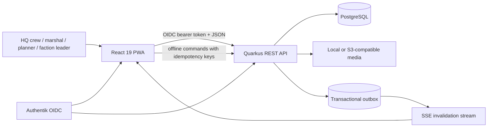

# Airsoft Inventory — Requirements and Current Architecture

> **Status:** Implemented architecture baseline
>
> **Purpose:** Normative requirements, architectural boundaries, invariants, and implementation traceability for the current repository.
> **Related detail:** [`docs/DOMAIN_ARCHITECTURE.md`](docs/DOMAIN_ARCHITECTURE.md), [`docs/DEPLOYMENT_STEP1.md`](docs/DEPLOYMENT_STEP1.md), and [`docs/DEPLOYMENT_STEP2.md`](docs/DEPLOYMENT_STEP2.md).

## 1. Scope and quality goals

The system manages equipment for recurring airsoft events: catalog and storage, faction demand, warehouse commissioning, custody handover, returns, loss and damage, maintenance, procurement, and immutable operational history.

The architecture prioritizes these qualities, in order:

1. **Inventory correctness:** a stock-changing command is atomic, idempotent where replay is possible, and checked under a database lock.
2. **Traceability:** every order transition and inventory movement records the authenticated actor, server timestamp, source aggregate, and quantity delta.
3. **Field resilience:** the PWA supports cached reads and a replayable offline command queue without weakening server-side validation.
4. **Explicit contracts:** REST DTOs, role names, media references, and service capabilities have one canonical representation.
5. **Extendability:** domain services own business rules, ORM classes own queries, resources own HTTP translation, and React hooks own server-state orchestration.
6. **Low boilerplate:** repeated CRUD mechanics are shared only where endpoint capabilities genuinely match.

## 2. System context



The application is a modular monolith. This is deliberate: inventory, orders, damage, and maintenance require local ACID transactions and do not benefit from distributed write coordination at the current scale.

## 3. Functional requirements and implementation status

| ID | Requirement | Status | Primary implementation |
|---|---|---:|---|
| CAT-01 | Maintain items, images, categories, event tags, hints, value, and storage location | Implemented | `CatalogResource`, `CatalogService`, `Item`, Items UI |
| CAT-02 | Maintain assemblies with fixed component quantities | Implemented | `Assembly`, catalog service, Assemblies UI |
| CAT-03 | Consolidated serialized item tracking: single parent catalog entry with aggregate stock, min-stock alerting, asset ID provisioning, and instance drill-down | Implemented | `CatalogService`, `AssetInstance`, Items UI |
| CAT-04 | Provide an item details view in which free-form product information and category-specific operational data can be added and reviewed | Implemented | `ItemDetail`, `ItemForm`, `Item`, maintenance query |
| CAT-05 | Support shared, event-driven, person-local, and group-local items; person/group items are excluded from other users' catalog reads while inventory managers retain operational access | Implemented | `ItemVisibilityScope`, `CatalogOrm`, `CatalogService`, item form |
| CAT-06 | Category-aware fields include vehicle fuel consumption and battery replacement date, generator running hours and maintenance log, and food best-before date | Implemented | `Item`, `ItemForm`, `ItemDetail`, `MaintenanceRecord` |
| LOC-01 | Maintain hierarchical/georeferenced storage and pickup locations | Implemented | `StorageLocation`, map components, pickup map dialog |
| INV-01 | Distinguish total owned, on-hand, checked-out, damaged, reserved, and available stock | Implemented | `InventoryOperationsService.StockState`, `StockDto` |
| INV-02 | Block over-allocation and unsafe/overdue checkout | Implemented | locked transaction paths and maintenance guard |
| INV-03 | Require event and faction context for every direct checkout and retain that context on the immutable transaction | Implemented | `TransactionForm`, assembly checkout, `InventoryOperationsService`, `StockTransaction` |
| INV-04 | Enforce tracking mode immutability once stock/movements exist; prohibit quantity-only mutations on serialized assets and support faction batching | Implemented | `CatalogService`, `InventoryOperationsService`, `OrderService` |
| ORD-01 | Support `draft → submitted → preparing → ready → picked_up → partially_returned/returned → closed` plus cancellation | Implemented | `OrderService`, order resources and hooks |
| ORD-02 | Commission individual items and assemblies on desktop and mobile | Implemented | `OrderPickListTable` |
| ORD-03 | Reserve prepared quantities and atomically convert them to custody on pickup | Implemented | reservations, order service, stock transactions |
| ORD-04 | Reconcile returned, consumed, missing, damaged, and written-off units | Implemented | `OrderReturnChecklist`, return service path |
| ORD-05 | Compare the current order with the previous event-year baseline | Implemented | `OrderTraceability`, `factionOrderHistory.ts` |
| ORD-06 | Resolve item SKU/QR, serialized asset code, and exact order code through targeted server queries; open stock handling, show checked-out quantity, and reconcile returns against an optional originating order | Implemented | `codeResolver.ts`, inventory/order services, `TransactionForm`, faction-order return endpoint |
| RET-01 | Define the expected return location per item and allow the returning person to attach an image showing where the item was placed | Implemented | `Item.returnLocation`, `ReturnSubmission`, `ReturnSubmissionForm`, media service |
| RET-02 | Keep submitted returns out of available/on-hand stock until a warehouse worker acknowledges them; provide a separate pending/history view with accept and reject actions | Implemented | `ReturnSubmissionService`, `/api/returns`, `ReturnedItems`, stock transaction/order reconciliation services |
| AUD-01 | Preserve append-only order history with actor, timestamp, action, note, and delta | Implemented | `FactionOrderHistory`, mapper, `OrderTraceability` |
| AUD-02 | Display create/prepare/ready/pickup/return actors and timestamps | Implemented | `OrderTraceability` |
| DAM-01 | Report, repair, verify, and write off damaged stock without creating stock | Implemented | damage service/resource and regression tests |
| DAM-02 | Record a resolution comment describing the action taken and optionally update the affected item's hint | Implemented | `DamageReportsList`, damage resolution DTO/service, item hint |
| MNT-01 | Track maintenance cycles and block checkout where required | Implemented | maintenance models and operations service |
| PRC-01 | Calculate demand deficit against usable on-hand stock and expose the planning workflow only to planners and administrators | Implemented | procurement service/resource, `ProcurementGuard`, navigation policy, and UI |
| PRC-02 | Record external orders for shortages with supplier, order date, ordering user, quantity, unit price, reference, and expected delivery; link shortage and order rows to item detail | Implemented | `Procurement`, `ProcurementOrders`, purchasing API |
| PRC-03 | Show outstanding ordered units separately as in transit on item stock and procurement views; exclude them from on-hand, owned, and available until goods receipt | Implemented | purchase order line aggregate, item stock DTO, deficit response, item detail |
| OFF-01 | Queue supported field commands offline and replay them idempotently | Implemented | IndexedDB queue, `/api/sync`, command IDs |
| OFF-02 | Keep filtered offline catalogs isolated by normalized query | Implemented | query-scoped keys in `resourceFactory.ts` |
| SEC-01 | Authenticate with Authentik OIDC and authorize on the server | Implemented | Quarkus OIDC and `ActorService` |
| SEC-02 | Use only canonical roles and namespaced Authentik groups | Implemented | Section 6 |
| API-01 | Return explicit DTOs; never serialize persistence entities directly | Implemented | `ApiResponses` and `ApiMapper` |
| API-02 | Expose only supported operations in each frontend API contract | Implemented | capability interfaces in `resourceFactory.ts` |

Counts, transfers, purchasing, custody, and stock management are first-class backend modules. The procurement page now records and displays external purchase orders; goods receipt remains a warehouse workflow.

## 4. Architectural boundaries

### 4.1 Backend

```text
resource/          HTTP routes, validation, authorization entry points, DTO mapping
service/           use cases, transactions, invariants, domain-event creation
orm/               persistence queries, locks, aggregate loading
model/             JPA entities and canonical enums
helper/security/   authenticated actor and RBAC policy
helper/storage/    canonical object-key media access
resource/dto/      public response contracts
```

Rules:

- A REST resource must not contain stock arithmetic or lifecycle decisions.
- A service transaction owns all writes for one use case and emits its outbox event in that transaction.
- ORM access stays behind focused ORM collaborators; entities do not provide active-record methods.
- API responses are mapped DTOs. Associations are expanded intentionally, never through incidental entity serialization.
- Stock and order commands lock the affected aggregate before validating quantities.

### 4.2 Frontend

```text
pages/             route composition and user workflows
components/        focused forms, lists, dialogs, and order-detail sections
hooks/             React Query orchestration and cache invalidation
services/          HTTP contracts, payload mapping, offline integration
types/             canonical client contracts
utils/             pure stock, access, naming, and order calculations
store/             client-only UI state
```

The service factory is capability-based:

- `CreateResourceApi`: list and create only.
- `MutableResourceApi`: list, detail, create, and update.
- `CrudResourceApi`: full list/detail/create/update/delete behavior.

Transactions, damage reports, and general orders therefore cannot acquire unsupported update/delete calls through a generic type. Realtime invalidation is handled centrally rather than by fabricated per-resource records.

Additional frontend rules:

- Route pages are loaded with `React.lazy` behind the application `Suspense` boundary. The login page is imported statically so authentication fallback rendering never depends on that boundary.
- Pages and generic utilities do not call the HTTP client directly. Services own transport contracts, including item/SKU, asset-code, and exact order-code resolution.
- The `stock` projection returned with an item is authoritative. The client must not download global transaction, damage, or order ledgers merely to recompute current stock.
- Route access and navigation visibility share the same access helpers. Hiding a navigation entry is a UX measure only; the backend remains the authorization boundary.
- Referential stability is provided by React Compiler, not by hand. `useMemo`, `useCallback`, and `React.memo` are used nowhere; values are computed directly during render, and multi-statement derivations use an inline immediately-invoked function. Do not reintroduce manual memoization — the compiler is configured through `reactCompilerPreset()` and enforced by the `react-compiler/react-compiler` lint rule at error level.
- When an effect must invoke a render-scoped function without making that function a reactive dependency, use `useEffectEvent`. It is the sanctioned replacement for the `useCallback` that the compiler no longer needs.
- Client-side pagination of already-loaded collections goes through `useClientPagination`. `SHOW_ALL_PAGE_SIZE` (`-1`) is the canonical "all entries" sentinel and must keep working; the hook clamps the current page during render rather than syncing it in an effect.
- Heavy dependencies that are needed only by an explicit user action are imported with `await import()` inside the handler that needs them, never at module scope. `jspdf` (with its `html2canvas` and `dompurify` transitives) is the current example.

## 5. Inventory semantics

For a bulk item, the authoritative read model is:

```text
onHand = inbound ledger movements - outbound ledger movements
checkedOut = checkout - checkin - consumed - missing
totalOwned = onHand + checkedOut
available = max(0, onHand - unresolvedDamage - activeReservations)
```

Invariants:

- `totalOwned` includes material currently in custody; valuation and procurement must not treat checkout as loss.
- `onHand` is physically at an inventory location.
- `available` is the only quantity allocatable to a new order.
- `ordered` is the unreceived quantity on external purchase orders in `ordered` or `partially_received` status. It is shown as in transit and is excluded from physical, owned, and available stock until a goods receipt posts. Draft and cancelled orders do not contribute.
- Order preparation displays the authoritative `available` value. While editing an order that already owns an active reservation, the UI adds only that order's reservation back to the allocatable amount; it must not subtract all reservations a second time.
- Damage repair changes condition, not physical quantity.
- A write-off is the explicit operation that reduces owned stock.
- Serialized items require asset-specific transactions; quantity-only stock movements and order handovers are rejected.
- Direct checkout commands require an event and faction snapshot. Order checkout and return transactions derive the same snapshot from their source order.
- A return associated with a faction order must use the order reconciliation use case; the generic transaction endpoint rejects order-linked stock changes.

The item collection is intentionally **not server-cached** because it carries dynamic stock. Its stock projection is computed with three grouped queries—transaction totals, unresolved damage, and active reservations—rather than per-item queries. Stable catalog collections may use server caching and ETags. Exact SKU/code resolution uses bounded server-side filters; barcode handling must not fetch an unbounded collection and search it in the browser.

### 5.1 Serialized inventory and tracking mode rules

1. **Tracking mode transition guard (immutability with stock):**
   - Changing `trackingMode` from `bulk` or `lot_tracked` to `serialized` (or vice-versa) on an item that has existing stock (`baseAmount > 0` or current stock ledger entries) is **strictly prohibited**.
   - Attempting to switch an existing item with stock to serialized mode must be blocked at both the API (`CatalogService`) and UI (`ItemForm`) layers. Mutating existing bulk stock to serialized without registered asset IDs produces orphaned stock and breaks the physical identity invariant.
   - An item may only be configured as serialized at creation or when current and historical stock is zero, unless an explicit guided migration tool is used to register individual physical asset IDs for all existing units.

2. **Parent catalog aggregation and minimum stock:**
   - To keep the catalog concise, serialized equipment (e.g., 5 power generators or 50 walkie-talkies) exists as a **single consolidated parent catalog item** rather than cluttering the catalog with separate rows per physical unit.
   - The parent item carries aggregate inventory metrics (`totalOwned`, `onHand`, `available`) alongside threshold alerting (`minStock`). For example, an aggregate power generator item tracks 5 total units and alerts when available operational units fall below `minStock = 2`.
   - Creating serialized stock requires defining or generating asset identifiers rather than assigning an anonymous scalar count. Minimum stock remains an aggregate threshold for the equipment model, not a per-asset flag.

3. **Sub-group asset instance drill-down:**
   - Selecting a serialized item in the catalog opens a detailed drill-down view of its child physical units (`AssetInstance`).
   - Each unit in the sub-group displays:
     - Canonical Asset ID / QR code (e.g., `GEN-001` .. `GEN-005` or `WT-001` .. `WT-050`) and optional manufacturer serial number;
     - Current operational and availability state (available, reserved, checked out / in custody, in repair, maintenance due, damaged);
     - Current storage location, operating hours, and active custodian.
   - The UI provides batch generation (e.g., prefix + sequential numbering) and manual barcode/QR scanning to easily register multiple asset IDs upon item creation or intake.

4. **Event allocation and faction distribution batching:**
   - High-value serialized items often need to be distributed in subsets to multiple factions during events (e.g., 50 walkie-talkies partitioned into batches of 10 for different faction headquarters).
   - Order commissioning and custody handovers must support selecting or assigning batches of specific serialized assets to faction orders, while maintaining 100% individual asset identity and return reconciliation for each handed-over unit.

### 5.2 Item detail, category data, and visibility

1. Every catalog item has a dedicated details route. In addition to stock, images, transactions, and serialized assets, it displays a free-form product description, expected return location, visibility assignment, and any applicable category-specific fields.
2. Category-specific fields are first-class typed data rather than prose-only conventions:
   - vehicles expose fuel consumption in litres per 100 km and the next battery replacement date;
   - generators expose current running hours, the next maintenance date/interval, and their maintenance-record history;
   - food exposes a best-before date.
3. An item's `visibilityScope` is one of `global`, `event`, `person`, or `group`.
   - `event` requires at least one event type tag;
   - `person` requires an assigned user and is visible only to that user and inventory managers;
   - `group` requires an assigned group and is visible only to members of that group and inventory managers;
   - inventory managers retain access because catalog maintenance, return acknowledgement, and stock correctness require operational oversight.
4. Collection and item-detail endpoints enforce the same visibility policy. Client-side hiding is not a security boundary.

### 5.3 Two-stage return intake

Returns initiated from a user's checked-out-item flow are submissions, not stock movements. A submission records the item, quantity or serialized asset, the person for whom it is returned, optional originating order, the item's configured return location, notes, and an optional placement image.

The return lifecycle is:

```text
checked out → return submitted (pending) → warehouse accepted → stock check-in/reconciliation
                                      └→ warehouse rejected → remains checked out
```

Invariants:

- A pending submission does not create a `checkin` transaction and does not increase on-hand or available stock.
- Pending serialized assets use `returned_pending_check`, which still counts as checked out and cannot be allocated.
- A worker acknowledgement is the only operation that invokes the canonical direct check-in or faction-order reconciliation path.
- Rejection restores a serialized asset to its prior checked-out state; bulk quantity remains unchanged throughout rejection.
- The submitted placement image is evidence for locating the physical item, not proof of stock acceptance.
- The separate returned-items view defaults to pending submissions and also exposes accepted/rejected history.

## 6. Authentication and authorization

Production authentication uses Authentik OIDC bearer tokens. Development header authentication exists only when `inventory.dev-auth.enabled=true` and uses the same canonical roles.

| Canonical role | Authentik group | Scope |
|---|---|---|
| `hq_admin` | `inventory_hq_admin` | users and all operational functions |
| `warehouse_crew` | `inventory_warehouse_crew` | catalog, warehouse, commissioning |
| `marshal` | `inventory_marshal` | handover and reconciliation |
| `event_planner` | `inventory_event_planner` | events, planning, and procurement deficits |
| `maintenance_crew` | `inventory_maintenance_crew` | maintenance and damage workflows |
| `faction_leader` | `inventory_faction_leader` | assigned factions only |
| `read_only` | `inventory_read_only` | read-only operational visibility |

There are no aliases for earlier role names, unprefixed identity-provider groups, local-storage token formats, or URL-form media references. Unknown roles are least-privilege `faction_leader`; authorization is still enforced at every protected backend use case. Existing installations must transform invalid role data before deploying this version—runtime compatibility is intentionally absent.

## 7. Order lifecycle and traceability

Order lines use one canonical handover quantity: `handedOverQuantity`. Requested and prepared values remain distinct, and reconciliation is measured against handed-over units.

Every transition appends a history entry with:

- authenticated actor ID and display name;
- server-generated UTC timestamp;
- action and optional note;
- from/to lifecycle state where applicable;
- item/assembly additions, removals, and before/after quantity changes;
- idempotency key for replayable commands.

The detail UI exposes the immutable history, lifecycle actors, timestamps, and the previous comparable faction order. The order collection is loaded where it is genuinely required for previous-order comparison and editing; current availability does not trigger global transaction or damage-report downloads. Editing a current order never overwrites its prior history snapshots. Item QR codes open the transaction workflow directly; returns show the total quantity currently out and offer only picked-up orders with an outstanding quantity for that item. Selecting an order records the return through its reconciliation aggregate rather than creating an unrelated stock entry.

## 8. Offline and consistency model

- The server remains authoritative; cached client data never bypasses server validation.
- Supported offline writes receive a client command/idempotency key.
- Replay is atomic per command. A rejected command rolls back its partial changes and is surfaced as a conflict.
- IndexedDB replay cleanup is batched across affected stores so a successfully replayed command and its cached projections cannot be left half-updated by a multi-store client transaction.
- Catalog fallback entries are keyed by resource plus sorted query arguments, so filters cannot return another query's cached result.
- The transactional outbox publishes invalidation events after commit; SSE tells clients which query families to refresh.
- Dynamic stock is fetched live after invalidation and is not hidden behind the catalog response cache.

## 9. Persistence and schema state

The runtime uses plain Jakarta Persistence/Hibernate ORM with PostgreSQL. Panache is not part of the persistence model. Production schema ownership is explicit: `%prod` enables Flyway at startup and configures Hibernate with `strategy=validate`. Versioned migrations are committed under `backend/src/main/resources/db/migration`: `V1.0.0__init.sql`, `V1.0.1__category_maintenance.sql`, `V1.1.0__damage_report_targets.sql`, and `V1.1.1__general_order_flow.sql`. Baseline-on-migrate is opt-in for an explicitly reviewed existing database; an empty database runs the initial migration normally.

The unqualified local profile still uses Hibernate `strategy=update`, while development and test use disposable `drop-and-create` schemas with Flyway disabled. Shared staging, production-like, and multi-node deployments must use the production-equivalent Flyway/validate policy rather than the local default. Remaining hardening work is to retire `update` outside explicitly disposable/local use, keep all future changes forward-only, test upgrades from supported database versions, and validate backup/restore before release.

Core persisted concepts include users, storage locations, items and images, scoped item assignments, category-specific item data, assemblies and components, event occurrences and factions, faction orders and normalized lines, reservations, custody handovers, two-stage return submissions, reconciliations, stock transactions (including immutable event/faction checkout snapshots), damage reports, maintenance, and domain outbox events.

## 10. Media contract

Database records contain canonical relative object keys only, for example `items/<uuid>/<uuid>.webp`. API media URLs are generated by the client against `/api/media/{key}`. Absolute or external URLs are rejected by the media boundary; the backend does not infer keys from historical public URLs.

Authenticated users may stage a return-placement image. Once the return submission is persisted, the media service atomically promotes the staged object to a canonical `returns/...` key; warehouse acknowledgement does not depend on an external URL.

## 11. Verification and finding traceability

| Finding | Resolution | Regression evidence |
|---|---|---|
| P0 — frontend did not compile after the architecture refactor | Repaired malformed item-detail JSX, restored live order-detail dependencies, corrected form callback typing, and restored imports that are still used | `npm.cmd run build`, `npm.cmd run lint` |
| P0 — item detail route read the wrong parameter | `ItemDetail` now reads the canonical `/items/:itemId` parameter and renders immutable item transactions and serialized-asset detail | TypeScript production build |
| P0 — prepared-order availability double-counted reservations | UI consumes server-projected stock and adds back only the current order's own reservation while editing | TypeScript production build; order reservation API tests |
| P0 — SKU/order scanning fell back to broad collection downloads | Item search matches name or SKU; order lookup accepts an exact normalized `orderCode`; code resolution goes through bounded service calls | `itemListsAreBoundedAndRejectInvalidPageSizes`, `concurrentOrdersReceiveUniqueCodesAndListAsCompactPages`, TypeScript production build |
| P0 — procurement data and UI were accessible beyond planner/admin scope | Backend requires planner access; route guard and navigation share the same planner/admin policy | `procurementDeficitsRequirePlannerAccess`, TypeScript production build and lint |
| Tracking mode was reset when omitted from an item update | Partial updates preserve the current mode; a real mode change still runs the stock/asset/history guard | `serializedItemCreationProvisionsAssetsAndBlocksTrackingModeChangeWithStock` |
| P1 — mobile commissioning controls missing | Responsive quantity chips and prepare controls restored for items and assemblies | TypeScript production build |
| P1 — duplicated client/server stock arithmetic and redundant global queries | Legacy client ledger arithmetic removed; screens consume `Item.stock`; item collection bypasses server response cache and its projection uses grouped queries | `itemListReturnsLiveOwnedAndOnHandStockAfterCheckout`, TypeScript production build |
| P1 — total stock dropped checked-out units | DTO separates `totalOwned` and `onHand`; valuation/procurement use owned stock | same stock regression test |
| P1 — order traceability removed | Actor cards, previous-order diff, and immutable history extracted to `OrderTraceability` | TypeScript production build |
| P2 — offline cache ignored filters | Stable sorted query tuple is part of the IndexedDB cache key | TypeScript production build |
| P2 — destructive dialog used for checkout | Action-neutral `ConfirmDialog` with explicit label, tooltip, and color | TypeScript production build |
| P2 — generic API advertised unsupported CRUD | Capability-specific APIs and hooks introduced | TypeScript compiler |
| Resource hook implementations were duplicated | Full CRUD hooks compose the create/mutable hook layers and add only delete capabilities | TypeScript production build and lint |
| Quantity-map conversion was duplicated | Event and order forms share typed conversion helpers with explicit non-negative or positive-integer rules | TypeScript production build and lint |
| P2 — Panache dependency without a Panache model | Panache dependency and entity inheritance removed | Maven clean test |
| Legacy authentication/authorization | Old local storage reads, old enum values, role aliases, and old group mappings removed | `ActorServiceRoleTest`, API auth test |
| Legacy order/media representations | old pickup quantity fallback and URL-to-key conversion removed | order/API tests and `MediaServiceTest` |
| QR return lacked custody context | Scan opens the transaction dialog, shows checked-out quantity, filters eligible orders, and routes selected returns through order reconciliation | TypeScript production build and order API tests |
| Checkout lacked event/faction traceability | UI requires both fields; API rejects context-free checkout; transaction response exposes the stored snapshot | `itemListReturnsLiveOwnedAndOnHandStockAfterCheckout` |
| General orders tab remained inactive | Canonical `tab=general` URL state replaces the contradictory empty-query fallback | TypeScript production build |
| Dense assembly media layout | Image, event tags, description, instruction, and metrics share one responsive summary panel | TypeScript production build |
| Monolithic eager route loading | Authenticated route pages are lazy-loaded behind a common `Suspense` boundary; login remains an independent static fallback | Vite production chunk output |
| Render-time clock access failed React purity checks | Dashboard time is held in state and advanced by an effect-driven interval | ESLint and TypeScript production build |
| Item details could not capture operational category data | Added typed vehicle, generator, and food fields plus generator maintenance history to the existing item-detail route | `personScopedItemsAndCategoryDetailsAreOnlyVisibleToTheAssigneeAndManagers`, TypeScript production build |
| Person/group-local catalog entries leaked through unfiltered item reads | Catalog list and detail queries now apply the canonical visibility scope with an explicit inventory-manager operational override | `personScopedItemsAndCategoryDetailsAreOnlyVisibleToTheAssigneeAndManagers` |
| Returns immediately changed stock with no physical acknowledgement | Added pending return submissions, optional placement photos, and a worker-only acknowledgement view; only acceptance reaches canonical stock/reconciliation services | `submittedReturnDoesNotChangeStockUntilWarehouseAcknowledgement`, TypeScript production build |
| Manual memoization duplicated what React Compiler already provides | Removed all 124 `useMemo`/`useCallback` wrappers; derivation is inline, and `useEffectEvent` replaced the three `useCallback`s that effects depended on | `npm.cmd run lint` (`react-compiler/react-compiler` at error level), TypeScript production build |
| Client-side pagination was copied into 13 list surfaces | Extracted `useClientPagination`, which derives the clamped page during render and keeps the `-1` "all entries" sentinel; adopted in 13 surfaces across 10 components | TypeScript production build; `npm.cmd run lint` |
| `jspdf` was pulled into every route bundle that could export a PDF | Replaced the three module-scope imports with `await import('jspdf')` inside the exporting handlers | Vite chunk output: `jspdf-vendor` and `html2canvas` are demand-loaded only |

Required verification before merge:

```powershell
npm.cmd run build
npm.cmd run lint
cd backend
mvn.cmd clean test
```

## 12. Deliberate next priorities

These are not compatibility work and are not represented as already implemented:

1. Require every shared/staging PostgreSQL deployment to use Flyway plus Hibernate validation; retire the unqualified `update` strategy outside explicitly local use and add upgrade/backfill tests for each forward migration.
2. Generate the TypeScript transport models from the OpenAPI document to reduce remaining manual DTO duplication.
3. Add browser-level tests for mobile commissioning, scan resolution, order reservation editing, procurement access, offline filtered reads, and the traceability panel.
4. Validate backup restore, outbox recovery, and offline-conflict workflows in a production-like environment.
5. Add route prefetching and enforce bundle-size budgets. Route-level code splitting is active and `jspdf` is now demand-loaded, but `mui-grid-vendor` (~757 kB) and `recharts-vendor` (~347 kB) remain the largest chunks.
6. Expand serialized-inventory browser coverage and UX for high-volume asset registration, scanner-assisted assignment, and faction batch reconciliation.
7. Add browser-level coverage for scoped catalog visibility and the pending-return photo/acknowledgement workflow.

## 13. Frontend consolidation state

### 13.1 Decisions taken

- **Virtualization is retained, not replaced by removing the "all entries" option.** `SHOW_ALL_PAGE_SIZE` (`-1`) stays supported, and `@mui/x-data-grid` continues to virtualize the DataGrid-backed lists. `@tanstack/react-virtual` is deliberately *not* added to those lists, because double virtualization is a defect source.
- **The hybrid layout is retained.** `pages/`, `components/`, `hooks/`, `services/`, `types/`, and `utils/` remain the organizing structure; §4.2 describes it. A wholesale move to `features/*` is not planned.
- **Radix UI and Ark UI are not adopted.** MUI already supplies the dialog, menu, select, focus-trap, and ARIA behaviour; there is no hand-rolled focus trap or portal in the codebase. Swapping primitive libraries would re-author the Emotion styling layer and grow the codebase rather than shrink it.

### 13.2 Completed consolidations

| Change | Effect |
|---|---|
| Removed every `useMemo` and `useCallback` wrapper (124 sites across 28 files); no `React.memo` existed | Derivation happens directly during render; React Compiler supplies referential stability |
| Added `hooks/useClientPagination.ts` and adopted it in 13 list surfaces across 10 components | Replaced 13 copies of the `pageSize === -1` / `Math.min(page, …)` / `slice()` block with one derived hook |
| Removed the `setPage(1)` effects in `PrintQRCodes` and `TransactionHistory` | Filter handlers reset pagination directly; the hook clamps the current page when loaded collections shrink |
| Replaced three effect-dependency `useCallback`s in `EventDetail`, `OrderReturnChecklist`, and `FactionOrderForm` with `useEffectEvent` | Effects now depend only on real inputs; the barcode listener in `OrderReturnChecklist` is registered once instead of on every items/outstanding change |
| Removed the `UserPermissionsEditor` prop-to-state sync effect | The editor is remounted from the persisted server snapshot via a composed `key`, per the derive-don't-sync rule |
| Moved `jspdf` to `await import()` in all three consumers | ~628 kB (`jspdf` + `html2canvas` + `dompurify`) leaves the route bundle and loads only when a PDF is actually generated |

### 13.3 Derived state conversion backlog

`react-hooks/set-state-in-effect` remains off, with the offending sites enumerated in `eslint.config.js`. Each is a prop- or query-parameter-to-state synchronisation that still needs behavioural verification, which requires the browser test suite from §12.3:

`components/common/ImageAttachments.tsx`, `components/forms/FactionOrderForm.tsx` (×2), `components/orders/detail/OrderPickupMapDialog.tsx`, `components/procurement/ProcurementOrders.tsx`, `pages/EventDetail.tsx`, `pages/Events.tsx` (×2), `pages/FactionOrderDetail.tsx`, `pages/FactionOrders.tsx`, `pages/ItemDetail.tsx`.

Turn this rule back on once those are converted.

### 13.4 Remaining consolidation not yet done

These were analysed and quantified but not implemented, because each changes working behaviour and needs test coverage first:

1. **Extract the catalog item/assembly picker.** The same search + category filter + paging + quantity-map + tile/list toggle interaction is implemented three times (`FactionOrderForm`, `OrderPickListTable`, `GeneralOrders`). This is the largest remaining duplication (roughly 600–900 lines).
2. **Extract a shared mutation-feedback helper.** Around 50 call sites repeat an inline `onSuccess`/`onError` pair with `showSnackbar(t(…))`.
3. **Move list filters and pagination into the URL.** `CheckedOutItems`, `StorageLocations`, `GeneralOrders`, `FactionOrders`, `PrintQRCodes`, `AssetInstancesList`, `UserManagement` and `ProcurementOrders` still hold filters in `useState`, so views are not shareable and are lost on navigation.
4. **Compose `OrderDetailHeader` from slots.** It currently takes roughly fourteen `on*` callbacks, and `OrderPickListTable` drills three `React.Dispatch<SetStateAction<…>>` setters down.
5. **Optimistic updates.** Only `Header.tsx` uses `onMutate`; order transitions, damage status changes, and return acknowledgement still wait for the server round trip.
6. **Convert the remaining effect-based fetch loops** (`Events`, `FactionOrders`, `FactionOrderDetail`, `UserManagement`, `ProcurementOrders`, `OrderReturnChecklist`) to TanStack Query, and replace `GeneralOrders.openPickup`'s `Promise.all` with `useQueries`.
