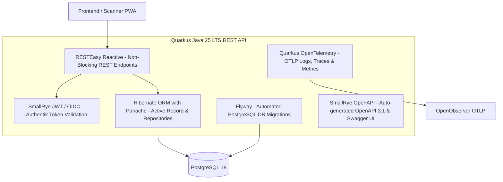
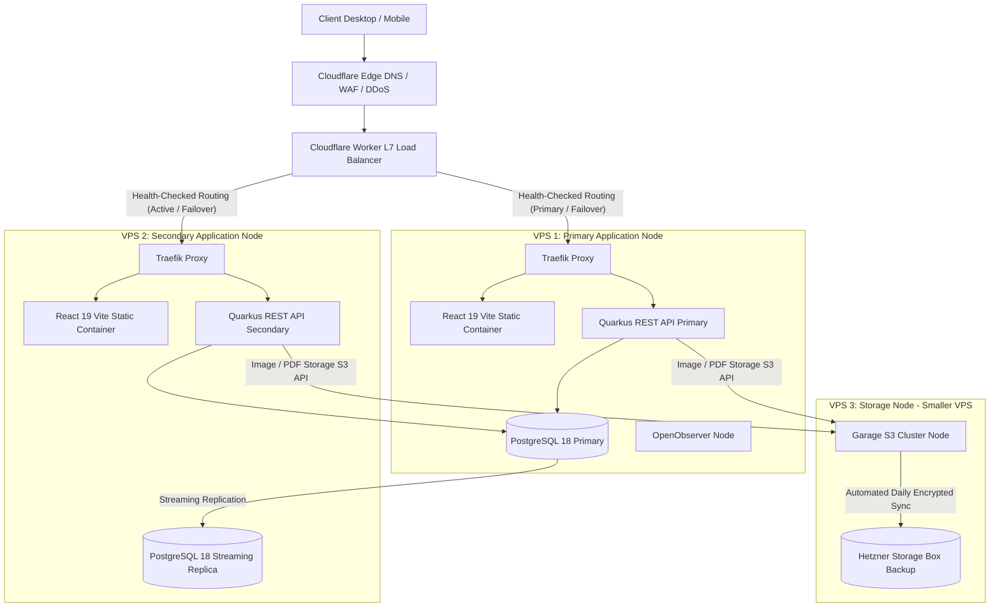
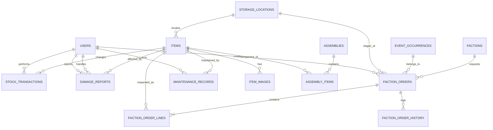
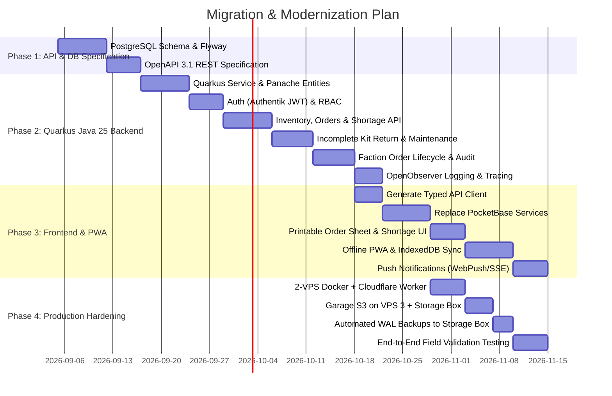

# Airsoft Inventory Management System — Requirements & Architecture Specification

> **Status:** Architecture Refinement & Evaluation Baseline  
> **Document Purpose:** Clear, structured specification for coding agents and human engineers to evaluate the application's current state, assess feature gaps, compare tech stacks against industry standards, and guide migration from PocketBase to an enterprise-grade REST backend (PostgreSQL + Java 25 LTS / Quarkus).

---

## 1. Executive Summary & Domain Context

### 1.1 Business Goal
The primary objective is to provide a **clean, fast, rock-solid inventory and logistics management system** tailored for organizing large-scale **Airsoft events and festival-like scenarios** (e.g., Dark Emergency / DE, LightSim / LS, The Nemesis Operation / TNO, ASD, Mahlwinkel / M24).

Airsoft events present a unique operational challenge:
1. **Internal Field Infrastructure:** Heavy operational assets managed exclusively by internal HQ crew (power generators, distribution boxes, mobile toilets/sanitary units, perimeter lighting, PA sound systems, radios, tools).
2. **In-Game Assets & Electronics:** High-value or delicate tech deployed during the game (mission computers, interactive prop terminals, simulated bomb crates, sound/smoke effects, electronic flags).
3. **Customer / Faction Handover:** Gear handed over to external faction leaders, marshals, or trusted players. These individuals are **not internal employees**, so **strict traceability, custody records, and condition verification** upon checkout and check-in are critical.
4. **Consumables vs. Returnables:** High-turnover consumables (BBs, CO2/Gas cartridges, smoke grenades, pyrotechnics, cable ties, tape) must be tracked for depletion, whereas returnable assets must be tracked for physical custody and condition.
5. **Yearly Event Cycles:** Major events occur annually. Planning should not start from scratch: teams need to duplicate previous years' faction lists as a baseline and adapt them.

### 1.2 Core Operational Workflow


---

## 2. Current Implementation State vs. Target Requirements

This matrix evaluates the current codebase against the requirements defined in [`requirments.md`](file:///d:/Code/ASH/inventory/requirments.md) and real-world field operations:

| Feature / Capability | Handwritten Requirement | Current App State | Gap / Target Architecture |
|---|---|---|---|
| **Item Management** | Categories, subcategories, event filters, images, hints | **Implemented** (`src/pages/Items.tsx`, `ItemDetail.tsx`) | Images stored in PocketBase; target Garage S3 on VPS 3. |
| **Assemblies / Bundles** | Group items together to check out at once | **Implemented** (`src/pages/Assemblies.tsx`, `AssemblyDetail.tsx`) | Ready; component breakdown works during checkout. |
| **Consumables vs. Returnables** | Track items expected to return vs. used up | **Partial** (`containerSize`, container remaining %, but no explicit consumable flag) | Needs explicit item classification (`consumable` vs. `returnable`). |
| **Stock Tracking & Alerts** | Alerts when stock runs low | **Partial** (`minStock` exists, flagged in UI dashboard) | Needs automated alerts / push notifications / email warnings. |
| **Event History & Baselines** | History of orders and what was actually used; copy last year's baseline | **Implemented** (`src/pages/FactionOrders.tsx`, copy previous list) | Baseline copying exists; needs cross-year event occurrence scoping. |
| **Faction Orders** | Factions state what they need; editable drafts | **Implemented** (`src/pages/FactionOrderDetail.tsx`) | JSON aggregate map in PocketBase; needs normalized relational lines. |
| **Packing & Readiness Notification** | Packing by warehouse crew; notification when ready | **Partial** (status flow exists: `draft -> preparing -> ready`) | Notification system missing (WebPush, email, or in-app push). |
| **Damage & Loss Tracking** | Menu to track broken or lost items | **Implemented** (`src/pages/DamageReports.tsx`) | Partial repair/write-off works; needs direct linking to return scans. |
| **User Traceability** | Track who performed each action | **Implemented** (records user ID on transactions and order milestones) | Needs server-enforced audit immutability and tamper-proof logs. |
| **QR Code Scanning & Printing** | QR on items, assemblies, orders; camera scan & print sheets | **Implemented** (`ZXing` scanner, `/print-qr` with `jsPDF`) | Works well on desktop and mobile; needs short manual code fallback. |
| **Order Identification** | Unique human-readable code per order | **Partial** (uses auto-generated PB IDs or order codes) | Needs structured code format (e.g. `DE26-KGG-01`). |
| **Printable Paper Sheets** | Paper commissioning lists to check off by hand in warehouse | **Missing / Minimal** (browser print CSS only) | Needs dedicated printable PDF packing slip with checkboxes and QR header. |
| **Demand & Reorder View** | See what is more ordered than in stock & what needs reordering | **Missing** | Dedicated procurement view calculating `Demand - Available Stock = Deficit`. |
| **Incomplete Kit Check-in** | Handle missing kit components separately upon return | **Missing** | Itemized return checklist keeping unreturned kit parts assigned to customer. |
| **Safety & Maintenance Cycles** | Periodic test schedules (DGUV V3, generator hours, battery health) | **Missing** | Certification schedules with automated checkout blocking for overdue gear. |
| **Offline Field Mode (PWA)** | Scan and operate in bunkers/forests with zero cellular signal | **Missing** | Service Worker + IndexedDB queue with automated sync and idempotency keys. |
| **Access Control & HQ Crew Limit** | Limit access to HQ crew, separate faction leaders | **Partial** (`role` field on user, but PB collection rules are currently broad) | Server-side RBAC (HQ Admin, Warehouse Packer, Faction Leader). |
| **High Availability & Storage** | Redundant nodes, S3 storage, and off-site backup | **Missing** (Single container on 1 host) | Cloudflare Workers LB -> 2 App VPS + 3rd VPS Garage S3 & Storage Box. |
| **Cross-Device Usability** | Mobile & desktop responsive, simple fast UI | **Implemented** (MUI responsive drawers, mobile bottom bars, card layouts) | Responsive layouts active; PWA offline layer planned. |

---

## 3. Detailed Functional Domain Specification

### 3.1 Item & Asset Catalog
- **Hierarchy:** Primary Categories (e.g., *Infrastructure, Comms, Props, Pyro, Medical, Tools*) and Subcategories (*Generators, Cabling, Sound, Radios, Defusal Kits*).
- **Event Scope Tagging:** Items can be flagged for specific events (e.g. `DE`, `LS`, `TNO`, `ASD`, `M24`).
- **Media & Guidance:**
  - Multiple image attachments for visual identification.
  - Field instructions / operational hints (e.g. *"Requires 2-stroke oil mix 1:50"*, *"PIN code for keypad is 4081"*).
- **Container / Partial Stock Tracking:** Container size, container count, opened containers, and % remaining for bulk goods (e.g. gas, fog machine fluid, cable rolls).
- **Storage Locations & OpenStreetMap (OSM) Overlay:**
  - **Hierarchical Addressing:** Building, Area, Shelf, Bin, and position details.
  - **Interactive OpenStreetMap Marking:** Every storage location can be pinpointed with precise GPS coordinates (`latitude`, `longitude`, `mapZoom`) on an interactive Leaflet/OpenStreetMap interface.
  - **Custom Field / Aerial Map Overlays:** Supports uploading custom high-resolution drone/aerial maps or hangar floorplans rendered directly over the base OSM map using geo-referenced bounding coordinates (`overlayBounds: [[south, west], [north, east]]`).
  - Warehouse pickers and marshals can tap a location to view its exact physical position on the field map.

### 3.2 Assemblies / Kit Bundles
- Predefined kits composed of multiple inventory items and fixed quantities (e.g., *"Faction HQ Power Kit"* = 1x Inverter Generator, 2x 25m Cable Drums, 4x Multi-socket outlets, 2x 50W LED floodlights).
- **One-Tap Commissioning:** Checking out an assembly checks out each underlying component stock item atomically.
- Shortage detection: Warns if a full assembly cannot be assembled due to individual missing items.

### 3.3 Event Occurrence & Faction Order Lifecycle
The core operational lifecycle consists of strict status transitions:

```text
[DRAFT] -> [SUBMITTED] -> [PREPARING / PACKING] -> [READY] -> [PICKED UP] -> [PARTIALLY_RETURNED / RETURNED] -> [CLOSED]
   \            \                   \                  \             \
    +------------+-------------------+------------------+-------------+--> [CANCELLED]
```

1. **Draft / Baseline Creation:**
   - Faction leader or HQ planner creates the list for the upcoming event occurrence.
   - **Designated Pickup Location:** Order specifies a designated **Pickup / Handover Location** (linked to a physical storage/staging location, e.g. *"HQ Main Supply Tent"*, *"Armory West Container"*, *"Checkpoint Charlie"*).
   - Option to prefill using last year's event order as baseline.
   - Shows diff (added, removed, increased, decreased quantities).
2. **Warehouse Commissioning (Packing & Staging):**
   - Internal warehouse crew opens the order on mobile or prints a physical check-off sheet.
   - Lines display exact storage locations (Shelf/Bin + OSM map pin) for rapid picking across warehouse zones.
   - Items are marked as prepared; prepared quantities are **reserved** from available stock so other orders cannot claim them.
   - Prepared gear is staged at the designated order pickup location.
   - Shortages are clearly highlighted.
3. **Readiness & Notification:**
   - Once all items are assembled (or shortages explicitly acknowledged), status moves to `READY`.
   - Automated push notification / email / SMS sent to the designated collector with the **exact pickup location and OpenStreetMap pin**.
4. **Custody Handover (Pickup):**
   - The collector presents the printed or digital Order QR code at the designated pickup location.
   - The order detail screen renders the interactive OpenStreetMap pin showing where to collect the gear.
   - Warehouse marshal scans the QR code, confirms collector identity.
   - System atomically creates checkout transactions transferring custody to the collector.
5. **Return & Condition Check (Reconciliation):**
   - Post-game return: Marshal scans the order QR code at the designated return/intake point.
   - Items are inspected:
     - Undamaged returnable items are checked back into inventory.
     - Consumable items are marked as used/depleted.
     - Incomplete assembly components are flagged as missing (Section 3.6).
     - Broken items spawn a **Damage / Loss Report** linked to the order and the customer.
   - Order cannot be closed until all outstanding units are reconciled (returned, consumed, or written off).

### 3.4 Traceability, Custody & Audit Trails
- **Tamper-proof Ledger:** Every quantity change, custody handover, or status change writes an immutable audit record containing:
  - `actor_id` (authenticated user)
  - `timestamp` (server-generated UTC)
  - `action` (e.g. `PREPARED`, `CUSTODY_HANDOVER`, `RETURNED`, `DAMAGE_REPORTED`)
  - `delta_snapshot` (item IDs, previous quantity, new quantity)
- **Customer Accountability:** Because faction leaders and marshals are external customers, the system records explicit sign-off timestamps and actor IDs at checkout and check-in.

### 3.5 Demand Forecasting, Stock Deficits & Reorder Planning View
To prevent field shortages before major events, the system provides a dedicated **Shortage & Procurement Planning View**:
- **Core Formula:**
  $$\text{Net Deficit} = \sum(\text{Requested Quantities across Active Upcoming Orders}) - (\text{Total Physical Stock} - \text{Damaged/Written-off})$$
- **Key Capabilities:**
  - **Scope Filtering:** Filter demand across a single upcoming event occurrence (e.g. "DE 2026") or all planned events in the season.
  - **Item Classification Split:**
    - *Consumables Deficit:* Flags consumable goods (BBs, gas, smoke grenades, batteries, cable ties) that must be **purchased** from suppliers.
    - *Asset / Equipment Deficit:* Flags durable gear (power generators, radios, floodlights) where demand exceeds warehouse inventory, signaling a need for **external rental or equipment purchase**.
  - **Supplier Grouping & Export:** Group deficit items by supplier/vendor with one-click export (CSV / PDF) for purchase orders.
  - **Direct Alert Indicators:** Highlights shortage badges directly on the Global Dashboard and within Event Planning screens.

### 3.6 Incomplete Kit / Assembly Check-in & Return Workflow
When an assembly (e.g., *"Faction HQ Power Kit"* composed of 1 generator, 2 cable drums, 4 multi-sockets, and 2 floodlights) is returned, components are often missing or returned separately.
- **Component-Level Return Checklist:** The marshal scans the order QR code, which displays an itemized visual checklist of all components within the checked-out assembly.
- **Partial Assembly Reconciliation:**
  - Undamaged returned components are checked back into available warehouse stock immediately.
  - Missing components (e.g., 1 cable drum not returned) are flagged as **`MISSING_UNRETURNED`**.
  - Custody for the missing item remains assigned to the collecting customer/faction.
  - The order status transitions to **`PARTIALLY_RETURNED`** (preventing premature order closure).
- **Resolution Outcomes:**
  1. *Late Return:* Customer returns the missing item later $\rightarrow$ marshal scans the item back in $\rightarrow$ order closes.
  2. *Declared Lost / Replaced:* Customer pays replacement fee or signs loss waiver $\rightarrow$ item is written off with replacement invoice note $\rightarrow$ order closes.

### 3.7 Periodic Safety & Maintenance Cycles (DGUV V3, Generator Hours, Battery Health)
Critical infrastructure and game gear require systematic maintenance and regulatory safety certifications:
- **German DGUV V3 Electrical Safety Testing:**
  - Mandatory annual inspection for 230V portable electrical equipment (generators, cable drums, distribution boxes, floodlights).
  - Tracks: Last Test Date, Next Due Date, Inspector ID, Certificate / Protocol Number, and Pass/Fail result.
  - **Checkout Blocker:** If an item's DGUV V3 test is `OVERDUE`, the system displays a prominent warning and blocks adding it to an order or checking it out until recertified.
- **Operating Hours & Runtime Logging:**
  - Dedicated runtime counter for engine-driven assets (inverter generators, compressors).
  - Prompts for runtime hours upon check-in (e.g. *"Generator ran 18 hours at DE 2026"*).
  - Automated service triggers (e.g. oil change & spark plug service due every 50 hours).
- **Battery Health & Airsoft Chrono Logs:**
  - Prop and radio battery cycle count, internal resistance, and storage charge state.
  - Chronograph / FPS logs for event-owned loaner airsoft replicas (Joules / FPS history and safety tag).
- **Status Lifecycle:** `CERTIFIED` $\rightarrow$ `DUE_SOON` (within 30 days) $\rightarrow$ `OVERDUE` (locked from checkout) $\rightarrow$ `IN_MAINTENANCE`.

### 3.8 Offline Field Mode (Progressive Web App with Local Sync Queue)
Airsoft events are hosted on remote military training areas, dense forests, or underground bunker facilities with poor or non-existent 4G/5G cellular coverage.
- **PWA Service Worker Caching:**
  - The web application installs as a PWA on mobile devices (iOS / Android / Rugged Android scanners).
  - Caches the application shell, item catalog (names, storage locations, photos, hints), and all active event orders and pick-lists in browser **IndexedDB**.
- **Offline Scanner & Commissioning Operations:**
  - Marshals can scan QR codes, check off items during warehouse picking, confirm readiness, and record return condition without any internet connection.
- **Append-Only Sync Queue & Conflict Resolution:**
  - Every offline scan/action appends an immutable event into IndexedDB with a client-generated UUID idempotency key and local timestamp.
  - Visual status indicator in the UI: *"Offline — 7 actions queued"*.
  - When connection is re-established (e.g. returning to HQ Wi-Fi), the queue automatically replays against the Quarkus REST API.
  - Server-side idempotency keys prevent duplicate checkouts or duplicate check-ins even if synced multiple times.

---

## 4. Feature & Architecture Comparison vs. Industry-Leading Solutions

To ensure the inventory system is a comprehensive, production-grade tool for event organizers, we benchmarked current features against industry standards (**Rentman** for AV/event production logistics, **Snipe-IT** for enterprise asset tracking, and **Sortly** for visual mobile inventory).

### 4.1 Feature Matrix & Scope

| Capability | Ash Inventory (Current) | Industry Benchmark (Rentman / Snipe-IT / Sortly) | Status in Specification |
|---|---|---|---|
| **Faction / Event Orders** | **Core Strength:** Event-scoped faction lists, copy previous year baseline, diff view. | Typically generic sub-rentals; lacks airsoft/scenario faction workflows. | **Implemented & Core Feature** |
| **Assemblies / Bundles** | **Implemented:** Predefined kits, component quantity breakdown. | Standard in Rentman & Snipe-IT ("Kits / Bundles"). | **Implemented & Core Feature** |
| **Visual Warehouse & Maps** | **Implemented:** Leaflet map overlay for field/warehouse positioning. | Rare in standard tools (usually text-only shelf/bin). | **Implemented & Enhanced** |
| **Mobile QR Scanning** | **Implemented:** ZXing camera & file scanner on desktop/mobile. | Standard across all mobile inventory apps. | **Implemented** |
| **Demand vs. Stock Deficit** | **Added (Section 3.5):** Procurement & reorder deficit view across upcoming events. | **Rentman Gold Standard:** Real-time shortage planner showing required vs. available gear across dates. | **Included (Target Build)** |
| **Incomplete Kit Check-in** | **Added (Section 3.6):** Component-level checklist tracking missing kit parts upon return. | Rentman tracks "missing kit components" with replacement billing/follow-up. | **Included (Target Build)** |
| **Periodic Maintenance & Inspection** | **Added (Section 3.7):** DGUV V3 safety testing, generator runtime hours, battery health. | Standard (DGUV V3 safety testing, periodic inspection dates, calibration, warranty). | **Included (Target Build)** |
| **Offline Field Mode (PWA)** | **Added (Section 3.8):** IndexedDB local queue for remote dead-zone scanning & sync. | High-end field logistics apps support offline queueing with sync. | **Included (Target Build)** |
| **Transport Manifests / CMR** | Paper packing lists for vehicles with hazard weights. | Standard export of vehicle packing manifests and CMR transport papers. | **Deferred (Skipped for now per requirements)** |

### 4.2 High-Value Features Included in Target Scope

1. **Demand Forecasting & Procurement Reorder View (Section 3.5):**
   - Real-time stock shortage calculations across upcoming event occurrences with 1-click supplier purchase order export.
2. **Incomplete Kit / Assembly Return Checklist (Section 3.6):**
   - Enables checking in undamaged kit components while keeping missing individual parts (e.g. 1 cable drum or adapter) assigned to the customer.
3. **Periodic Maintenance & Inspection Cycles (Section 3.7):**
   - Tracks legal electrical safety tests (**DGUV V3**), generator operating hours (service alarms every 50h), and prop battery health, automatically blocking overdue gear from checkout.
4. **Offline Field Mode via PWA (Section 3.8):**
   - Service Worker caching and IndexedDB offline queueing with idempotency keys for zero-signal bunker/forest scanning.

*(Note: Transport manifests / CMR documents are explicitly deferred for a future iteration).*

---

## 5. Target Architecture & Technology Recommendations

### 5.1 Database: PostgreSQL 18+ (The Foundation)
**Verdict:** PostgreSQL 18+ replaces SQLite/PocketBase to guarantee ACID compliance, transactional integrity, and scalable multi-user operations.

- **ACID Transactions & Row-Level Locking:** Prevents race conditions and double-checkouts when multiple marshals scan items simultaneously.
- **Relational Integrity:** Foreign keys enforce that order histories, audit trails, and item references remain intact even if master records are deactivated.
- **Fuzzy Search:** Built-in `pg_trgm` extension enables typo-tolerant search for German/English gear names on mobile devices.
- **Disaster Recovery:** Point-in-Time Recovery (PITR) via continuous Write-Ahead Log (WAL) archiving.

### 5.2 Backend Architecture: Java 25 (LTS) & Quarkus (Finalized Target Backend)

The backend is implemented as a high-performance, containerized REST API using **Quarkus with Java 25 (current LTS)**.



*Why Quarkus fits this application best:*
1. **Low Resource Footprint:** Runs in JVM mode (~90MB RAM) or compiled to a **GraalVM Native Binary (<40MB RAM)** with sub-second cold starts.
2. **Hibernate with Panache:** High developer velocity with type-safe queries, active-record style helpers, and built-in transaction management (`@Transactional`).
3. **Database Migrations:** Automated version-controlled schema evolution using **Flyway**.
4. **Built-in Security:** First-class OpenID Connect integration (`quarkus-oidc`) verifying JWTs issued by Authentik/Keycloak.
5. **Native Observability:** `quarkus-opentelemetry` automatically streams structured traces, DB query timings, and logs directly to OpenObserver via standard OTLP.

---

### 5.3 Multi-VPS Hosting Architecture: Cloudflare Workers + 2 App Nodes + 1 Storage Node

To ensure high availability, redundancy, and independent storage scaling without the complexity of Kubernetes, the infrastructure uses a **3-node VPS architecture** coordinated by **Cloudflare Workers**:



#### Infrastructure Specifications

| Node | Hardware Spec | Services Deployed | Purpose |
|---|---|---|---|
| **Cloudflare Edge** | Cloudflare Global Anycast | Cloudflare DNS, WAF, DDoS Protection, **Cloudflare Worker** | Smart L7 edge load balancer with active health probing (`/q/health/live`), SSL termination, and instant failover. |
| **VPS 1** (App Node 1) | 4 vCPUs, 8–16 GB RAM (e.g. Hetzner Nuremberg) | Traefik, React 19 SPA, Quarkus REST API, PostgreSQL 16 (Primary), OpenObserver | Primary application execution, master database writes, centralized logging. |
| **VPS 2** (App Node 2) | 4 vCPUs, 8–16 GB RAM (e.g. Hetzner Falkenstein) | Traefik, React 19 SPA, Quarkus REST API, PostgreSQL 16 (Hot Standby Replica) | Redundant application node, read-scaling, and instant hot-standby failover. |
| **VPS 3** (Storage Node) | 2 vCPUs, 4 GB RAM (Small VPS) | **Garage S3** (Rust-based lightweight S3 storage engine) | Dedicated S3-compatible object storage for item photos, QR codes, and generated PDF slips. |
| **Hetzner Storage Box** | Managed 1 TB Storage (CIFS/SSH) | Storage Box mount / `rclone` target | Encrypted off-site disaster recovery target for PostgreSQL WAL archives and Garage S3 data. |

#### Why Garage S3 + Hetzner Storage Box?
- **Garage S3 (https://garagehq.deuxfleurs.fr/):**
  - Ultra-lightweight, geo-distributed open-source S3 implementation written in Rust.
  - Consumes <50MB RAM, supports standard AWS S3 SDK calls, and handles low-bandwidth network connections gracefully.
  - Keeps media storage independent from the application servers, allowing VPS 1 and VPS 2 to remain completely stateless.
- **Hetzner Storage Box Integration:**
  - Inexpensive (€3.50/mo for 1TB), highly durable off-site storage in ISO-27001 certified German data centers.
  - Backed up nightly from VPS 3 using `rclone` or `borgbackup` with client-side encryption.

---

### 5.4 Traceability & Observability (OpenObserver)
- **OpenObserver Integration:**
  - Lightweight, open-source alternative to Datadog / Elasticsearch deployed on VPS 1.
  - Quarkus backend and React frontend emit standard **OpenTelemetry (OTel)** logs, metrics, and distributed traces.
  - Ingests:
    1. **Audit Logs:** Dedicated JSON stream logging every inventory movement with user ID, IP, order ID, and before/after stock delta.
    2. **Application Performance Metrics:** API endpoint latencies (especially QR scanner endpoints).
    3. **Error Traces:** Detailed stack traces and client-side unhandled errors from mobile field devices.

---

### 5.5 Hosting Capacity & The "When Does k3s Make Sense?" Evaluation

#### 5.5.1 The 2-VPS + Cloudflare Worker Setup Capacity
With two 4-core application nodes and a Cloudflare Worker edge:
- **Throughput:** Capable of handling **10,000+ requests/sec** and over **5,000 active concurrent users**.
- **Redundancy:** If VPS 1 undergoes maintenance or suffers a hardware outage, the Cloudflare Worker detects the health-check failure in <2 seconds and directs 100% of traffic to VPS 2.
- **Resource Utilization:** Average CPU usage across both nodes will remain under 10% during standard operations, providing immense headroom for peak event surges.

#### 5.5.2 At Which Point Does k3s Actually Make Sense?
Even with 2 VPS instances, running Docker Compose + Traefik with Cloudflare Workers is significantly simpler and more reliable than maintaining a Kubernetes cluster.

**k3s becomes sensible ONLY when you encounter these specific organizational triggers:**
1. **Automated Cross-Node Pod Rescheduling:** If you acquire 3+ application nodes and want Kubernetes to dynamically shift workloads when a node dies without configuring manual DNS/reverse proxy failover.
2. **GitOps CD Pipeline (ArgoCD):** When multiple engineers push code daily and require automated blue/green or canary rollouts across a fleet.
3. **Multi-Tenant Country Fleets:** When expanding to 5+ international regions and requiring Kubernetes namespaces, ingress controllers, and resource quotas to isolate regional event instances.

Until those operational complexities arise, **Docker Compose + Cloudflare Workers + Traefik provides 99.99% uptime with near-zero administrative overhead.**

#### 5.5.3 Backup & Disaster Recovery Strategy
1. **PostgreSQL Streaming & WAL Archiving:** Continuous WAL shipping from PostgreSQL Primary on VPS 1 to Hetzner Storage Box via `pgBackRest` or `wal-g` (Recovery Point Objective / RPO < 5 minutes).
2. **Database Snapshots:** Daily full database dump encrypted with GPG and stored off-site.
3. **Garage S3 Sync:** Daily incremental block sync from VPS 3 to Hetzner Storage Box.
4. **Recovery Time Objective (RTO):** Full application rebuild from scratch on new servers in < 30 minutes via checked-in Docker Compose files and Flyway migrations.


---

## 6. Target Relational Database Schema (PostgreSQL)

To replace the denormalized PocketBase collections, the target schema is structured as follows:



### Table Definitions

1. **`storage_locations` (OpenStreetMap Georeferenced)**
   - `id` (UUID, PK), `name` (VARCHAR), `description` (TEXT), `area` (VARCHAR), `location` (VARCHAR), `position` (VARCHAR)
   - **OpenStreetMap & Map Overlay Fields:**
     - `latitude` (DOUBLE PRECISION, NULLABLE), `longitude` (DOUBLE PRECISION, NULLABLE), `map_zoom` (INT, default 16)
     - `map_overlay_url` (VARCHAR, NULLABLE — custom aerial drone photo or floorplan stored in Garage S3)
     - `overlay_bounds` (JSONB, NULLABLE — GPS coordinate bounding box `[[south, west], [north, east]]` anchored to OSM)
   - `created_at`, `updated_at` (TIMESTAMPTZ)

2. **`items`**
   - `id` (UUID, PK), `sku` (VARCHAR, UNIQUE), `name` (VARCHAR), `description` (TEXT), `category_id` (UUID), `subcategory_id` (UUID)
   - `is_consumable` (BOOLEAN, default FALSE)
   - `base_amount` (INT), `min_stock` (INT), `unit_value_cents` (INT)
   - `storage_location_id` (UUID, FK), `position_details` (VARCHAR)
   - `hint` (TEXT — field handling instructions)
   - `container_size` (NUMERIC), `container_count` (INT), `containers_opened` (INT), `container_remaining_pct` (INT)
   - **Maintenance Fields:** `maintenance_interval_days` (INT, NULLABLE), `next_maintenance_due` (DATE, NULLABLE), `current_operating_hours` (NUMERIC, default 0), `maintenance_status` (ENUM: `certified`, `due_soon`, `overdue`, `in_service`)
   - `created_at`, `updated_at` (TIMESTAMPTZ)

3. **`maintenance_records` (DGUV V3, Generator Hours, Battery & Chrono Logs)**
   - `id` (UUID, PK), `item_id` (UUID, FK), `type` (ENUM: `dguv_v3`, `generator_service`, `battery_test`, `chrono_fps`)
   - `inspector_user_id` (UUID, FK), `performed_at` (TIMESTAMPTZ), `next_due_at` (TIMESTAMPTZ)
   - `operating_hours` (NUMERIC, NULLABLE), `result` (ENUM: `passed`, `failed`, `advisory`)
   - `certificate_number` (VARCHAR, NULLABLE), `notes` (TEXT)
   - `created_at` (TIMESTAMPTZ)

4. **`assemblies` & `assembly_items`**
   - `assemblies`: `id` (UUID, PK), `name` (VARCHAR), `description` (TEXT), `event_tags` (TEXT[])
   - `assembly_items`: `assembly_id` (UUID, FK), `item_id` (UUID, FK), `quantity` (INT), PK(`assembly_id`, `item_id`)

5. **`event_occurrences` & `factions`**
   - `factions`: `id` (UUID, PK), `event_type` (VARCHAR — DE, LS, TNO, ASD, M24), `name` (VARCHAR), `slug` (VARCHAR), `is_active` (BOOLEAN)
   - `event_occurrences`: `id` (UUID, PK), `event_type` (VARCHAR), `name` (VARCHAR e.g. "DE 2026"), `start_date` (DATE), `end_date` (DATE), `status` (VARCHAR)

6. **`faction_orders` & `faction_order_lines`**
   - `faction_orders`:
     - `id` (UUID, PK), `order_code` (VARCHAR, UNIQUE, e.g. `DE26-KGG-01`)
     - `event_occurrence_id` (UUID, FK), `faction_id` (UUID, FK)
     - **Designated Pickup Location:** `pickup_location_id` (UUID, FK to `storage_locations`, NULLABLE — georeferenced OSM handover point)
     - `status` (ENUM: `draft`, `submitted`, `preparing`, `ready`, `picked_up`, `partially_returned`, `returned`, `closed`, `cancelled`)
     - `created_by` (UUID, FK), `prepared_by` (UUID, FK), `ready_by` (UUID, FK), `picked_up_by` (UUID, FK), `returned_by` (UUID, FK)
     - `notes` (TEXT), `created_at`, `updated_at`
   - `faction_order_lines`:
     - `id` (UUID, PK), `faction_order_id` (UUID, FK)
     - `item_id` (UUID, FK), `source_assembly_id` (UUID, FK, NULLABLE)
     - `requested_quantity` (INT), `prepared_quantity` (INT, default 0)
     - `picked_up_quantity` (INT, default 0), `returned_quantity` (INT, default 0)
     - **Incomplete Return Tracking:** `missing_quantity` (INT, default 0), `damaged_quantity` (INT, default 0)
     - `notes` (TEXT)
     - UNIQUE(`faction_order_id`, `item_id`, `source_assembly_id`)

7. **`faction_order_history` (Append-Only Audit Ledger)**
   - `id` (BIGSERIAL, PK), `faction_order_id` (UUID, FK)
   - `actor_id` (UUID, FK), `action` (VARCHAR), `occurred_at` (TIMESTAMPTZ, server default NOW())
   - `from_status` (VARCHAR), `to_status` (VARCHAR)
   - `delta_snapshot` (JSONB — records exact line state changes)
   - `idempotency_key` (UUID, UNIQUE — supports offline PWA sync deduplication)
   - `notes` (TEXT)

8. **`stock_transactions`**
   - `id` (UUID, PK), `item_id` (UUID, FK), `user_id` (UUID, FK)
   - `type` (ENUM: `checkout`, `checkin`, `added`, `repaired`, `written_off`)
   - `quantity` (INT), `faction_order_id` (UUID, FK, NULLABLE), `damage_report_id` (UUID, FK, NULLABLE)
   - `reason` (VARCHAR), `notes` (TEXT), `timestamp` (TIMESTAMPTZ)

9. **`damage_reports`**
   - `id` (UUID, PK), `item_id` (UUID, FK), `reporter_id` (UUID, FK), `handler_id` (UUID, FK, NULLABLE)
   - `faction_order_id` (UUID, FK, NULLABLE)
   - `quantity` (INT), `repaired_quantity` (INT, default 0), `written_off_quantity` (INT, default 0)
   - `severity` (ENUM: `low`, `medium`, `high`, `total_loss`)
   - `status` (ENUM: `reported`, `in_review`, `repaired`, `written_off`, `resolved`)
   - `description` (TEXT), `resolution_notes` (TEXT)

---

## 7. Migration & Modernization Roadmap



### Phase 1: API Specification & Schema Design
1. Formalize PostgreSQL DDL migrations using **Flyway** (including maintenance and incomplete return tables).
2. Generate an **OpenAPI 3.1 contract** representing inventory, assemblies, transactions, damage, reorder deficits, maintenance cycles, and faction orders.

### Phase 2: Quarkus (Java 25 LTS) Backend Development & Observability
1. Implement the REST API using **Java 25 (LTS) & Quarkus** (RESTEasy Reactive + Hibernate ORM with Panache).
2. Enforce atomic transactions:
   - Reserving items during packing.
   - Atomic checkout upon pickup.
   - Component-level incomplete return handling (splitting undamaged vs. missing kit items).
   - Real-time stock shortage & demand forecasting calculations.
   - DGUV V3 / maintenance status checkout blockers.
3. Configure `quarkus-opentelemetry` streaming traces and structured audit logs to **OpenObserver**.

### Phase 3: Frontend Refactoring & Offline PWA Mode
1. Run `openapi-typescript` or `orval` against the Quarkus OpenAPI contract to generate 100% type-safe React Query hooks.
2. Replace `src/services/pocketbaseClient.ts` and PocketBase SDK calls with standard HTTP client (Axios or native `fetch`).
3. Add dedicated printable PDF template with physical check-off boxes for warehouse commissioning.
4. Add the Demand & Reorder Deficit view (`Demand - Available Stock = Reorder Quantity`).
5. Implement **Offline Field Mode via PWA**:
   - Service Worker caching of active orders and pick lists in **IndexedDB**.
   - Offline scanning queue with client-side idempotency keys syncing back to Quarkus upon reconnection.
6. Implement push notifications via Server-Sent Events (SSE) or WebPush API.

### Phase 4: Production Hardening & Multi-VPS Deployment
1. Deploy **Cloudflare Worker** as health-checked edge load balancer routing to VPS 1 and VPS 2.
2. Setup **VPS 1 (Primary)** and **VPS 2 (Hot Standby)** running Traefik, React 19 SPA, Quarkus REST API, and PostgreSQL 18 streaming replication.
3. Setup **VPS 3** running **Garage S3** for media/PDF storage and mount/sync to **Hetzner Storage Box** for encrypted off-site backups.
4. Setup automated PostgreSQL WAL archiving (`pgBackRest` or `wal-g`) to Hetzner Storage Box.
