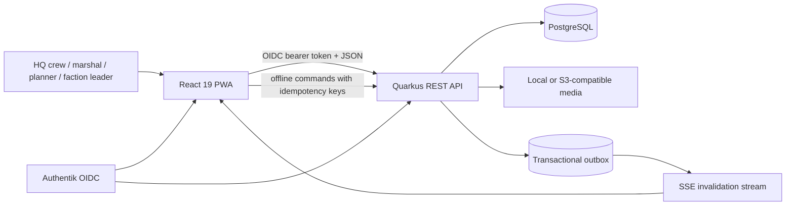

# Airsoft Inventory — Requirements and Current Architecture

> **Status:** Implemented architecture baseline, 2026-09-11
>
> **Purpose:** Normative requirements, architectural boundaries, invariants, and implementation traceability for the current repository.
> **Related detail:** [`docs/DOMAIN_ARCHITECTURE.md`](docs/DOMAIN_ARCHITECTURE.md), [`docs/DEPLOYMENT_STEP1.md`](docs/DEPLOYMENT_STEP1.md), and [`docs/DEPLOYMENT_STEP2.md`](docs/DEPLOYMENT_STEP2.md).

## 1. Scope and quality goals

The system manages equipment for recurring airsoft events: catalog and storage, faction demand, warehouse commissioning, custody handover, returns, loss and damage, maintenance, procurement, and immutable operational history.

The architecture prioritizes these qualities, in order:

1. **Inventory correctness:** a stock-changing command is atomic, idempotent where replay is possible, and checked under a database lock.
2. **Traceability:** every order transition and inventory movement records the authenticated actor, server timestamp, source aggregate, and quantity delta.
3. **Field resilience:** the PWA supports cached reads and a replayable offline command queue without weakening server-side validation.
4. **Explicit contracts:** REST DTOs, role names, media references, and service capabilities have one canonical representation.
5. **Extendability:** domain services own business rules, ORM classes own queries, resources own HTTP translation, and React hooks own server-state orchestration.
6. **Low boilerplate:** repeated CRUD mechanics are shared only where endpoint capabilities genuinely match.

## 2. System context



The application is a modular monolith. This is deliberate: inventory, orders, damage, and maintenance require local ACID transactions and do not benefit from distributed write coordination at the current scale.

## 3. Functional requirements and implementation status

| ID | Requirement | Status | Primary implementation |
|---|---|---:|---|
| CAT-01 | Maintain items, images, categories, event tags, hints, value, and storage location | Implemented | `CatalogResource`, `CatalogService`, `Item`, Items UI |
| CAT-02 | Maintain assemblies with fixed component quantities | Implemented | `Assembly`, catalog service, Assemblies UI |
| CAT-03 | Consolidated serialized item tracking: single parent catalog entry with aggregate stock, min-stock alerting, asset ID provisioning, and instance drill-down | Planned | `CatalogService`, `AssetInstance`, Items UI |
| LOC-01 | Maintain hierarchical/georeferenced storage and pickup locations | Implemented | `StorageLocation`, map components, pickup map dialog |
| INV-01 | Distinguish total owned, on-hand, checked-out, damaged, reserved, and available stock | Implemented | `InventoryOperationsService.StockState`, `StockDto` |
| INV-02 | Block over-allocation and unsafe/overdue checkout | Implemented | locked transaction paths and maintenance guard |
| INV-03 | Require event and faction context for every direct checkout and retain that context on the immutable transaction | Implemented | `TransactionForm`, assembly checkout, `InventoryOperationsService`, `StockTransaction` |
| INV-04 | Enforce tracking mode immutability once stock/movements exist; prohibit quantity-only mutations on serialized assets and support faction batching | Planned | `CatalogService`, `InventoryOperationsService`, `OrderService` |
| ORD-01 | Support `draft → submitted → preparing → ready → picked_up → partially_returned/returned → closed` plus cancellation | Implemented | `OrderService`, order resources and hooks |
| ORD-02 | Commission individual items and assemblies on desktop and mobile | Implemented | `OrderPickListTable` |
| ORD-03 | Reserve prepared quantities and atomically convert them to custody on pickup | Implemented | reservations, order service, stock transactions |
| ORD-04 | Reconcile returned, consumed, missing, damaged, and written-off units | Implemented | `OrderReturnChecklist`, return service path |
| ORD-05 | Compare the current order with the previous event-year baseline | Implemented | `OrderTraceability`, `factionOrderHistory.ts` |
| ORD-06 | Resolve item QR codes directly to stock handling, show checked-out quantity, and reconcile returns against an optional originating order | Implemented | QR resolver, `TransactionForm`, faction-order return endpoint |
| AUD-01 | Preserve append-only order history with actor, timestamp, action, note, and delta | Implemented | `FactionOrderHistory`, mapper, `OrderTraceability` |
| AUD-02 | Display create/prepare/ready/pickup/return actors and timestamps | Implemented | `OrderTraceability` |
| DAM-01 | Report, repair, verify, and write off damaged stock without creating stock | Implemented | damage service/resource and regression tests |
| MNT-01 | Track maintenance cycles and block checkout where required | Implemented | maintenance models and operations service |
| PRC-01 | Calculate demand deficit against total owned stock | Implemented | procurement service/resource and UI |
| OFF-01 | Queue supported field commands offline and replay them idempotently | Implemented | IndexedDB queue, `/api/sync`, command IDs |
| OFF-02 | Keep filtered offline catalogs isolated by normalized query | Implemented | query-scoped keys in `resourceFactory.ts` |
| SEC-01 | Authenticate with Authentik OIDC and authorize on the server | Implemented | Quarkus OIDC and `ActorService` |
| SEC-02 | Use only canonical roles and namespaced Authentik groups | Implemented | Section 6 |
| API-01 | Return explicit DTOs; never serialize persistence entities directly | Implemented | `ApiResponses` and `ApiMapper` |
| API-02 | Expose only supported operations in each frontend API contract | Implemented | capability interfaces in `resourceFactory.ts` |

## 4. Architectural boundaries

### 4.1 Backend

```text
resource/          HTTP routes, validation, authorization entry points, DTO mapping
service/           use cases, transactions, invariants, domain-event creation
orm/               persistence queries, locks, aggregate loading
model/             JPA entities and canonical enums
helper/security/   authenticated actor and RBAC policy
helper/storage/    canonical object-key media access
resource/dto/      public response contracts
```

Rules:

- A REST resource must not contain stock arithmetic or lifecycle decisions.
- A service transaction owns all writes for one use case and emits its outbox event in that transaction.
- ORM access stays behind focused ORM collaborators; entities do not provide active-record methods.
- API responses are mapped DTOs. Associations are expanded intentionally, never through incidental entity serialization.
- Stock and order commands lock the affected aggregate before validating quantities.

### 4.2 Frontend

```text
pages/             route composition and user workflows
components/        focused forms, lists, dialogs, and order-detail sections
hooks/             React Query orchestration and cache invalidation
services/          HTTP contracts, payload mapping, offline integration
types/             canonical client contracts
utils/             pure stock, access, naming, and order calculations
store/             client-only UI state
```

The service factory is capability-based:

- `CreateResourceApi`: list and create only.
- `MutableResourceApi`: list, detail, create, and update.
- `CrudResourceApi`: full list/detail/create/update/delete behavior.

Transactions, damage reports, and general orders therefore cannot acquire unsupported update/delete calls through a generic type. Realtime invalidation is handled centrally rather than by fabricated per-resource records.

## 5. Inventory semantics

For a bulk item, the authoritative read model is:

```text
onHand = inbound ledger movements - outbound ledger movements
checkedOut = checkout - checkin - consumed - missing
totalOwned = onHand + checkedOut
available = max(0, onHand - unresolvedDamage - activeReservations)
```

Invariants:

- `totalOwned` includes material currently in custody; valuation and procurement must not treat checkout as loss.
- `onHand` is physically at an inventory location.
- `available` is the only quantity allocatable to a new order.
- Damage repair changes condition, not physical quantity.
- A write-off is the explicit operation that reduces owned stock.
- Serialized items require asset-specific transactions; quantity-only stock movements and order handovers are rejected.
- Direct checkout commands require an event and faction snapshot. Order checkout and return transactions derive the same snapshot from their source order.
- A return associated with a faction order must use the order reconciliation use case; the generic transaction endpoint rejects order-linked stock changes.

The item collection is intentionally **not server-cached** because it carries dynamic stock. Its stock projection is computed with three grouped queries—transaction totals, unresolved damage, and active reservations—rather than per-item queries. Stable catalog collections may use server caching and ETags.

### 5.1 Serialized inventory and tracking mode rules

1. **Tracking mode transition guard (immutability with stock):**
   - Changing `trackingMode` from `bulk` or `lot_tracked` to `serialized` (or vice-versa) on an item that has existing stock (`baseAmount > 0` or current stock ledger entries) is **strictly prohibited**.
   - Attempting to switch an existing item with stock to serialized mode must be blocked at both the API (`CatalogService`) and UI (`ItemForm`) layers. Mutating existing bulk stock to serialized without registered asset IDs produces orphaned stock and breaks the physical identity invariant.
   - An item may only be configured as serialized at creation or when current and historical stock is zero, unless an explicit guided migration tool is used to register individual physical asset IDs for all existing units.

2. **Parent catalog aggregation and minimum stock:**
   - To keep the catalog concise, serialized equipment (e.g., 5 power generators or 50 walkie-talkies) exists as a **single consolidated parent catalog item** rather than cluttering the catalog with separate rows per physical unit.
   - The parent item carries aggregate inventory metrics (`totalOwned`, `onHand`, `available`) alongside threshold alerting (`minStock`). For example, an aggregate power generator item tracks 5 total units and alerts when available operational units fall below `minStock = 2`.
   - Creating serialized stock requires defining or generating asset identifiers rather than assigning an anonymous scalar count. Minimum stock remains an aggregate threshold for the equipment model, not a per-asset flag.

3. **Sub-group asset instance drill-down:**
   - Selecting a serialized item in the catalog opens a detailed drill-down view of its child physical units (`AssetInstance`).
   - Each unit in the sub-group displays:
     - Canonical Asset ID / QR code (e.g., `GEN-001` .. `GEN-005` or `WT-001` .. `WT-050`) and optional manufacturer serial number;
     - Current operational and availability state (available, reserved, checked out / in custody, in repair, maintenance due, damaged);
     - Current storage location, operating hours, and active custodian.
   - The UI provides batch generation (e.g., prefix + sequential numbering) and manual barcode/QR scanning to easily register multiple asset IDs upon item creation or intake.

4. **Event allocation and faction distribution batching:**
   - High-value serialized items often need to be distributed in subsets to multiple factions during events (e.g., 50 walkie-talkies partitioned into batches of 10 for different faction headquarters).
   - Order commissioning and custody handovers must support selecting or assigning batches of specific serialized assets to faction orders, while maintaining 100% individual asset identity and return reconciliation for each handed-over unit.

## 6. Authentication and authorization

Production authentication uses Authentik OIDC bearer tokens. Development header authentication exists only when `inventory.dev-auth.enabled=true` and uses the same canonical roles.

| Canonical role | Authentik group | Scope |
|---|---|---|
| `hq_admin` | `inventory_hq_admin` | users and all operational functions |
| `warehouse_crew` | `inventory_warehouse_crew` | catalog, warehouse, commissioning |
| `marshal` | `inventory_marshal` | handover and reconciliation |
| `event_planner` | `inventory_event_planner` | events and planning |
| `maintenance_crew` | `inventory_maintenance_crew` | maintenance and damage workflows |
| `faction_leader` | `inventory_faction_leader` | assigned factions only |
| `read_only` | `inventory_read_only` | read-only operational visibility |

There are no aliases for earlier role names, unprefixed identity-provider groups, local-storage token formats, or URL-form media references. Unknown roles are least-privilege `faction_leader`; authorization is still enforced at every protected backend use case. Existing installations must transform invalid role data before deploying this version—runtime compatibility is intentionally absent.

## 7. Order lifecycle and traceability

Order lines use one canonical handover quantity: `handedOverQuantity`. Requested and prepared values remain distinct, and reconciliation is measured against handed-over units.

Every transition appends a history entry with:

- authenticated actor ID and display name;
- server-generated UTC timestamp;
- action and optional note;
- from/to lifecycle state where applicable;
- item/assembly additions, removals, and before/after quantity changes;
- idempotency key for replayable commands.

The detail UI exposes the immutable history, lifecycle actors, timestamps, and the previous comparable faction order. Editing a current order never overwrites its prior history snapshots. Item QR codes open the transaction workflow directly; returns show the total quantity currently out and offer only picked-up orders with an outstanding quantity for that item. Selecting an order records the return through its reconciliation aggregate rather than creating an unrelated stock entry.

## 8. Offline and consistency model

- The server remains authoritative; cached client data never bypasses server validation.
- Supported offline writes receive a client command/idempotency key.
- Replay is atomic per command. A rejected command rolls back its partial changes and is surfaced as a conflict.
- Catalog fallback entries are keyed by resource plus sorted query arguments, so filters cannot return another query's cached result.
- The transactional outbox publishes invalidation events after commit; SSE tells clients which query families to refresh.
- Dynamic stock is fetched live after invalidation and is not hidden behind the catalog response cache.

## 9. Persistence and schema state

The runtime uses plain Jakarta Persistence/Hibernate ORM with PostgreSQL. Panache is not part of the persistence model. Production currently uses Hibernate schema management with `strategy=update`; Flyway dependencies are present but automatic migration is disabled and no versioned migration set is committed.

This is the principal remaining production-hardening debt. Before a multi-node or audited production rollout, replace schema update with reviewed, forward-only Flyway migrations and include a deployment migration that converts any non-canonical role values before the application starts. Until then, database backup and restore validation are deployment prerequisites.

Core persisted concepts include users, storage locations, items and images, assemblies and components, event occurrences and factions, faction orders and normalized lines, reservations, custody handovers, reconciliations, stock transactions (including immutable event/faction checkout snapshots), damage reports, maintenance, and domain outbox events.

## 10. Media contract

Database records contain canonical relative object keys only, for example `items/<uuid>/<uuid>.webp`. API media URLs are generated by the client against `/api/media/{key}`. Absolute or external URLs are rejected by the media boundary; the backend does not infer keys from historical public URLs.

## 11. Verification and finding traceability

| Finding | Resolution | Regression evidence |
|---|---|---|
| P1 — mobile commissioning controls missing | Responsive quantity chips and prepare controls restored for items and assemblies | TypeScript production build |
| P1 — cached dynamic stock and N+1 calculation | Item collection bypasses server response cache; grouped stock projection added | `itemListReturnsLiveOwnedAndOnHandStockAfterCheckout` |
| P1 — total stock dropped checked-out units | DTO separates `totalOwned` and `onHand`; valuation/procurement use owned stock | same stock regression test |
| P1 — order traceability removed | Actor cards, previous-order diff, and immutable history extracted to `OrderTraceability` | TypeScript production build |
| P2 — offline cache ignored filters | Stable sorted query tuple is part of the IndexedDB cache key | TypeScript production build |
| P2 — destructive dialog used for checkout | Action-neutral `ConfirmDialog` with explicit label, tooltip, and color | TypeScript production build |
| P2 — generic API advertised unsupported CRUD | Capability-specific APIs and hooks introduced | TypeScript compiler |
| P2 — Panache dependency without a Panache model | Panache dependency and entity inheritance removed | Maven clean test |
| Legacy authentication/authorization | Old local storage reads, old enum values, role aliases, and old group mappings removed | `ActorServiceRoleTest`, API auth test |
| Legacy order/media representations | old pickup quantity fallback and URL-to-key conversion removed | order/API tests and `MediaServiceTest` |
| QR return lacked custody context | Scan opens the transaction dialog, shows checked-out quantity, filters eligible orders, and routes selected returns through order reconciliation | TypeScript production build and order API tests |
| Checkout lacked event/faction traceability | UI requires both fields; API rejects context-free checkout; transaction response exposes the stored snapshot | `itemListReturnsLiveOwnedAndOnHandStockAfterCheckout` |
| General orders tab remained inactive | Canonical `tab=general` URL state replaces the contradictory empty-query fallback | TypeScript production build |
| Dense assembly media layout | Image, event tags, description, instruction, and metrics share one responsive summary panel | TypeScript production build |

Required verification before merge:

```powershell
npm.cmd run build
npm.cmd run lint
cd backend
mvn.cmd clean test
```

## 12. Deliberate next priorities

These are not compatibility work and are not represented as already implemented:

1. Adopt forward-only Flyway migrations and disable Hibernate schema mutation in production.
2. Generate the TypeScript transport models from the OpenAPI document to reduce remaining manual DTO duplication.
3. Add browser-level tests for mobile commissioning, offline filtered reads, and the traceability panel.
4. Validate backup restore, outbox recovery, and offline-conflict workflows in a production-like environment.
5. Add route-level code splitting to reduce the largest frontend bundle.
6. Refactor `TrackingMode` and serialized inventory: prohibit tracking mode mutation on items with stock, consolidate serialized assets into parent catalog entries with instance drill-down, support asset ID batch registration, and enable faction batch distribution.
