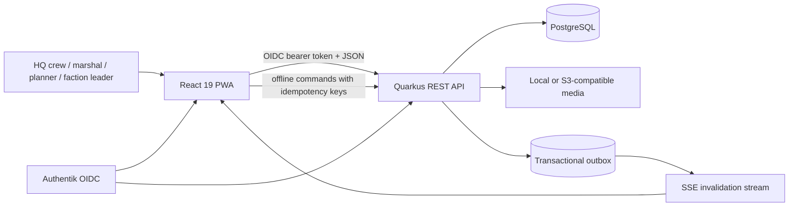

# Airsoft Inventory — Requirements and Current Architecture

> **Status:** F01–F23 present in source; consolidation and private-inventory access reviewed 1 October 2026; private inventory/sharing implemented; automated privacy regressions and PostgreSQL schema validation passed; browser/load acceptance pending
>
> **Purpose:** Normative requirements, architectural boundaries, invariants, and implementation traceability for the current repository.
> **Related detail:** [`docs/DOMAIN_ARCHITECTURE.md`](docs/DOMAIN_ARCHITECTURE.md), [`docs/DEPLOYMENT_STEP1.md`](docs/DEPLOYMENT_STEP1.md), and [`docs/DEPLOYMENT_STEP2.md`](docs/DEPLOYMENT_STEP2.md).

## 1. Scope and quality goals

The system manages equipment for recurring airsoft events: catalog and storage, faction demand, warehouse commissioning, custody handover, returns, loss and damage, maintenance, procurement, and immutable operational history.

The architecture prioritizes these qualities, in order:

1. **Inventory correctness:** a stock-changing command is atomic, idempotent where replay is possible, and checked under a database lock.
2. **Traceability:** every order transition and inventory movement records the authenticated actor, server timestamp, source aggregate, and quantity delta.
3. **Field resilience:** the PWA supports cached reads and a replayable offline command queue without weakening server-side validation.
4. **Explicit contracts:** REST DTOs, role names, media references, and service capabilities have one canonical representation.
5. **Extendability:** domain services own business rules, ORM classes own queries, resources own HTTP translation, and React hooks own server-state orchestration.
6. **Low boilerplate:** repeated CRUD mechanics are shared only where endpoint capabilities genuinely match.

## 2. System context


```mermaid
flowchart LR
    User[HQ crew / marshal / planner / faction leader] --> PWA[React 19 PWA]
    PWA -->|OIDC bearer token + JSON| API[Quarkus REST API]
    PWA -->|offline commands with idempotency keys| API
    API --> DB[(PostgreSQL)]
    API --> Media[Local or S3-compatible media]
    API --> Outbox[(Transactional outbox)]
    Outbox --> SSE[SSE invalidation stream]
    SSE --> PWA
    Auth[Authentik OIDC] --> PWA
    Auth --> API
```

The application is a modular monolith. This is deliberate: inventory, orders, damage, and maintenance require local ACID transactions and do not benefit from distributed write coordination at the current scale.

## 3. Functional requirements and implementation status

### Current delivery status — 1 October 2026

F01–F23 have frontend workflows and backend implementations in source. The [repository review](docs/REPOSITORY_REVIEW.md) consolidates their ownership map, operational semantics, source-confirmed defects, C01–C09 status and verification limits. Source presence does not imply conformance with every requirement.

| Area | Current state |
|---|---|
| F01–F18 | Event planning/results, purchasing/receiving, location stock, transfers/counts/lots, orders/custody, repairs/maintenance, hierarchy, offline correction, reporting and operator tools present |
| F19–F23 | Ownership/commitments, member self-service, action inbox/reminders, camera/code management and borrowing/rental lifecycle present |
| Private inventory and sharing | Account-owned private items/locations, owner self-service, multiple person/group view/edit grants, admin-managed share groups, revocation, audit/revision control and resource-associated media implemented. Warehouse roles have no private bypass. Source boundaries and runtime acceptance limits are documented in Sections 5.4 and 6.1. |
| Consolidation | One disposable SQL baseline; shared query feedback, snackbar, catalog dialogs and warehouse service; unused catalog view and CRUD aliases removed; category/catalog/general-order persistence follows ORM boundaries |
| Architectural gaps | Original A01–A06, P01–P05 and U01–U02 fixes confirmed in source: scoped REST assembly reads, session isolation, stock/count/return policy, batch projections, report filtering/export, invalidation and preparation/exact-detail cache changes. MCP R01/R02 fixes now authenticate production transport and delegate authorized catalog/stock use cases with scoped reads and outbox publication. Remaining source gaps are report contributor-hold parity, cold-start collection scheduling, camera deployment policy and inbox query fan-out. |
| Verification | On 1 October 2026: 111 backend tests passed on PostgreSQL 17, including 8 private-inventory API cases and canonical Flyway baseline/Hibernate schema validation; 18 client tests, backend packaging, frontend production build and full src lint passed after incorporating current main. Coverage includes sharing, edit/management separation, personal/group revocation, a simultaneous edit/group-revocation case, independent location disclosure, media authorization, codes/history, report cache isolation, offline protection and account isolation. Browser visual acceptance, S3 integration and load/performance traces remain pending. |

“Implemented” below means source coverage, not release verification. Earlier build/test results do not validate subsequent changes.

### Requirement traceability

| ID | Requirement | Status | Primary implementation |
|---|---|---:|---|
| CAT-01 | Maintain items, images, categories, event tags, hints, value, and storage location | Implemented | `CatalogResource`, `CatalogService`, `Item`, Items UI |
| CAT-02 | Maintain assemblies with fixed component quantities | Implemented | `Assembly`, catalog service, Assemblies UI |
| CAT-03 | Consolidated serialized item tracking: single parent catalog entry with aggregate stock, min-stock alerting, asset ID provisioning, and instance drill-down | Implemented | `CatalogService`, `AssetInstance`, Items UI |
| CAT-04 | Provide an item details view in which free-form product information and category-specific operational data can be added and reviewed | Implemented | `ItemDetail`, `ItemForm`, `Item`, maintenance query |
| CAT-05 | Support shared/event catalogs and private items visible to their owner, administrators and explicitly authorized people/groups | Implemented | `InventoryAccessPolicy`, `InventoryAccess`, scoped `CatalogOrm`, `InventorySharing`; public/event visibility remains separate |
| CAT-06 | Category-aware fields include vehicle fuel consumption and battery replacement date, generator running hours and maintenance log, and food best-before date | Implemented | `Item`, `ItemForm`, `ItemDetail`, `MaintenanceRecord` |
| LOC-01 | Maintain hierarchical/georeferenced storage and pickup locations | Implemented | `StorageLocation`, map components, pickup map dialog |
| LOC-02 | Track private storage locations with account-linked ownership and explicit user/group access; protect address, coordinates, overlays and contents | Implemented | `StorageLocation.accessPolicy`, scoped location reads, `ApiMapper` whereabouts/parent redaction, associated overlay media and sharing UI |
| OWN-01 | Link privately owned items to a real user account independently of owner display name, keeper, physical location and current custodian | Implemented | `InventoryAccessPolicy.owner` references `UserAccount`; ownership/keeper/custody display fields remain independent |
| OWN-02 | Let individual users create and maintain their own private items and locations without requiring warehouse privileges | Implemented | `CatalogService`, catalog routes/forms, private asset/lot/code editing and direct stock commands authorize the owner or an edit grant |
| INV-01 | Distinguish total owned, on-hand, checked-out, damaged, reserved, and available stock | Implemented | `InventoryOperationsService.StockState`, `StockDto` |
| INV-02 | Block over-allocation and unsafe/overdue checkout | Implemented | locked transaction paths and maintenance guard |
| INV-03 | Require event and faction context for every direct checkout and retain that context on the immutable transaction | Implemented | `TransactionForm`, assembly checkout, `InventoryOperationsService`, `StockTransaction` |
| INV-04 | Enforce tracking mode immutability once stock/movements exist; prohibit quantity-only mutations on serialized assets and support faction batching | Implemented | `CatalogService`, `InventoryOperationsService`, `OrderService` |
| ORD-01 | Support `draft → submitted → preparing → ready → picked_up → partially_returned/returned → closed` plus cancellation | Implemented | `OrderService`, order resources and hooks |
| ORD-02 | Commission individual items and assemblies on desktop and mobile | Implemented | `OrderPickListTable` |
| ORD-03 | Reserve prepared quantities and atomically convert them to custody on pickup | Implemented | reservations, order service, stock transactions |
| ORD-04 | Reconcile returned, consumed, missing, damaged, and written-off units | Implemented | `OrderReturnChecklist`, return service path |
| ORD-05 | Compare the current order with the previous event-year baseline | Implemented | `OrderTraceability`, `factionOrderHistory.ts` |
| ORD-06 | Resolve item SKU/QR, serialized asset code, and exact order code through targeted server queries; open stock handling, show checked-out quantity, and reconcile returns against an optional originating order | Implemented | `codeResolver.ts`, inventory/order services, `TransactionForm`, faction-order return endpoint |
| RET-01 | Define the expected return location per item and allow the returning person to attach an image showing where the item was placed | Implemented | `Item.returnLocation`, `ReturnSubmission`, `ReturnSubmissionForm`, media service |
| RET-02 | Keep submitted returns out of available/on-hand stock until a warehouse worker acknowledges them; provide a separate pending/history view with accept and reject actions | Implemented | `ReturnSubmissionService`, `/api/returns`, `ReturnedItems`, stock transaction/order reconciliation services |
| AUD-01 | Preserve append-only order history with actor, timestamp, action, note, and delta | Implemented | `FactionOrderHistory`, mapper, `OrderTraceability` |
| AUD-02 | Display create/prepare/ready/pickup/return actors and timestamps | Implemented | `OrderTraceability` |
| DAM-01 | Report, repair, verify, and write off damaged stock without creating stock | Implemented | damage service/resource and regression tests |
| DAM-02 | Record a resolution comment describing the action taken and optionally update the affected item's hint | Implemented | `DamageReportsList`, damage resolution DTO/service, item hint |
| MNT-01 | Track maintenance cycles and block checkout where required | Implemented | maintenance models and operations service |
| PRC-01 | Calculate demand deficit against usable on-hand stock and expose the planning workflow only to planners and administrators | Implemented | procurement service/resource, `ProcurementGuard`, navigation policy, and UI |
| PRC-02 | Record external orders for shortages with supplier, order date, ordering user, quantity, unit price, reference, and expected delivery; link shortage and order rows to item detail | Implemented | `Procurement`, `ProcurementOrders`, purchasing API |
| PRC-03 | Show outstanding ordered units separately as in transit on item stock and procurement views; exclude them from on-hand, owned, and available until goods receipt | Implemented | purchase order line aggregate, item stock DTO, deficit response, item detail |
| OFF-01 | Queue supported field commands offline and replay them idempotently | Implemented | IndexedDB queue, `/api/sync`, command IDs |
| OFF-02 | Keep filtered offline catalogs isolated by normalized query | Implemented | query-scoped keys in `resourceFactory.ts` |
| SEC-01 | Authenticate with Authentik OIDC and authorize on the server | Implemented | Quarkus OIDC and `ActorService` |
| SEC-02 | Use only canonical roles and namespaced Authentik groups | Implemented | Section 6 |
| SEC-03 | Default new private items/locations to owner and `hq_admin` access; other staff roles require an explicit grant | Implemented | `InventoryAccess` and ORM visibility predicates; only `hq_admin` has implicit private access |
| SEC-04 | Allow owners/admins to grant and revoke view access for multiple people and groups on each private item/location | Implemented | `InventoryAccessService`, `/api/access`, `InventorySharing`, `InventoryAccessGroups`; view is the default grant |
| SEC-05 | Separate view, private-record editing, sharing administration and inventory-operation permissions; prevent viewers from escalating access | Implemented | Owner/admin policy management, view/edit grants and command interceptor preserve existing operational role/consent checks |
| SEC-06 | Apply one resource policy to REST/MCP, nested records, search, stock, reports/exports, media and realtime delivery | Implemented | Scoped primary queries, entity-reference protection, response projection defense, actor/access-scoped report filtering, authorized media and scoped MCP catalog/stock paths |
| SEC-07 | Audit permission/owner changes, reject stale concurrent changes and revalidate access at each server operation | Implemented | Locked access policies/groups, revision checks, validated principals and immutable `access.changed` before/after audit events |
| SEC-08 | Scope caches to access context and invalidate restricted data after permission/group changes; define offline revocation limits | Implemented | Private no-store responses, resource-free SSE invalidation, query/media refresh, private durable-cache/queue exclusion and current-access report filtering |
| API-01 | Return explicit DTOs; never serialize persistence entities directly | Implemented | `ApiResponses` and `ApiMapper` |
| API-02 | Expose only supported operations in each frontend API contract | Implemented | capability interfaces in `resourceFactory.ts` |

Counts, transfers, purchasing, custody, and stock management have backend modules and frontend operational workflows. Procurement supports editable purchase drafts and ordering; warehouse users receive deliveries from purchase details. Operations provides role-specific access to warehouse, purchasing, lifecycle and recovery tasks. All schema definitions are in the canonical disposable baseline; fresh PostgreSQL initialization and Hibernate entity validation passed in `BaselineSchemaTest`.

## 4. Architectural boundaries

### 4.1 Backend

```text
resource/          HTTP routes, validation, authorization entry points, DTO mapping
service/           use cases, transactions, invariants, domain-event creation
orm/               persistence queries, locks, aggregate loading
model/             JPA entities and canonical enums
helper/security/   authenticated actor and RBAC policy
helper/storage/    canonical object-key media access
resource/dto/      public response contracts
```

Rules:

- A REST resource must not contain stock arithmetic or lifecycle decisions.
- A service transaction owns all writes for one use case and emits its outbox event in that transaction.
- ORM access stays behind focused ORM collaborators; entities do not provide active-record methods.
- API responses are mapped DTOs. Associations are expanded intentionally, never through incidental entity serialization.
- Stock and order commands lock the affected aggregate before validating quantities.

### 4.2 Frontend

```text
pages/             route composition and user workflows
components/        focused forms, lists, dialogs, and order-detail sections
hooks/             React Query orchestration and cache invalidation
services/          HTTP contracts, payload mapping, offline integration
types/             canonical client contracts
utils/             pure stock, access, naming, and order calculations
store/             client-only UI state
```

The service factory is capability-based:

- `CreateResourceApi`: list and create only.
- `MutableResourceApi`: list, detail, create, and update.
- `CrudResourceApi`: full list/detail/create/update/delete behavior.

Transactions, damage reports, and general orders therefore cannot acquire unsupported update/delete calls through a generic type. Realtime invalidation is handled centrally rather than by fabricated per-resource records.

Additional frontend rules:

- Route pages are loaded with `React.lazy` behind the application `Suspense` boundary. The login page is imported statically so authentication fallback rendering never depends on that boundary.
- Pages and generic utilities do not call the HTTP client directly. Services own transport contracts, including item/SKU, asset-code, and exact order-code resolution.
- The `stock` projection returned with an item is authoritative. The client must not download global transaction, damage, or order ledgers merely to recompute current stock.
- Route access and navigation visibility share the same access helpers. Hiding a navigation entry is a UX measure only; the backend remains the authorization boundary.
- React Compiler supplies render memoization through `reactCompilerPreset()` and the `react-compiler/react-compiler` lint rule at error level. Compute values directly during render; do not introduce manual `useMemo`, `useCallback` or `React.memo` by default. Current source still uses `useMemo` in CSV planning and `useCallback` in the object URL subscription hook. These are existing exceptions to review, not evidence of universal removal; subscription identity and resource cleanup must remain correct when changing that hook.
- When an effect must invoke a render-scoped function without making that function a reactive dependency, use `useEffectEvent`. It is the sanctioned replacement for the `useCallback` that the compiler no longer needs.
- Client-side pagination of already-loaded collections goes through `useClientPagination`. `SHOW_ALL_PAGE_SIZE` (`-1`) is the canonical "all entries" sentinel and must keep working; the hook clamps the current page during render rather than syncing it in an effect.
- Heavy dependencies that are needed only by an explicit user action are imported with `await import()` inside the handler that needs them, never at module scope. `jspdf` (with its `html2canvas` and `dompurify` transitives) is the current example.

## 5. Inventory semantics

For a bulk item, the authoritative read model is:

```text
onHand = inbound ledger movements - outbound ledger movements
checkedOut = checkout - checkin - consumed - missing
totalOwned = onHand + checkedOut + inTransit
physicalAvailable = max(0, onHand - unresolvedDamage - activeReservations - blockedPositions)
```

`blockedPositions` excludes quarantined or unusable lot stock without subtracting already-counted damage twice. Final `available` further applies active-item/maintenance, unresolved contributor-damage and ownership/commitment eligibility. An event-scoped projection may credit that order's reservation or eligible committed supply; cached or report quantities never replace command validation.

Invariants:

- `totalOwned` includes material currently in custody and organization stock in physical transfer; valuation and procurement must not treat checkout or transfer transit as loss.
- `onHand` is physically at an inventory location.
- `available` is the only quantity allocatable to a new order.
- `ordered` is the unreceived quantity on external purchase orders in `ordered` or `partially_received` status. It is shown as in transit and is excluded from physical, owned, and available stock until a goods receipt posts. Draft and cancelled orders do not contribute.
- Order preparation displays the authoritative `available` value. While editing an order that already owns an active reservation, the UI adds only that order's reservation back to the allocatable amount; it must not subtract all reservations a second time.
- Damage repair changes condition, not physical quantity.
- A write-off is the explicit operation that reduces owned stock.
- Serialized items require asset-specific transactions; quantity-only stock movements and order handovers are rejected.
- Direct checkout commands require an event and faction snapshot. Order checkout and return transactions derive the same snapshot from their source order.
- A return associated with a faction order must use the order reconciliation use case; the generic transaction endpoint rejects order-linked stock changes.

The item collection is intentionally **not server-cached** because it carries dynamic stock. Its projection batches ledger/damage/reservation aggregates, positions/lots, serialized assets, equipment/maintenance facts, images and outstanding purchase supply through explicit query assemblers. This is not a promise of three total statements; actual lazy loading and query cost require measurement. Stable catalog collections may use server caching and ETags; dynamic event metrics bypass the catalog ETag shortcut. Exact SKU/code resolution uses bounded server-side filters; barcode handling must not fetch an unbounded collection and search it in the browser.

### 5.1 Serialized inventory and tracking mode rules

1. **Tracking mode transition guard (immutability with stock):**
   - Changing `trackingMode` from `bulk` or `lot_tracked` to `serialized` (or vice-versa) on an item that has existing stock (`baseAmount > 0` or current stock ledger entries) is **strictly prohibited**.
   - Attempting to switch an existing item with stock to serialized mode must be blocked at both the API (`CatalogService`) and UI (`ItemForm`) layers. Mutating existing bulk stock to serialized without registered asset IDs produces orphaned stock and breaks the physical identity invariant.
   - An item may only be configured as serialized at creation or when current and historical stock is zero. Register the individual physical asset IDs before issuing serialized stock.

2. **Parent catalog aggregation and minimum stock:**
   - To keep the catalog concise, serialized equipment (e.g., 5 power generators or 50 walkie-talkies) exists as a **single consolidated parent catalog item** rather than cluttering the catalog with separate rows per physical unit.
   - The parent item carries aggregate inventory metrics (`totalOwned`, `onHand`, `available`) alongside threshold alerting (`minStock`). For example, an aggregate power generator item tracks 5 total units and alerts when available operational units fall below `minStock = 2`.
   - Creating serialized stock requires defining or generating asset identifiers rather than assigning an anonymous scalar count. Minimum stock remains an aggregate threshold for the equipment model, not a per-asset flag.

3. **Sub-group asset instance drill-down:**
   - Selecting a serialized item in the catalog opens a detailed drill-down view of its child physical units (`AssetInstance`).
   - Each unit in the sub-group displays:
     - Canonical Asset ID / QR code (e.g., `GEN-001` .. `GEN-005` or `WT-001` .. `WT-050`) and optional manufacturer serial number;
     - Current operational and availability state (available, reserved, checked out / in custody, in repair, maintenance due, damaged);
     - Current storage location, operating hours, and active custodian.
   - The UI provides batch generation (e.g., prefix + sequential numbering) and manual barcode/QR scanning to easily register multiple asset IDs upon item creation or intake.

4. **Event allocation and faction distribution batching:**
   - High-value serialized items often need to be distributed in subsets to multiple factions during events (e.g., 50 walkie-talkies partitioned into batches of 10 for different faction headquarters).
   - Order commissioning and custody handovers must support selecting or assigning batches of specific serialized assets to faction orders, while maintaining 100% individual asset identity and return reconciliation for each handed-over unit.

### 5.2 Item detail, category data, and visibility

1. Every catalog item has a dedicated details route. In addition to stock, images, transactions, and serialized assets, it displays a free-form product description, expected return location, visibility assignment, and any applicable category-specific fields.
2. Category-specific fields are first-class typed data rather than prose-only conventions:
   - vehicles expose fuel consumption in litres per 100 km and the next battery replacement date;
   - generators expose current running hours, the next maintenance date/interval, and their maintenance-record history;
   - food exposes a best-before date.
3. The current implementation's `visibilityScope` is one of `global`, `event`, `person`, or `group`.
   - `event` requires at least one event type tag;
   - `person` requires an assigned user and is visible only to that user and inventory managers;
   - `group` requires an assigned group and is visible only to members of that group and inventory managers;
   - this assignment policy applies only to catalog entries without a private access policy. Private resources instead use account ownership and grants; only `hq_admin` has implicit administrative access under Section 6.1.
4. Collection and item-detail endpoints enforce the same visibility policy. Client-side hiding is not a security boundary.
5. `ownershipType=private_owner` currently controls ownership/availability rules, not confidentiality. An owner name, keeper assignment, storage location, commitment or loan must never be treated as an access grant. Sections 5.4 and 6.1 define the required private-resource behavior and supersede the existing manager bypass for private items.

### 5.3 Two-stage return intake

Returns initiated from a user's checked-out-item flow are submissions, not stock movements. A submission records the item, quantity or serialized asset, the person for whom it is returned, optional originating order, the item's configured return location, notes, and an optional placement image.

The return lifecycle is:

```text
checked out → return submitted (pending) → warehouse accepted → stock check-in/reconciliation
                                      └→ warehouse rejected → remains checked out
```

Invariants:

- A pending submission does not create a `checkin` transaction and does not increase on-hand or available stock.
- Pending serialized assets use `returned_pending_check`, which still counts as checked out and cannot be allocated.
- A worker acknowledgement is the only operation that invokes the canonical direct check-in or faction-order reconciliation path.
- Rejection restores a serialized asset to its prior checked-out state; bulk quantity remains unchanged throughout rejection.
- The submitted placement image is evidence for locating the physical item, not proof of stock acceptance.
- The separate returned-items view defaults to pending submissions and also exposes accepted/rejected history.

### 5.4 Private items, storage locations and owner self-service

These are required target behaviors, **not a claim of complete implementation**.

1. An authenticated user can register private items and private storage locations, track bulk/lot/serialized stock and find their current physical location through the system. Creation binds the resource to the authenticated owner's stable account ID and defaults to private access. A normal user cannot create resources owned by another account or change organizational inventory by supplying a different ID.
2. Private-resource ownership uses an account relationship. `ownerName` remains descriptive equipment data; keeper, assigned contributor, borrowing recipient and current custodian remain separate concepts. Ownership transfer requires owner/admin authorization, records old/new owners, revalidates outstanding stock/custody obligations and reviews existing shares without making the resource public.
3. The owner can maintain their own private catalog data, images, location and tracking records through dedicated authorized workflows. Stock changes retain the same atomicity, locks, asset identity and immutable movement evidence as organizational inventory. Private self-service does not confer warehouse, user-management or procurement privileges.
4. Item/location details provide an explicit sharing control for selecting multiple people and groups, reviewing effective access and its source, and removing grants. A viewer can find the item and its authorized current whereabouts. Viewing does not authorize editing, sharing, checkout, transfer or lending; operational consent/commitment rules continue to apply independently.
5. Private locations protect their descriptions, address, coordinates, map overlays and hierarchy details. Private contents in a shared warehouse remain hidden from users without item access. A location share does not grant access to independently private items stored there, and an item share does not grant access to unrelated items at the same location.
6. A new item created in private storage defaults to private access. Location hierarchy/access rules must be explicit: grants are resource-specific, with no implicit access to parents, children or siblings. Moving an item or changing a parent cannot silently widen item visibility.
7. To make an item share useful for locating it, the owner must explicitly authorize disclosure of its current whereabouts. If the location is independently private, its owner/admin must authorize that disclosure too. Without both authorizations, show the item with a restricted-location indicator and omit sensitive location fields. An authorized location projection reveals only the details needed to locate that item, not the location's other private contents.

#### Delivered access architecture — 1 October 2026

The earlier ownership feature provided descriptive owner/keeper fields and lending availability. Its single-user/faction visibility assignment, warehouse bypass and authentication-only location/media reads did not meet these requirements. The following source changes provide a separate privacy policy:

| Boundary | Current implementation |
|---|---|
| Ownership and grants | Each private item/location has its own `InventoryAccessPolicy`, stable owner account and revision. `InventoryAccessGrant` references exactly one user or `InventoryAccessGroup` and an optional edit capability. HQ admins manage group membership independently of faction/RBAC groups. |
| Creation and editing | Item/location forms default to private creation. Non-managers create private resources owned by their current account; public organization records retain manager checks. Private editors can maintain catalog data, lot/asset identities and labels. Privacy is immutable through ordinary catalog edits. |
| Whereabouts | Item and location grants are independent. `ApiMapper` omits inaccessible storage/return locations, position details and parent IDs; it supplies `locationRestricted` for a hidden current location. Viewing a location never grants private-item access. |
| Reads and indirect references | Catalog/category/lot/position/maintenance queries enforce resource visibility before pagination. `ActorService.protect` follows singular entity associations, including repair → damage → item and loan → commitment → item. `PrivacyProjectionService` expands related evidence IDs (aliases, history/aggregate references, inbox records) and conservatively omits an entire mixed record if unauthorized evidence remains. |
| Writes and concurrency | `PrivateInventoryCommandInterceptor` authorizes direct and related IDs before commands, locks referenced policies in stable order and requires edit access. The service rechecks locked records. Share updates and group membership edits lock policies, reject stale revisions and record actor/reason/before/after evidence. Private access supplements the existing role and lending-consent rules. |
| Owner transfer | HQ admins can transfer the account owner with an audit reason. Items must have no outstanding custody/reservations/transit/current commitments; locations must be empty. Grants remain explicit and are reviewed in the same save. |
| Media and reports | `InventoryMediaObject` binds staged uploads to the uploader and attached item/location/return/assembly/maintenance media to their resource. Downloads authorize current access and use no-store headers. Reports filter protected rows before totals, pagination and export; cached variants include the actor and denied-reference set. |
| Browser and realtime | SSE carries resource-free `access.invalidated` messages. Private responses bypass conditional/durable catalog caches, and known private commands cannot enter the offline queue. Query snapshots and media object URLs refresh every 60 seconds, clear on offline/session change, and invalidate on live access events and foreground/reconnection. |

Private administration and private inventory writes are online-only. Existing public offline commands still revalidate server permissions when replayed. A disconnected device cannot receive revocation events, and downloaded/exported copies cannot be recalled. The 60-second refresh bounds active browser query/media snapshots; browser suspension can delay timers, so foreground/reconnect triggers revalidation. Query eviction does not erase copies a user already downloaded or manually copied.

Organizational bulk category-maintenance changes update public items; private records retain their owner's settings. Aggregate order/count/transfer/purchase lists exclude denied related IDs before pagination. The response projection check additionally protects immutable history and mixed nested evidence.

The implementation passes automated PostgreSQL and client regressions, including a simultaneous edit/group membership revocation case and local media authorization. PostgreSQL baseline initialization and Hibernate schema validation passed. Browser visual acceptance, concurrency under load, S3 storage integration and production-scale performance of related-reference filtering still need acceptance. Conservative mixed-record omission can shorten legacy lists when only their history exposes a protected reference; query optimization must preserve confidentiality and correct visible totals.

## 6. Authentication and authorization

Production authentication uses Authentik OIDC bearer tokens. Development header authentication exists only when `inventory.dev-auth.enabled=true` and uses the same canonical roles.

| Canonical role | Authentik group | Scope |
|---|---|---|
| `hq_admin` | `inventory_hq_admin` | users and all operational functions |
| `warehouse_crew` | `inventory_warehouse_crew` | catalog, warehouse, commissioning |
| `marshal` | `inventory_marshal` | handover and reconciliation |
| `event_planner` | `inventory_event_planner` | events, planning, and procurement deficits |
| `maintenance_crew` | `inventory_maintenance_crew` | maintenance and damage workflows |
| `faction_leader` | `inventory_faction_leader` | assigned factions only |
| `read_only` | `inventory_read_only` | read-only organizational visibility; own/shared private resources use their explicit policy |

There are no aliases for earlier role names, unprefixed identity-provider groups, local-storage token formats, or URL-form media references. Unknown roles are least-privilege `faction_leader`; authorization is still enforced at every protected backend use case. Disposable databases must be recreated with canonical role data; runtime compatibility is intentionally absent.

### 6.1 Private-resource authorization and sharing

Private-resource authorization combines existing role permissions with an explicit resource access policy. **Only `hq_admin` has an implicit bypass for private items and locations.** No warehouse, marshal, planner, maintenance, read-only or faction role grants private access by itself.

| Actor/access source | View private resource | Edit private record | Manage shares/ownership | Perform stock/custody/lending operations |
|---|---|---|---|---|
| Owner account | Yes | Own resource | Shares; owner transfer requires `hq_admin` | Authorized own-resource workflows and existing domain invariants |
| `hq_admin` | Yes | Yes | Yes, audited | Existing role permissions and domain invariants |
| Explicitly shared user/group member | Yes | Only with a separate explicit edit grant | No | Only with explicit resource authorization, applicable workflow permissions and lending consent |
| Other authenticated users, including staff | No | No | No | No |

Required policy and enforcement rules:

- **Stable principals and validated grants:** Private items and locations reference an owner account. Share grants reference stable user or group IDs, resource ID/type and capability (`view` by default; editing is separate). Store who granted access and when in immutable access-change events. Validate existing account/group principals, prevent duplicate grants and reject arbitrary group strings. Groups need a canonical identity and authoritative membership source, independent of RBAC role groups. Reuse faction groups only through explicit validated mappings. Group administration must not let a user self-enrol into a group with existing shares.
- **Explicit effective access:** Owner/admin access and active direct/group grants determine resource visibility. An owner/admin can grant or revoke sharing. Delegated editing never includes permission administration or ownership transfer. Removing one grant leaves any other valid grant in effect; the UI identifies each remaining access source. Local share-group membership is checked from the database on every authorization; changes emit live invalidation and the browser has a 60-second query/media refresh fallback.
- **Consistent server boundary:** A shared policy service defines resource decisions; ORM queries apply equivalent predicates before pagination, counts and aggregation. Every use case rechecks the authenticated actor, including writes, exact-ID/SKU/QR lookup, nested assemblies, assets, positions/lots, custody, returns, maintenance, planning, contributor views, reports/CSV/PDF, MCP tools/resources and media. A private item requires item authorization; location fields additionally require the disclosure authorization from Section 5.4. Unauthorized detail/media requests use a non-disclosing not-found response; lists, autocomplete, totals, category choices and maps exclude unauthorized evidence.
- **Media association:** Protected object keys resolve to their owning item/location/return record and use that record's current policy. A guessed key, a cached catalog reference or an authentication token alone cannot authorize a download. Staged uploads belong to their uploader; attachment and deletion require the relevant resource capability. Public object storage or direct media URLs must not bypass the application policy.
- **Revision and audit:** Permission changes lock/version the access policy, reject stale revisions and atomically record actor, timestamp, reason and old/new owner or grant values. Keep audit/history immutable and authorized; revocation hides current private evidence without rewriting stock history. An operation cannot proceed using a stale permission snapshot when revocation has already committed.
- **Realtime and caches:** Permission/group changes invalidate affected catalog, location, media, report and detail projections. Server caches/ETags include the actor's effective access context or store raw projections that are always filtered under current authorization before response. SSE payloads must not disclose private IDs, names, addresses or permission audit details to unauthorized recipients; revocation can issue a recipient-scoped invalidation so the affected client removes data.
- **Offline limits:** Access administration is online-only. On logout, account/role/group changes or a received revocation, remove affected protected in-memory and durable cache entries and invalidate object URLs. Server access ends on revocation; an offline device cannot receive immediate cache removal, and already downloaded/exported copies cannot be recalled. Document this limit and define a bounded private-cache freshness policy; queued commands must revalidate current permissions on replay.

Runtime acceptance evidence required before these source implementations can be considered release-verified:

| Scenario | Expected result |
|---|---|
| Owner A creates a private item/location; unrelated user B and unshared warehouse crew browse or guess IDs/keys | A and `hq_admin` can access it; B and crew cannot discover details, stock, location or media |
| A shares with two people and two groups | Each authorized recipient can view the item and explicitly authorized whereabouts; recipients cannot edit/share/checkout through a view grant |
| A revokes a person/group grant or membership is removed | Subsequent server requests and queued replay deny access unless another valid grant remains; reachable clients evict affected caches |
| Item stored in a shared warehouse or moved into/out of private storage | Item privacy persists; moving/hierarchy changes do not create shares; private location fields require separate disclosure authorization |
| Viewer opens location contents, assemblies, reports/exports, media, QR resolution or MCP | All paths use the same policy; other private resources and aggregate evidence remain hidden |
| Owner edits own inventory or attempts to edit another owner's/organizational item | Own authorized workflow succeeds with stock invariants; unrelated mutations and forged ownership/share inputs fail |
| Owner/admin updates shares concurrently or transfers ownership | Stale updates fail; resulting ownership/grants are explicit; immutable audit identifies actor and before/after access |
| Roles/accounts change, a privileged report cache is warm, or the client goes offline | No cross-account/access-context reuse; online revocation is enforced and the documented offline freshness limit applies |

## 7. Order lifecycle and traceability

Order lines use one canonical handover quantity: `handedOverQuantity`. Requested and prepared values remain distinct, and reconciliation is measured against handed-over units.

Every transition appends a history entry with:

- authenticated actor ID and display name;
- server-generated UTC timestamp;
- action and optional note;
- from/to lifecycle state where applicable;
- item/assembly additions, removals, and before/after quantity changes;
- idempotency key for replayable commands.

The detail UI exposes the immutable history, lifecycle actors, timestamps, and the previous comparable faction order. The order collection is loaded where it is genuinely required for previous-order comparison and editing; current availability does not trigger global transaction or damage-report downloads. Editing a current order never overwrites its prior history snapshots. Item QR codes open the transaction workflow directly; returns show the total quantity currently out and offer only picked-up orders with an outstanding quantity for that item. Selecting an order records the return through its reconciliation aggregate rather than creating an unrelated stock entry.

## 8. Offline and consistency model

- The server remains authoritative; cached client data never bypasses server validation.
- Supported offline writes receive a client command/idempotency key.
- Replay is atomic per command. A rejected command rolls back its partial changes and is surfaced as a conflict.
- IndexedDB replay cleanup is batched across affected stores so a successfully replayed command and its cached projections cannot be left half-updated by a multi-store client transaction.
- Catalog fallback entries are keyed by resource plus sorted query arguments, so filters cannot return another query's cached result.
- The transactional outbox publishes invalidation events after commit; SSE tells clients which query families to refresh.
- Dynamic stock is fetched live after invalidation and is not hidden behind the catalog response cache.

## 9. Persistence and schema state

The runtime uses Jakarta Persistence/Hibernate with PostgreSQL; Panache is not used. Production enables Flyway at startup and Hibernate `validate`. One canonical creation script, `backend/src/main/resources/db/migration/V1.0.0__init.sql`, defines all 54 tables, relationships, constraints and indexes. Edit that baseline and the entity definitions directly. Incremental migrations, legacy stock backfills, out-of-order application and baseline-on-existing-database switches have been removed.

All current data is disposable. Recreate an empty database when the baseline changes; an existing Flyway history will not accept its changed checksum. This repository provides no upgrade/repair procedure for old databases. No database was changed during consolidation.

The unqualified and development profiles currently use PostgreSQL with Hibernate `update` and Flyway disabled. PostgreSQL/drop-and-create is configured for regular tests, with Docker Dev Services or an explicitly configured disposable test database. A separate baseline test schema runs Flyway plus Hibernate validation. Shared or production-like environments must use the production profile and the single baseline plus validation. Fresh PostgreSQL baseline execution and Hibernate SQL/entity validation passed in the automated baseline test. See [privacy testing](docs/PRIVACY_TESTING.md) for repeatable commands and remaining acceptance limits.

Persisted domains include catalog/assets, warehouses/locations, orders/reservations, custody/returns, stock/positions/lots, purchases/receipts/documents, transfers/counts, damage/repairs/maintenance, ownership/commitments/loans, contributor requests, personal reminders, sync evidence, report snapshots and outbox events.

## 10. Media contract

Database records contain canonical relative object keys only, for example `items/<uuid>/<uuid>.webp`. API media URLs are generated by the client against `/api/media/{key}`. Absolute or external URLs are rejected by the media boundary; the backend does not infer keys from historical public URLs.

Authenticated users may stage a return-placement image. Once the return submission is persisted, the media service atomically promotes the staged object to a canonical `returns/...` key; warehouse acknowledgement does not depend on an external URL.

## 11. Verification policy and current evidence

Repository instructions in `.codex/AGENTS.md` prohibit application builds, packaging and test suites unless the user explicitly requests them. Non-emitting frontend type checking, targeted lint and source/schema inspection are permitted. See the [repository review](docs/REPOSITORY_REVIEW.md) for checks actually executed and the remaining C09 acceptance and performance measurements. The user explicitly requested builds/tests and merge for this privacy change; current automated verification is recorded above. Historical F19 results apply to that earlier revision only.

## 12. Current consolidation priorities

The [repository review](docs/REPOSITORY_REVIEW.md) is the canonical review and refactoring backlog. Priorities are visibility/account isolation, safe count/return transitions, consistent maintenance and stock projections, bounded query loading and simpler invalidation/draft ownership. Focused ORM collaborators, shared catalog controls, transport converters and mutation feedback already exist. Preserve stock locks, idempotency, role/scope checks and immutable history while completing their adoption.

## 13. Frontend consolidation state

- Keep the current pages/components/hooks/services/types/utils layout and MUI components.
- Capability-specific resource APIs/hooks, `useCrudManager`, `useClientPagination`, `useProgressiveList`, `OperationForm`, stock lookups, quantity conversion, media controls and order-detail sections are existing reuse boundaries.
- `QueryFeedback` now shares list loading/error/empty presentation. Errors suppress empty-result messages. `AppSnackbar` shares authenticated/login notifications. Delete hooks use the same invalidation helper as create/update.
- DataGrid virtualization and the `SHOW_ALL_PAGE_SIZE` sentinel remain supported. PDF generation is loaded on demand. React Compiler supplies memoization.
- `FactionOrderForm`, `OrderPickListTable` and `GeneralOrders` use shared catalog filtering/search and quantity controls. Extend adoption where behavior matches while preserving preparation reservations, assembly checklists, exact asset selection and order-specific permissions.

### Derived state synchronization

`react-hooks/set-state-in-effect` is enabled as an error. Form drafts use guarded source changes, allowed selections derive from current options, and object URL previews use an external-resource subscription with cleanup. The U01 guarded preparation draft now resets quantities, assets and sources together on meaningful source/permission changes; frontend static checks passed before the MCP follow-up. Reopen/refetch/permission and preview behavior still needs browser acceptance under C09 in the [repository review](docs/REPOSITORY_REVIEW.md). No new bundle-size measurement is claimed.
