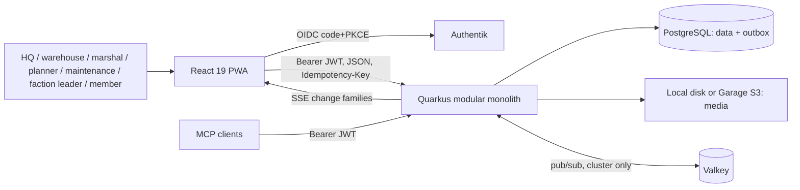
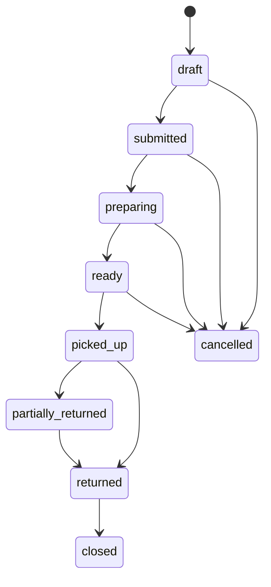

# ASH Inventory — Architecture

Replaces `REQUIREMENTS_ARCHITECTURE.md` and `DOMAIN_ARCHITECTURE.md`. Reflects the source as of 5 October 2026, after the review fixes.
**Target** marks agreed changes that the code doesn't follow yet (deferred design work); each links to [CODE_REVIEW_2026-10-05.md](CODE_REVIEW_2026-10-05.md) (`#n`).

## 1. Purpose

The system manages equipment for recurring airsoft events. It covers:

- catalog and storage;
- faction demand and planning;
- purchasing;
- warehouse commissioning;
- custody handover and returns;
- damage, repair and maintenance;
- counts and transfers;
- lending of privately owned equipment;
- an immutable movement history.

Quality goals, in order:

1. **Stock correctness.** Every stock change is atomic, idempotent and validated under a lock.
2. **Traceability.** Every movement and transition records actor, server time, source and delta.
3. **Privacy.** Private items and locations are visible only to the owner, `hq_admin` and explicit grantees.
4. **Field resilience.** The PWA keeps cached reads and replays queued commands; the server stays authoritative.
5. **Simplicity.** One model per concept, explicit DTOs, and no compatibility layers. Data is disposable.

## 2. System context



The application is a modular monolith on purpose. Inventory, orders, damage and maintenance need local ACID transactions. The default deployment is one API node; `docker-compose.cluster.yml` adds replicas and Valkey.

## 3. Capabilities

| Module | Capabilities (feature IDs) |
|---|---|
| **Catalog** | Items with images, categories, event tags, hints, value and return location. Assemblies with fixed component quantities. Category-specific data: vehicle fuel and battery date, generator hours, food best-before (CAT-01..06). Serialized items are one parent row with asset drill-down and batch asset-ID generation (CAT-03). QR/label codes with alias retirement (F22). |
| **Locations & stock** | Warehouses, a hierarchical georeferenced location tree and pickup points (LOC-01, F15). Positions per item/location/lot, lots with FEFO and quarantine (F11), transfers with transit (F06), blind counts with variance approval (F10). |
| **Planning & purchasing** | Event occurrences and factions (F01). Demand vs usable stock deficit with overrides (PRC-01, F02). Purchase orders → partial goods receipts → vendor documents (PRC-02/03, F03/F04/F14). |
| **Orders & custody** | Faction and general orders through the lifecycle in §6 (ORD-01..05). Pick lists for items/assemblies/exact assets, pickup handover, return reconciliation (ORD-02..04). Direct checkout/check-in requires event and faction (INV-03). Exact SKU/asset/order code resolution (ORD-06). |
| **Returns** | Two-stage return: a member submits with a placement photo, then the warehouse accepts or rejects (RET-01/02, F08). |
| **Lifecycle** | Damage → repair → verify / write-off (DAM-01/02). Maintenance schedules by date, hours or usage, with checkout blocking (MNT-01, F12/F13). |
| **Ownership & lending** | Private/external equipment, owner consent commitments, loan agreements with collection/return evidence, rental cost (OWN-01/02, F19, F23). |
| **Member self-service** | Personal custody, keeper assignments, requests, action inbox and reminders (F20, F21). |
| **Private inventory** | Account-owned private items, locations and assemblies; view/edit grants to people and admin-managed share groups; owner transfer; audited (CAT-05, LOC-02, SEC-03..08). |
| **Operations** | Offline queue review and correction (F16). Report snapshots with CSV/PDF export (F17). Outbox and dead-letter recovery (F18). CSV import. |
| **MCP** | Tool/resource access for AI clients, delegating to the same services and policy as REST. |

### Requirement traceability

Status: ✅ present in source · ◐ present with a known gap (finding `#n`) · ☐ missing.
✅ means the source implements the requirement. It doesn't mean browser, load or production acceptance has passed (see §12).

**Catalog and locations**

| ID | Requirement | Status | Implementation |
|---|---|:-:|---|
| CAT-01 | Maintain items with images, category, event tags, hint, value, storage and return location | ✅ | `CatalogService`, `ItemForm`, `ItemDetail`, `MediaService` |
| CAT-02 | Maintain assemblies with fixed component quantities; an assembly is visible only if every component is | ✅ | `CatalogService`, `ApiQueryService.projectAssemblies`, `AssemblyDetail` |
| CAT-03 | Serialized equipment is one parent item with aggregate stock and `minStock`, batch asset-ID generation, and asset drill-down (state, location, hours, custodian) | ✅ | `AssetInstance`, `AssetInstancesList`, `AssetDetail` |
| CAT-04 | Item detail shows free-form product info, stock, images, history and assets | ✅ | `ItemDetail` |
| CAT-05 | Shared/event catalog plus private items visible to owner, `hq_admin` and grantees | ◐ | `InventoryAccessPolicy`, scoped `CatalogOrm`. Legacy `visibilityScope` runs in parallel (#16) |
| CAT-06 | Typed category data: vehicle fuel l/100 km and battery date; generator hours and maintenance log; food best-before | ✅ | `Item`, `ItemForm`, `MaintenanceRecord` |
| CAT-07 | Tracking mode is immutable once stock or movements exist (API and UI); serialized items can't be consumable | ✅ | `CatalogService`, `ItemForm` |
| CAT-08 | Unique SKU/asset/label codes; aliases are retired, never reused; master data is retired, not deleted | ✅ | `StockManagementService`, `InventoryCode`, `CodeManagement` |
| LOC-01 | Warehouses and a hierarchical, georeferenced location tree with pickup points; no cycles, same-warehouse parent | ✅ | `LocationHierarchyService`, `StorageLocations`, `StorageLocationMap` |
| LOC-02 | Private locations protect address, coordinates, overlays, hierarchy and contents | ✅ | `StorageLocation.accessPolicy`, `ApiMapper` redaction, `InventorySharing` |

**Stock**

| ID | Requirement | Status | Implementation |
|---|---|:-:|---|
| INV-01 | Distinguish owned, on-hand, checked-out, in-transit, damaged, reserved, available and ordered (§4) | ✅ | `InventoryOperationsService.StockState`, `StockPolicy`; one item eligibility predicate `AvailabilityData.eligible()` for commands, planning, reports and MCP |
| INV-02 | Block over-allocation and checkout of unsafe or overdue equipment under lock | ✅ | `InventoryOperationsService`, `OrderService`, `MaintenancePolicy` |
| INV-03 | Every direct checkout carries event and faction; stored on the immutable transaction | ✅ | `TransactionForm`, `InventoryOperationsService`, `StockTransaction` |
| INV-04 | Serialized stock moves by exact asset only; batches of assets can be assigned per faction order | ✅ | `OrderService`, `OrderPickListTable` |
| INV-05 | Transfers: dispatch → transit → (partial) receipt with discrepancies; transit is not custody | ✅ | `TransferService`, `TransfersPanel` |
| INV-06 | Counts: blind count and recount; a different admin approves material variance; posting creates adjustment entries | ✅ | `CountService`, `StockOperations` |
| INV-07 | Lots with expiry, FEFO selection and quarantine | ✅ | `PositionService`, `InventoryLot`, `LotsPanel` |

**Orders, custody and returns**

| ID | Requirement | Status | Implementation |
|---|---|:-:|---|
| ORD-01 | Order lifecycle §6, including cancellation; transitions under an order lock | ◐ | `OrderService`, `GeneralOrderService`. Two separate order models (#15) |
| ORD-02 | Commission items, assemblies and exact assets on desktop and mobile | ✅ | `OrderPickListTable`, `GeneralOrderWorkflow` |
| ORD-03 | Preparation reserves; pickup atomically converts reservations to custody | ✅ | `OrderService`, `OrderAllocationService` |
| ORD-04 | Reconcile returned, consumed, missing, damaged and written-off units against handed-over units | ✅ | `OrderReturnChecklist`, `CustodyBalanceService` |
| ORD-05 | Compare with the previous event-year order | ✅ | `OrderTraceability`, `factionOrderHistory.ts` |
| ORD-06 | Resolve SKU/QR, asset code and order code with targeted queries; returns show the quantity out and can link the originating order | ✅ | `codeResolver.ts`, `TransactionForm` |
| ORD-07 | Camera and manual code scanning; scanning never changes stock | ✅ | `CameraScanner`, `useBarcodeScanner`; nginx allows `camera=(self)` |
| RET-01 | Expected return location per item; the returner can attach a placement photo | ✅ | `Item.returnLocation`, `ReturnSubmissionForm` |
| RET-02 | A submitted return isn't stock until a warehouse worker accepts it; pending/history view with accept/reject | ✅ | `ReturnSubmissionService`, `ReturnedItems` |
| AUD-01 | Append-only order and stock history: actor, UTC time, action, from/to, delta, note, idempotency key | ✅ | `FactionOrderHistory`, `GeneralOrderHistory`, `StockTransaction` |
| AUD-02 | Show create/prepare/ready/pickup/return actors and timestamps | ✅ | `OrderTraceability` |

**Lifecycle, planning and purchasing**

| ID | Requirement | Status | Implementation |
|---|---|:-:|---|
| DAM-01 | Report → triage → repair → verify, or write off; repair never creates stock; write-off only by `hq_admin` | ✅ | `LifecycleService`, `DamageReportsList` |
| DAM-02 | Resolution comment; optionally update the item hint | ✅ | `LifecycleService`, `DamageReportsList` |
| MNT-01 | Schedules by date, operating hours or usage, per item or per asset; warning window; checkout blocking | ◐ | `MaintenancePolicy`, `MaintenanceEvaluationService`, `IndividualSchedules`. Item columns duplicate the schedules (#17) |
| PRC-01 | Deficit = demand vs usable stock incl. expected receipts and overrides; planners/admins only | ✅ | `PlanningService`, `PlanningStockService`, `Procurement` |
| PRC-02 | Purchase orders: supplier, dates, buyer, quantity, unit price, reference; partial goods receipts; vendor documents restricted to HQ roles | ✅ | `PurchasingService`, `PurchasingOperations` |
| PRC-03 | Ordered quantity is shown as in transit and excluded from owned/available until received | ✅ | `PurchasingService`, item stock DTO |

**Ownership, members and operations**

| ID | Requirement | Status | Implementation |
|---|---|:-:|---|
| OWN-01 | Private ownership references a user account, independent of owner name, keeper, location and custodian | ✅ | `InventoryAccessPolicy.owner` |
| OWN-02 | Users create and maintain their own private items, locations and assemblies without warehouse rights | ✅ | `CatalogService`, `PrivateInventoryCommandInterceptor` |
| OWN-03 | Lending: owner consent windows, loan agreement before transfer, collection/return evidence, extensions, rental cost | ✅ | `EquipmentService`, `LoanService`, `LoansPanel`, `EquipmentOwnership` |
| MBR-01 | Member self-service: own custody, keeper assignments, requests, return submissions | ✅ | `MemberService`, `Contributor` |
| MBR-02 | Recipient-scoped action inbox and reminders (overdue returns, expiry, maintenance) | ✅ | `ActionInboxService`, `ActionInboxContent` |
| OPS-01 | Eight report snapshots with filters, freshness flag and CSV/PDF export | ✅ | `OperationalReportService`, `ReportsPanel`; freshness from sharded, commit-ordered revision counters |
| OPS-02 | Outbox with lease, retry, dead letter and operator retry; purge after 30 days | ✅ | `DomainEventService`, `OutboxDispatcher` |
| OPS-03 | CSV import with preview, dependency order and per-row results | ✅ | `CsvImportDialog`, `csvImportService` |
| OFF-01 | Queue supported field commands offline and replay them idempotently; conflicts are corrected with a new command | ✅ | `offlineQueue.ts`, `SyncService`, `SyncIssuesDialog` |
| OFF-02 | Cached catalogs keyed by account, role and normalized query; usable on a cold offline start | ✅ | `resourceFactory.ts`, `referenceDataService.ts`; collection and reference queries use `networkMode: 'offlineFirst'` |

**Security and API**

| ID | Requirement | Status | Implementation |
|---|---|:-:|---|
| SEC-01 | Authentik OIDC; the account is bound to the provider's stable subject; logout ends server-side token use | ◐ | Quarkus OIDC (`principal-claim=sub`), `ActorService` (`issuer`+`sub`), `oidcClient.ts` (revocation), cross-tab logout, SSE ends at `exp`. A revoked access token stays valid until `exp` unless `OIDC_REQUIRE_INTROSPECTION` is on (#3) |
| SEC-02 | Canonical roles from namespaced Authentik groups; factions per user; no group → no access | ✅ | `ActorService.roleFrom` / `factionsFrom` (`inventory_faction_<EVENT>_<slug>`); no role → 403; read-only `UserManagement` |
| SEC-03 | New private resources default to owner + `hq_admin`; other staff need an explicit grant | ✅ | `InventoryAccess`, ORM visibility predicate |
| SEC-04 | Owner/admin grant and revoke view access for multiple people and groups | ✅ | `InventoryAccessService`, `InventorySharing`, `InventoryAccessGroups` |
| SEC-05 | View, edit, share-management and stock-operation rights are separate; viewers can't escalate | ✅ | `InventoryAccess`, `PrivateInventoryCommandInterceptor` |
| SEC-06 | One policy across REST, MCP, nested records, search, stock, reports, media and realtime | ◐ | Present via `PrivacyResponseFilter` and the reference graph; denied sets bound as one `uuid[]`; SSE carries no IDs. Query-predicate migration pending measurement (#9) |
| SEC-07 | Audited permission/owner changes with revision check; access rechecked on every operation | ✅ | `InventoryAccessService`, `access.changed` events |
| SEC-08 | Caches are scoped to the access context and dropped after permission changes; offline limits documented | ✅ | `no-store` private responses, session `QueryClient`, `privateInventoryCache.ts`; `access.changed` resets only queries holding private data |
| SEC-09 | Uploads are type- and size-restricted, bound to their resource, and staged uploads expire | ✅ | `MediaTypes` (sniffed WebP/PNG/JPEG/PDF), 10 MB, per-user pending quota, `StagedMediaPurge` (24 h), `InventoryMediaService` binding |
| SEC-10 | Dev authentication can't be enabled in production | ✅ | `ProductionAuthGuard`; production builds offer dev login only with explicit `DEV_LOGIN=true` |
| API-01 | Explicit DTOs; entities are never serialized | ✅ | `ApiResponses`, `ApiMapper` |
| API-02 | Each frontend contract exposes only supported operations | ✅ | Capability interfaces in `resourceFactory.ts`. Target: generated client (#25) |
| API-03 | Lists are paged, filtered and sorted on the server; clients never download whole collections | ◐ | Endpoints support paging and search; the frontend still drains catalog pages but refetches only on relevant events (#11) |

## 4. Inventory semantics

```text
onHand         = Σ inbound ledger − Σ outbound ledger        (physically at a location)
checkedOut     = checkout − checkin − consumed − missing
inTransit      = dispatched, not yet received transfers
totalOwned     = onHand + checkedOut + inTransit
available      = max(0, onHand − damaged − reserved − quarantined/blocked)
                 then 0 if item not usable (maintenance, contributor-damage hold, consent window)
ordered        = unreceived purchase quantity (shown separately, never owned/available)
```

Invariants:

- `stock_transactions` is append-only and authoritative. `inventory_positions` and asset state are lockable projections, updated in the same transaction.
- Only `available` may be allocated. When an order is edited, only that order's own reservation is credited back.
- Repair changes condition, not quantity. Only an authorized write-off reduces owned stock.
- **Serialized** items move by exact asset only. The tracking mode is immutable once stock or movements exist. `serialized` can't be `consumable`.
- **Tracking modes:** `bulk` (position quantity), `serialized` (asset state), `lot_tracked` (lot positions, FEFO). **Roles:** `consumable`, `returnable`, `repairable`, `rental`.
- A pending return submission keeps custody (`returned_pending_check`). Only warehouse acceptance runs check-in or reconciliation.
- Order reconciliation: `handedOver = returned + consumed + damaged + writtenOff + outstanding`, with `missing ≤ outstanding`.
- Cached, report or offline quantities never authorize a command.
- Item eligibility (contributor-damage hold, maintenance blocks) is one predicate, `AvailabilityData.eligible()`, used by commands, catalog, planning, reports and MCP. Calendar dates use the business time zone `inventory.timezone` (`BusinessTime`), never the JVM default.
- **Target:** maintenance state lives only in schedules (#17).

## 5. Command and event model

Every stock-affecting command follows these steps:

1. Authenticate and authorize.
2. Deduplicate the command UUID.
3. Lock the aggregate and the affected positions or assets in a stable order.
4. Validate tracking mode, lifecycle state, maintenance and availability.
5. Mutate state and append ledger and history.
6. Append an outbox event.
7. Commit once.

Error codes: 400 validation, 403 policy, 404 missing or not visible, 409 conflict (with current state).

The outbox row is written in the business transaction. After that transaction commits, the node's dispatcher is woken immediately; a 5 s poll per node covers retries, crashes and other nodes' rows. The dispatcher claims rows (`SKIP LOCKED`, lease), publishes through `EventBroadcaster` (in-memory, or Valkey pub/sub in a cluster) and acknowledges them. Delivery is at-least-once; consumers deduplicate by `eventId`. After 10 failures an event goes to `dead_letter` for operator retry. Published events are purged after 30 days.

Event families: `catalog.*`, `stock.*`, `asset.*`, `order.*`, `general_order.*`, `custody.*`, `return.*`, `damage.*`, `repair.*`, `maintenance.*`, `transfer.*`, `count.*`, `purchase_order.*`, `goods_receipt.*`, `loan.*`, `equipment.*`, `access.changed`, `user.changed`.

**Realtime.** SSE (`EventStreamResource`) sends every authenticated session only the event family (`stock.changed`, `order.changed`, …) and, for catalog changes, the catalog resource kind — never IDs, actors, quantities or payloads. `access.*` is sent as `access.changed`. The stream ends at the bearer token's `exp` (at most 1 h); the client reconnects with a fresh token. The client coalesces events (300 ms), maps them to query domains and calls `invalidateQueries` (active queries refetch in place). `access.changed` and a reconnect (events may have been missed) additionally reset only the queries holding private inventory and bump the private-media epoch.

## 6. Order lifecycle



- Preparation creates reservations; it doesn't move stock.
- Pickup atomically converts reservations to custody and appends `checkout`.
- Return appends check-in plus one reconciliation per line or asset.
- Every transition appends immutable history: actor, UTC time, from/to, delta, note, idempotency key.
- The detail view shows the history and the previous event-year order for comparison.
- **Target:** one `orders` + `order_lines` model with `kind = faction | general` (#15). Today general orders store their lines as jsonb maps.

## 7. Security

### 7.1 Authentication and sessions

| Concern | Rule |
|---|---|
| Identity | Authentik OIDC: authorization code + PKCE (public client). The API is an OIDC `service` (bearer only), and the audience must equal the API client ID. |
| Account binding | `quarkus.oidc.token.principal-claim=sub`. `UserAccount` is unique by `(issuer, external_subject)`. Name (`name`/`preferred_username` claim) and e-mail are display data only. |
| Roles | From the token's Authentik groups on every request (most privileged `inventory_<role>`), mirrored to `app_users`, never edited in the app (`UserManagement` is read-only). Factions: `inventory_faction_<EVENT>_<slug>` groups → `EVENT:slug` keys, parsed by `ActorService`. No inventory role → 403. |
| Token lifetime | Configure a short access token (≤5 min) and rotating refresh token in Authentik. On logout the client revokes refresh and access token (RFC 7009), signs out all tabs (`BroadcastChannel`) and calls `end_session`. The API validates JWTs locally, so a revoked access token is accepted until `exp`; `OIDC_REQUIRE_INTROSPECTION=true` checks each token at the provider (cached `OIDC_TOKEN_CACHE_TTL`). The SSE stream closes at `exp`. The client re-reads `/api/auth/me` only when a refreshed token arrives. |
| Dev auth | Header actor (`X-Actor-Id/-Name/-Role/-Factions`) only when `inventory.dev-auth.enabled=true`; `ProductionAuthGuard` refuses to start `%prod` with it, or without OIDC. Production frontends offer dev login only with explicit `DEV_LOGIN=true`. |
| Paths | `%prod`: `/api/*` and `/mcp/*` require authentication. Rate limit per subject; anonymous callers per peer address (honours `TRUSTED_PROXIES` only). |

| Role (Authentik group `inventory_<role>`) | Scope |
|---|---|
| `hq_admin` | Everything, users, write-off, variance approval, implicit private access |
| `warehouse_crew` | Master data, receiving, reservation, preparation, transfers, counts, custody |
| `marshal` | Handover and return reconciliation |
| `event_planner` | Events, planning, procurement |
| `maintenance_crew` | Damage, repair, maintenance |
| `faction_leader` | Orders for their own factions |
| `read_only` | Organizational read access |

All role checks run in services, not resources, so REST, MCP and offline replay share them. Internal flows that act for an already authorized caller use unchecked variants (e.g. `createDamage` vs. `reportDamage`, `newEvent` for an order's implicit event).

### 7.2 Private resources

- An item, location or assembly with an `InventoryAccessPolicy` is private: one owner account, a revision, and grants to a user or share group with `view` or `edit`.
- Only the owner and `hq_admin` can view it implicitly; no other staff role bypasses the policy.
- Grants are resource-specific. Sharing a location doesn't reveal private items stored in it, and moving an item never widens its visibility.
- An item's whereabouts are disclosed only when the item grant *and* the location grant (if the location is private) allow it; otherwise the response carries `locationRestricted`.
- Policy changes lock the policy, check its revision and write an immutable `access.changed` audit with before/after.
- Media keys are bound to their owning resource and authorized on each download (`no-store`); the privacy check walks only that resource's ancestors. Uploads are sniffed (WebP/PNG/JPEG/PDF), size-limited and quota-limited; unattached uploads are purged after 24 h; non-images download as attachments.
- Operational list queries exclude denied evidence before pagination; the denied set is bound as one `uuid[]` parameter. When the response filter still drops rows it sends `X-Filtered-Rows`, so clients keep paging.
- Private writes are online-only; queued commands are re-authorized on replay.
- **Target:** privacy is enforced as a query predicate (`InventoryAccessOrm.visible()`, joined via `item_id`/`location_id`), not as a response post-filter or reference-graph walk (#9). Public visibility becomes "no policy", replacing the legacy `visibilityScope` fields (#16).

## 8. Backend

```text
resource/   HTTP only: routes, validation, DTO mapping, status codes
service/    use cases, transactions, authorization, invariants, outbox events
orm/        queries, locks, batch fact loaders (no business rules)
model/      JPA entities + enums (no active record)
helper/     security (actor, access, prod guard), storage (media, upload types, purge), event (outbox, broadcaster), rate limit, BusinessTime, PageBounds, Inputs
mcp/        MCP adapters delegating to service/
```

- **Stack:** Quarkus 3 (Java 25), Hibernate ORM (no Panache), PostgreSQL, Flyway, OIDC, smallrye-openapi, scheduler, OpenTelemetry (optional), AWS S3 SDK, quarkus-mcp-server.
- **Schema:** one baseline `V1.0.0__init.sql` for every profile (dev, test, prod): Flyway migrates at start, Hibernate only `validate`s; tests clean the `TEST_DB_URL` database at start. Edit the baseline in place and recreate the DB (no incremental migrations). It includes FK indexes for location/stock reads, `lower()` code lookups, `pg_trgm` indexes for catalog search, and the faction reference data (`(event_type, slug)` unique).
- **ORM:** collaborators extend `EntityOrm` (`find`, `findLocked`, `findLockedFresh`, `require*` with not-found labels); paging through `PageBounds`.
- **Read models:** item lists batch ledger, damage, reservation, position, asset, maintenance and purchase facts per page; there are no N+1 mappers. Reports are manually rebuilt snapshots. Freshness comes from `source_revisions`: statement triggers increment one of 16 counter shards per table (chosen by backend PID), so concurrent writers don't serialize on one row; readers sum the shards. The counters commit or roll back with the source writes.
- **Caching:**

| Data | Cache |
|---|---|
| Factions | `quarkus-cache` Caffeine per node, keyed by the committed `factions` revision (no invalidation messages needed) |
| Actor | Request-scoped and memoized; written only when token claims change |
| Dynamic stock, availability | Not cached; computed from projections |
| Cross-node SSE fan-out, rate limiter | Valkey pub/sub, cluster deployment only |
| HTTP | `private, no-store` for API responses; faction list ETag derived from the revision (a match returns 304 before any catalog read) |

- **Target** (#12): cache further reference data (locations, categories, maintenance policies) only after measurement, with revision keys.

## 9. Frontend

```text
pages/        route composition          components/  shared UI (dialogs, tables, forms, order sections)
hooks/        TanStack Query hooks       services/    API client, auth, offline
types/        API contracts              utils/       pure calculations
store/        Zustand UI state           i18n/        i18next resources
```

| Concern | Current | Target |
|---|---|---|
| Server state | TanStack Query v5, session-scoped `QueryClient`; selective, coalesced invalidation from local writes and SSE | Same |
| Client state | Zustand (UI), `useSyncExternalStore` modules (auth) | Zustand / `react-oidc-context` |
| API contract | Hand-written client and types | Generated from OpenAPI (`openapi-typescript` + `openapi-fetch`) (#25) |
| Auth | Hand-rolled PKCE, token revocation at logout, cross-tab logout | `oidc-client-ts` (#24) |
| Offline | Custom IndexedDB cache and queue; offline-capable queries `offlineFirst` | Query persister + persisted paused mutations (#26) |
| Lists | Download all pages, filter in browser; refetch only on relevant events | Server paging/filter, DataGrid server mode, item autocomplete (#11, #31) |
| Forms | `useState` per field | `react-hook-form` + `zod` (#27) |
| Routing | `BrowserRouter` + `<Routes>`, lazy pages | RR7 data router with loaders (#28) |
| PWA | Hand-written service worker, cache versioned per build (`vite.config.ts` stamps `sw.js`), network-first navigation | Same |
| Reference data | Event types and factions from `/api/event-types` and `/api/factions` (`useFactionCatalog`, offline-cached) | Same |
| Lint | ESLint with TypeScript 6 + `eslint-plugin-react-hooks` v7 compiler rules; TypeScript 7 (`typescript-native`) type-checks the build | Same |
| i18n | i18next + inline `t('de','en')` pairs | i18next keys only (#22) |
| UI | MUI 9, React Compiler (no manual memo), `FormDialog`, `ClosableDialog`, `QrLabelDialog`, `DamageReportDialog`, `QueryFeedback`, `AppSnackbar`, `formatMoney` | Plus `DataTable` (#31) |

Rules:

- Pages never call `fetch`; services own transport.
- The item's `stock` projection is authoritative; the client never recomputes stock from ledgers.
- Navigation hiding is UX only; the backend is the authorization boundary.
- Heavy libraries (`jspdf`) are imported on demand.
- Faction access in the UI uses `EVENT:slug` keys (`factionKeyOf`, `FactionOrder.factionKey`), the same keys the API enforces.

## 10. Offline model

- **Queueable offline:** direct stock transactions, media-free damage reports, and faction-order create/prepare/transition/reconcile. Each carries a client UUID that serves as the idempotency key.
- **Online-only:** everything else, including all private-resource writes, media and access administration.
- Replay is atomic per command. A rejection is a conflict that the user resolves with a new command linked to the original as its correction root. There's no last-write-wins.
- The queue, cache and history belong to the original account. Caches are cleared on logout and account switch. Downloaded exports can't be recalled.
- The OIDC session is mirrored to IndexedDB so an offline cold start keeps the account; its refresh token is revoked at logout.
- The service worker caches the app shell and same-origin assets only, never `/api` or third-party resources. Its cache is versioned per build; navigations are network-first, hashed bundles cache-first. A failed lazy chunk after a deployment reloads the page.

## 11. Deployment

| Profile | Components |
|---|---|
| Single node (default) | nginx (PWA) + API + PostgreSQL + local or Garage media; in-memory events and rate limit; no Valkey |
| Cluster | Two or more stateless API replicas + shared PostgreSQL, Garage and Valkey (`EVENT_BACKEND=redis`, `API_RATE_LIMIT_BACKEND=redis`, `REDIS_HEALTH_ENABLED=true`) |

- nginx serves the PWA with a strict CSP. `docker-entrypoint.sh` generates the header snippet: `connect-src` = self + the configured API and OIDC origins, `camera=(self)`; every location that sets its own headers includes it again.
- Business time zone: `INVENTORY_TIMEZONE` (default `Europe/Berlin`).
- The API sits behind a reverse proxy with explicit `TRUSTED_PROXIES`.
- Back up PostgreSQL and object storage together as one recovery unit.

## 12. Verification

- Backend tests run on PostgreSQL (Dev Services or `TEST_DB_URL`). The baseline test runs Flyway plus Hibernate validation.
- Frontend: `bun run typecheck` (TS 7), `bun test`, `bun run lint` (ESLint on TS 6).
- **Verified locally (5 October 2026):** 163 backend tests on PostgreSQL 18, 52 Bun tests, all 157 REST handlers (156 response-filter dispatches plus a real HTTP SSE test), MCP tools/resources/prompts, 21 browser media assertions, frontend/backend builds, typecheck and lint. The live REST/MCP sample smoke also passed with 340 item rows and 50 assembly rows. See [test inventory and requirement mapping](../tests/README.md) and [review findings](TEST_REVIEW_2026-10-05.md).
- **Pending acceptance:** integrated browser/mobile and physical camera workflows, real S3, load and lock contention, token revocation and multi-tab logout against the real Authentik, cross-browser CSV/PDF rendering and clustered outbox delivery.
- Builds and tests run only on explicit request (see `agent.md`).
