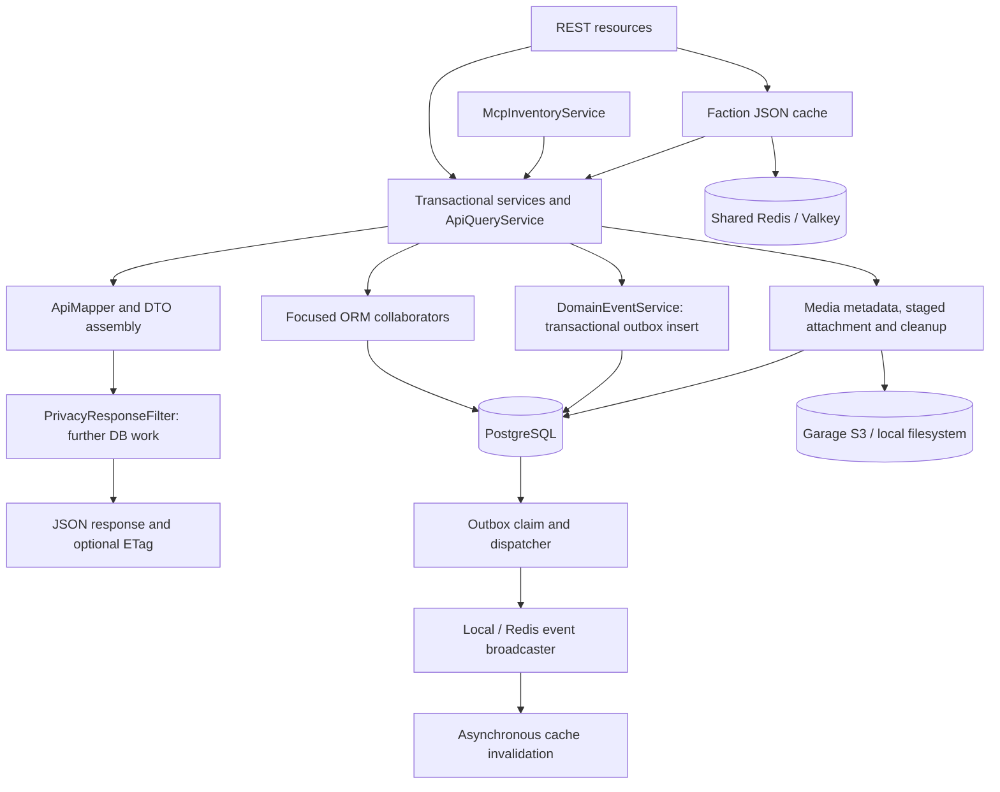

# Backend storage and caching review

Reviewed 2026-10-04 against the working tree before fixes. Findings and estimates below describe that reviewed state.

Follow-up: all three P1 findings are now fixed. Actor reuse respects transaction boundaries, privacy classification uses bounded permission queries and response-scoped provenance, and ten indexes were added to the canonical baseline. See [P1 fixes and validation](BACKEND_P1_FIXES.md). The follow-up passed 39 tests on PostgreSQL 17.6, including measured statement budgets, privacy API regressions, and baseline validation. All six P2 findings are also fixed; see [P2 fixes and validation](BACKEND_P2_FIXES.md). The final backend suite passed 138 tests on PostgreSQL 17.6. Findings below retain the pre-fix evidence. The recommendation to keep `quarkus-cache` still applies.

## Recommendation

Keep `quarkus-cache` and the shared Redis/Valkey backend for the existing faction cache. Quarkus 3.39.5's resolved `quarkus-cache` POM already depends on `quarkus-caffeine`. `quarkus-caffeine` supplies the underlying library integration; replacing the cache abstraction would require rewriting the annotation and CacheManager usage. It will not fix the database query patterns.

The main opportunities are repeated actor lookups, per-resource authorization queries, global privacy traversal, missing indexes, and repeated stock calculations. Some existing readers already use good batching and combined SQL, but that does not extend through the complete response path.

## Scope and confidence

Inspected the persistence collaborators under `backend/src/main/java/org/ash/inventory/orm`, their main service and REST/MCP callers, DTO mapping, response filters, models, the SQL baseline, cache configuration, media storage, outbox delivery, and cluster deployment configuration. Used the existing graph for orientation and verified findings against current source; the graph reports an older node-ID format.

Ran the existing MaintenancePolicyTest, InventoryModelInvariantTest, InMemoryRateLimiterTest, ActorServiceRoleTest, and MediaServiceTest: 14 tests passed with Maven offline on Java 25. These are unit tests, not SQL performance or Redis integration tests.

Docker's Linux engine is unavailable. No PostgreSQL connection, EXPLAIN ANALYZE, production query logs, or Redis fault-injection results were available. Query counts below count explicit ORM statements under stated conditions and exclude extra lazy loads, identity queries, permission queries, and writes unless specified. Missing-index findings describe the checked-in baseline; an existing deployment could have additional indexes.

## Storage path



Production uses PostgreSQL, Flyway's canonical baseline, Hibernate validation, and a JDBC pool of five connections by default. Development uses Hibernate schema update; tests now target PostgreSQL, although the backend README still describes H2 tests. Most domain relationships are lazy. No application-configured Hibernate entity/query cache usage was found; request persistence contexts must not be confused with the JSON response caches.

Commands lock domain resources, append ledger records and outbox events in their transaction, and return projections. Sync replay deliberately uses separate transactions per command. Outbox claims use pessimistic locking with SKIP LOCKED and acknowledge successful publication in a batch. These are useful correctness properties to preserve when reducing queries.

## Prioritized findings

### 1. [P1] The actor cache still executes a query on every call

Evidence: [ActorService.java](D:/Code/ASH/inventory/backend/src/main/java/org/ash/inventory/helper/security/ActorService.java:38), [UserOrm.java](D:/Code/ASH/inventory/backend/src/main/java/org/ash/inventory/orm/UserOrm.java:17), [InventoryAccessService.java](D:/Code/ASH/inventory/backend/src/main/java/org/ash/inventory/service/InventoryAccessService.java:35).

When `cached != null`, `current()` still invokes `findByExternalSubject()`, which executes JPQL. Hibernate's first-level entity cache does not eliminate this query. `ApiMapper.item()` always calls `accessPolicies.view()`, which calls `current()` even for a public item with no access policy. Thus a page of 100 items adds at least 100 actor SELECTs during item mapping alone. Non-null locations add more through repeated `canViewLocation()` and nested location projections.

Resolve the identity once and pass a materialized actor/access context through read projection. Reuse a managed actor within the same transaction. Preserve transaction boundaries: SyncService and response filters can start a new transaction in the same HTTP request, so simply returning a cached managed entity across the entire request is not a complete fix. Keep immutable identity facts request-local and reattach/load by primary key when a new transaction needs a managed actor. Test both list reads and sync replay.

### 2. [P1] Privacy checks perform global work and per-policy grant queries

Evidence: [InventoryAccessOrm.java](D:/Code/ASH/inventory/backend/src/main/java/org/ash/inventory/orm/InventoryAccessOrm.java:66), [PrivacyResponseFilter.java](D:/Code/ASH/inventory/backend/src/main/java/org/ash/inventory/resource/PrivacyResponseFilter.java:24), [PrivacyProjectionService.java](D:/Code/ASH/inventory/backend/src/main/java/org/ash/inventory/service/PrivacyProjectionService.java:23).

For a non-admin, `deniedReferences()` loads all private items and locations and calls `granted()` separately for each resource not owned by the actor. It then expands denied roots through a recursive graph spanning many tables and JSON general-order references. This makes a small response depend on the number of private resources across the application.

The response filter calls `filter()`, then `containsPrivateReference()`. The second call loads all private roots again and expands their references even for an administrator whose denied set is empty. Order, purchase, count, transfer and general-order queries can already have called `deniedReferences()` before the response filter repeats it. The recursion is combined SQL, but its scope remains global.

Select denied roots with two set-based queries using the existing visibility/NOT EXISTS predicate instead of one grant query per policy. Materialize shared access facts for a read transaction. For response filtering, collect candidate references first and resolve their provenance in batches, retaining the current transitive privacy semantics. Where global exclusions are still needed before pagination, compute them once. Reuse classification for the private-inventory header without a second global traversal. Do not replace permission checks with a TTL cache that delays revocation.

### 3. [P1] Important lookup and aggregation indexes are absent from the baseline

Evidence: [V1.0.0__init.sql](D:/Code/ASH/inventory/backend/src/main/resources/db/migration/V1.0.0__init.sql:868), [OperationsOrm.java](D:/Code/ASH/inventory/backend/src/main/java/org/ash/inventory/orm/OperationsOrm.java:119), [PlanningStockOrm.java](D:/Code/ASH/inventory/backend/src/main/java/org/ash/inventory/orm/PlanningStockOrm.java:44).

The baseline has useful reservation, outbox, member-request, permission, parent-location and transaction-event indexes. It does not define indexes beginning with `stock_transactions.item_id`, `stock_transactions.asset_instance_id`, `damage_reports.item_id`, `asset_instances.item_id`, `maintenance_schedules.item_id`, `item_images.item_id`, or `faction_order_lines.faction_order_id`. Primary keys and unrelated uniqueness constraints do not supply these access paths. PostgreSQL does not automatically index referencing foreign-key columns. [PostgreSQL constraints documentation](https://www.postgresql.org/docs/current/ddl-constraints.html#DDL-CONSTRAINTS-FK).

This matters because stock totals repeatedly scan ledger history, while page/detail readers filter or join these child tables. The combined planning query still needs these indexes. Validate the candidate indexes below with representative data, actual pg_indexes and EXPLAIN (ANALYZE, BUFFERS). Follow the project's disposable baseline policy when implementing; this review does not propose repairing an existing production schema blindly.

### 4. [P2] DTO assembly still introduces authorization and lazy-loading N+1 queries

Evidence: [ApiMapper.java](D:/Code/ASH/inventory/backend/src/main/java/org/ash/inventory/resource/ApiMapper.java:114), [InventoryAccessService.java](D:/Code/ASH/inventory/backend/src/main/java/org/ash/inventory/service/InventoryAccessService.java:35), [OperationsOrm.java](D:/Code/ASH/inventory/backend/src/main/java/org/ash/inventory/orm/OperationsOrm.java:34).

The mapper invokes `accessPolicies.view()` per item/location. For private policies, that reads grants, may issue further permission queries, and traverses lazy group members. Catalog item queries fetch locations/users but not these policy/grant/member facts.

Transaction, damage and maintenance-record list queries do not fetch the relationships their mappers read. For example, transaction mapping expands `value.user`, assets and an order summary. Names and expanded DTOs can trigger one SELECT per distinct associated entity. Fetch joins elsewhere do not solve these missing fetch plans, and first-level reuse only helps when associations repeat.

Make mapping consume precomputed policy/location views. Use DTO projections or to-one fetch joins for each list's actual response shape, and batch collection facts separately. Do not join several independent to-many collections into a paginated root query. The existing fail-on-pagination-over-collection-fetch setting is a useful guard.

### 5. [P2] Item reads have a large fixed query batch and duplicate ledger aggregation

Evidence: [ApiQueryService.java](D:/Code/ASH/inventory/backend/src/main/java/org/ash/inventory/service/ApiQueryService.java:213), [InventoryOperationsService.java](D:/Code/ASH/inventory/backend/src/main/java/org/ash/inventory/service/InventoryOperationsService.java:268), [OperationsOrm.java](D:/Code/ASH/inventory/backend/src/main/java/org/ash/inventory/orm/OperationsOrm.java:134), [EquipmentReadService.java](D:/Code/ASH/inventory/backend/src/main/java/org/ash/inventory/service/EquipmentReadService.java:24).

For a nonempty item page, the explicit root/projection path performs approximately 11–16 SELECTs before findings 1, 2 and 4. The minimum consists of the root query, two ledger aggregates, damage, faction reservations, general reservations, positions, member damage, schedules, images and outstanding purchases. Assets, usage counters, commitments, loans and consumption add conditional queries.

This is already batched by item IDs, so the explicit stock batch does not issue one stock query per item. It can still be consolidated. `transactionTotals()` sums by type, then separately scans custody write-offs. Conditional aggregation combines them. General reservations load every preparing/ready general order rather than selecting the relevant JSON quantities in SQL.

Planning already has a one-statement stock reader using CTEs and UNION ALL. Extract a common typed snapshot/projection approach for stock totals and policy facts; the planning reader is a useful starting point, not a drop-in DTO replacement because it deliberately returns less asset/location metadata. Keep images and other collections in separate bounded batches where that avoids duplicate rows. A reasonable initial target is roughly 4–6 domain reads per page, plus bounded identity/privacy work, subject to measurement and response requirements.

### 6. [P2] Custody and action-inbox reads grow with historical data

Evidence: [CustodyOrm.java](D:/Code/ASH/inventory/backend/src/main/java/org/ash/inventory/orm/CustodyOrm.java:13), [CustodyBalanceService.java](D:/Code/ASH/inventory/backend/src/main/java/org/ash/inventory/service/CustodyBalanceService.java:24), [ActionInboxService.java](D:/Code/ASH/inventory/backend/src/main/java/org/ash/inventory/service/ActionInboxService.java:36), [MaintenanceEvaluationService.java](D:/Code/ASH/inventory/backend/src/main/java/org/ash/inventory/service/MaintenanceEvaluationService.java:22).

Custody loads all handed-over faction lines, open general orders, all direct stock transactions and pending returns, then filters recipients and computes balances in Java. Direct movements include unrelated transaction types before the Java switch discards them. General-order item lookups occur inside JSON map loops; some may reuse entities already loaded in the transaction, but distinct missing items still cost queries.

The action inbox reads several whole collections, filters recipients in Java, and calls a checkout-count query per usage-count maintenance schedule. Member/loan lists and the legacy asset-list route also have unbounded reads. Their list/detail mappings can add lazy loads.

Push actor/status/outcome scope into SQL. Aggregate direct custody with CASE/SUM/GROUP BY over its balance key, including pending acknowledgements separately. Batch general-order referenced items. Batch usage counters as EquipmentReadService already does. Paginate lists that can grow without bounds. A UNION ALL of typed action candidates is appropriate once each branch is scoped; combining unbounded branches alone is insufficient.

### 7. [P2] Report cache hits still aggregate 27 source tables

Evidence: [OperationalReportService.java](D:/Code/ASH/inventory/backend/src/main/java/org/ash/inventory/service/OperationalReportService.java:54), [OperationalReportOrm.java](D:/Code/ASH/inventory/backend/src/main/java/org/ash/inventory/orm/OperationalReportOrm.java:22).

Reports persist their rows as a JSON snapshot. A bounded local LRU caches filtered immutable results, keyed by report version/generation, filters, actor and denied IDs. It has a five-minute lifetime, 64 variants and a total 100,000-row budget: useful safeguards.

Each report page still computes a source token from COUNT/MAX across 27 tables, plus current privacy work. UNION ALL reduces this to one round trip but does not reduce the aggregate work. A warm cache therefore avoids filtering the JSON again while continuing to touch all source tables. Rebuilds also hydrate whole entity sets and can lazily fetch relationships.

Replace the read-time watermark scan with compact transactional revisions/dirty markers for relevant report sources. Advance them in the same transaction as source changes; an asynchronously delivered outbox event alone leaves a freshness gap. Do not use a sequence maximum as a substitute for commit ordering without a sound protocol. Store/query typed report rows or materialized projections if JSON generations become large. Direct Caffeine could simplify the manual local LRU, but preserve its total row-weight bound, actor/permission-sensitive keys and immutable values.

### 8. [P2] Cache invalidation failure is not part of durable outbox success

Evidence: [CatalogResponseCache.java](D:/Code/ASH/inventory/backend/src/main/java/org/ash/inventory/resource/CatalogResponseCache.java:92), [EventBroadcaster.java](D:/Code/ASH/inventory/backend/src/main/java/org/ash/inventory/helper/event/EventBroadcaster.java:139), [OutboxDispatcher.java](D:/Code/ASH/inventory/backend/src/main/java/org/ash/inventory/helper/event/OutboxDispatcher.java:28).

The listener starts `invalidateAll().subscribe()` and logs asynchronous failure. The broadcaster also catches listener exceptions. The dispatcher can consequently mark an event published even though invalidation failed. Its event-ID deduplication can suppress the same local listener invocation on a publication retry. The cache's five-minute TTL then bounds staleness rather than durable retry guaranteeing successful eviction.

Catalog mutations also use CacheInvalidateAll annotations, but invalidation inside an enclosing command transaction cannot by itself provide commit-ordered read-your-writes semantics: a concurrent reader may repopulate old committed data. The post-commit outbox path is useful, but asynchronous eviction and concurrent fills still need a documented consistency policy.

If immediate freshness is required, use a transactional catalog revision in cache keys, or make invalidation a retryable consumer operation whose successful completion is tracked. If five-minute/eventual freshness is acceptable, state and test it. Define factions-cache Redis-outage behavior explicitly; this read has no application-level DB fallback wrapper. Fault-inject eviction, publication and load failures before changing backend behavior.

### 9. [P3] Cache configuration overstates the active coverage

Evidence: [CatalogResponseCache.java](D:/Code/ASH/inventory/backend/src/main/java/org/ash/inventory/resource/CatalogResponseCache.java:57), [CatalogResource.java](D:/Code/ASH/inventory/backend/src/main/java/org/ash/inventory/resource/CatalogResource.java:113), [application.properties](D:/Code/ASH/inventory/backend/src/main/resources/application.properties:64).

Only `factions()` has CacheResult. `events()` has no caching annotation, and storage-location GETs call the service directly. Locations/events have configuration and invalidation annotations but no response cache loader in the current source. This may be intentional: locations are actor-sensitive and events include live order/stock metrics. Remove obsolete configuration/comments or document the deliberate uncached behavior. Do not restore globally shared location/event caching by simply adding annotations.

The ETag filter covers assemblies and factions. It hashes the completed, privacy-filtered response; its early-304 shortcut is deliberately disabled. Thus 304 saves the response body, not domain/authorization queries. The local knownEtags map does not currently avoid those queries.

### 10. [P2] Multi-query stock reads do not guarantee a single committed snapshot

Evidence: [InventoryOperationsService.java](D:/Code/ASH/inventory/backend/src/main/java/org/ash/inventory/service/InventoryOperationsService.java:268), [PlanningService.java](D:/Code/ASH/inventory/backend/src/main/java/org/ash/inventory/service/PlanningService.java:43).

No custom JDBC transaction isolation is configured. Assuming PostgreSQL's default READ COMMITTED, successive SELECTs within one transaction can observe different commits. For example, ledger totals read before another checkout commits and reservations read after it commits can represent different instants. The planning stock statement has one snapshot for its branches, but surrounding demand/item/override queries remain separate. [PostgreSQL transaction isolation](https://www.postgresql.org/docs/current/transaction-iso.html#XACT-READ-COMMITTED).

Define the consistency requirement for read-only stock/planning responses. Prefer a single statement for closely related stock facts; use an appropriate consistent read transaction for a multi-statement planning/report snapshot when required. Preserve locked command validation and post-mutation recalculation. Do not reuse pre-mutation snapshots as authoritative checkout state.

## Reader inventory

Counts describe domain SELECTs, excluding cross-cutting identity/privacy work. Zero-row inputs skip many child reads.

| Area / ORM owners | Current approach | Assessment |
|---|---|---|
| Items: CatalogOrm, OperationsOrm, PositionOrm, EquipmentOrm | Paged root, batched aggregates and facts, images and purchases | Approximately 11–16 explicit SELECTs for a populated mixed page; hidden per-row work remains |
| Planning: PlanningOrm, PlanningStockOrm | Scope/items/demand/general orders/overrides/incoming, one UNION ALL stock snapshot | About seven explicit SELECTs without a selected event lookup; good stock combination, potentially large full-item/history scope |
| Events: CatalogOrm, EventMetricsOrm | Event root plus faction lines, general orders, movements and item names | Up to five explicit SELECTs for a populated list; batch-safe, but hydrates raw facts rather than grouped DTOs |
| Faction orders: OrderOrm | Paged root with to-one fetches, one lines batch, optional component batch | Good two/three-query list structure; denied-reference traversal and location DTOs add work |
| Order detail: OrderOrm, CatalogOrm | Lines, assignments, reservations, history, projected items/assemblies | Repeated images/projections and lazy history actors; consolidate shared item/access projections |
| General orders: GeneralOrderOrm | Scoped page, batched item-name projection, detail history fetch | Good name batching; global denied-reference cost remains; JSON item maps complicate joins |
| Handovers/reconciliations: CustodyOrm | Page + lines batch, or one fetched reconciliation page | Good bounded read shapes; authorization lookup is separate |
| Custody balances: CustodyOrm | Four broad collection reads and Java aggregation/filtering | Move recipient predicates and balance aggregation into SQL |
| Procurement/receipts: PurchasingOrm | Paged headers with to-one fetches and batched child lines | Good parent/child pattern; privacy work duplicated; outstanding purchases already grouped in SQL |
| Transfers/counts: TransferOrm, CountOrm | Paged fetched headers and batched lines; command locks | Good list pattern; global exclusions, child indexes and stable pagination need attention |
| Stock/locations/codes: StockManagementOrm, LocationHierarchyOrm | Scoped pages, exact lookups, hierarchical locks | Keep visibility before pagination; lower-case lookups need matching indexes; location hierarchy mutations lock broad sets |
| Lifecycle: LifecycleOrm, OperationsOrm | Schedule/repair fetched pages; damage/record lists with sparse fetch plans | Batch maintenance counters and complete list fetch plans |
| Returns/member/loans: ReturnSubmissionOrm, MemberOrm, LoanOrm | Some fetched reads, several unpaged lists and command existence queries | Scope/page lists, batch asset eligibility and related DTO data |
| Actions: ActionInboxOrm | Multiple status lists, custody reader, per-schedule counters | Candidate projections/UNION ALL, actor filters and grouped counters |
| Reports: OperationalReportOrm | Durable JSON snapshot, local filtered LRU, 27-table watermark UNION | Reduce source work, not only round trips; use compact freshness metadata |
| Users/notifications: UserOrm, NotificationOrm | Paged direct lists and recipient filter | Actor lookup misuse is the main issue; recipient/date index is a candidate |
| Access: InventoryAccessOrm | SQL EXISTS visibility, grants, recursive provenance | Keep SQL visibility; replace per-policy grant probes and repeated global traversals |
| Sync: SyncAuditOrm | Command lookup/locks/unique command IDs, separate replay transactions | Preserve isolation/idempotency; actor reuse must respect new transactions |
| Outbox: OutboxOrm | SKIP LOCKED claims, grouped status counts, batch acknowledgement | Good concurrency/batching; durable invalidation semantics and retention deserve attention |
| Media: InventoryMediaOrm | Key metadata lookup and permission check, external byte streaming | Indexed unique key; authorization uses global privacy work; object bytes are not fetched during DTO key mapping |
| Category policy: CategoryMaintenanceOrm | Small policy list, category lookup and scoped item changes | Low-cost list; normalized category index may help broad updates |

## Caching assessment

| Layer | Actual behavior | Recommended choice |
|---|---|---|
| Faction JSON | Quarkus Cache, Redis in normal/prod; Caffeine in dev/test; 300-second write expiry; key is eventType | Keep quarkus-cache; normalize blank keys, bound accepted variants, test Redis failures and invalidation |
| Locations/events | Configured cache names, no active response cache loader | Keep uncached unless a safe actor/revision-aware projection is introduced |
| Report generations | PostgreSQL JSON rows plus bounded local filtered LRU | Keep durable generation; Caffeine is optional for local weighted eviction, after reducing watermark/privacy queries |
| Actor/access facts | Request-scoped actor object, repeated SELECTs; permission queries per resource | Materialize within safe read/transaction scope; no stale cross-request permission cache |
| Planning/equipment | Request-local maps and availability memoization | Good pattern; keep pure policy evaluation after facts are loaded |
| HTTP | Privacy response headers; final-response ETag for assemblies/factions | Retain current grant evaluation; an ETag alone does not reduce DB work |
| Redis rate limiting | Atomic Lua sliding window; local fallback on failure | Good single-command design; fallback permits independent per-replica limits |
| Live events | Local processor plus Redis Pub/Sub; bounded local event-ID deduplication | Pub/Sub is fan-out, not durable cache-consumer acknowledgement |

The official guide confirms that Quarkus Cache uses Caffeine by default and supports mixed backends. [Quarkus Cache guide](https://quarkus.io/guides/cache/#configuring-the-underlying-caching-provider), [Redis cache guide](https://quarkus.io/guides/cache-redis-reference/), [Caffeine extension](https://quarkus.io/extensions/io.quarkus/quarkus-caffeine/).

Replacing shared Redis with local Caffeine would mean separate cache state per API replica. Cluster deployment explicitly shares Valkey for cache/rate limiting/events. Local Caffeine is reasonable for derived immutable, version-keyed local computations. It should not be selected merely because it eliminates a Redis hop while the response still performs many database queries.

## Concrete SQL consolidation

First combine the two existing ledger reads. This is a native-query sketch using already-authorized item IDs; Hibernate must bind parameters/types. It retains the existing Java normalization of custody write-offs:

```sql
SELECT t.item_id, t.type,
       sum(t.quantity) AS quantity,
       coalesce(sum(t.quantity) FILTER (WHERE t.custody_write_off), 0)
           AS custody_write_off_quantity
FROM stock_transactions t
WHERE t.item_id IN (:itemIds)
GROUP BY t.item_id, t.type;
```

General-order and faction reservation quantities can also become one grouped statement rather than hydrating all ready/preparing general orders:

```sql
WITH scope AS (SELECT id FROM items WHERE id IN (:itemIds)),
reservation_parts AS (
    SELECT r.item_id, sum(r.reserved_quantity - r.released_quantity) AS qty
    FROM stock_reservations r JOIN scope s ON s.id = r.item_id
    WHERE r.status IN ('active', 'partially_released')
    GROUP BY r.item_id
    UNION ALL
    SELECT s.id, sum(q.value::bigint)
    FROM general_orders o
    CROSS JOIN LATERAL jsonb_each_text(o.prepared_quantities) q
    JOIN scope s ON q.key = s.id::text
    WHERE o.status IN ('preparing', 'ready')
    GROUP BY s.id
)
SELECT item_id, sum(qty) FROM reservation_parts GROUP BY item_id;
```

For further consolidation, use a scoped CTE and preaggregate each independent fact set before joining, or return typed UNION ALL rows as PlanningStockOrm already does. Joining transactions, damage reports and reservations directly before aggregation multiplies quantities. Preserve asset/lot/commitment, reservation-release and custody-loss semantics in equivalence tests.

## Candidate indexes to validate

These are proposals, not executed changes. Avoid adding redundant indexes where production already has them; measure write overhead and query plans.

```sql
CREATE INDEX ix_tx_item_type ON stock_transactions (item_id, type);
CREATE INDEX ix_tx_asset_type ON stock_transactions (asset_instance_id, type)
    WHERE asset_instance_id IS NOT NULL;
CREATE INDEX ix_tx_occurred_page ON stock_transactions (occurred_at DESC, id DESC);
CREATE INDEX ix_damage_item_status ON damage_reports (item_id, status);
CREATE INDEX ix_asset_item_active ON asset_instances (item_id, active);
CREATE INDEX ix_schedule_item_active ON maintenance_schedules (item_id, active);
CREATE INDEX ix_images_item_order ON item_images (item_id, display_order);
CREATE INDEX ix_order_lines_order ON faction_order_lines (faction_order_id);
CREATE INDEX ix_overrides_latest
    ON planning_overrides (event_id, item_id, created_at DESC, id DESC);
```

Evaluate item/date and user/date ledger indexes for filtered history pages; a global occurred-at index alone does not efficiently serve every filter. Evaluate reverse item lookup on purchase_order_lines because its existing (purchase_order_id, item_id) uniqueness serves order lookup rather than item-first aggregation. For `lower(code) = :code`, assess expression indexes or canonical normalization; a case-sensitive unique index on the raw column does not substitute for an expression index. Leading-wildcard catalog search needs a suitable text/trigram strategy if measured search cost warrants it.

## Media and transaction observations

PostgreSQL stores media metadata/references; local files or Garage/S3 store bytes. Upload/attachment runs inside a DB transaction and performs synchronous object operations. Attachment copies to a canonical record key; after commit it deletes staging, and after rollback it deletes the destination. Failures are logged. DTO mapping returns canonical keys without reading object bytes, and media GET streams content after checking permission.

External storage cannot join the PostgreSQL transaction. Initial upload writes bytes before metadata registration succeeds, so failed DB work can leave an orphan. Cleanup callbacks are not durable jobs. Slow object copy/upload can also extend transaction/lock duration with the small connection pool. Consider a staged lifecycle with durable cleanup/attachment work if this becomes an operational problem; do not claim the cache extension change addresses it. Review orphan retention and S3 failure recovery independently.

## Validation and implementation order

1. Record JDBC SELECT count, rows returned, transaction duration, pool wait and Redis calls for cold/warm list requests. Cover admin, owner, direct grant, group grant and unauthorized cases; count response-filter work too.
2. Fix actor reuse within transactions and batch access projections/global denied roots. Check permission revocation and sync transaction boundaries.
3. Add measured indexes and combine duplicate ledger/reservation aggregates. Compare stock results across all tracking modes, damaged/quarantined/expired stock, custody write-offs, loans and maintenance.
4. Complete list fetch plans, scope custody/inbox queries and batch usage counters. Query counts should stay bounded as page size and private-resource count increase.
5. Replace report watermark scans with transactional freshness metadata and evaluate typed persisted report rows.
6. Test catalog consistency with two API replicas: concurrent fill and faction creation, unavailable Redis, failed eviction, publication retry and recovery. Make the freshness/fallback contract explicit.
7. Use PostgreSQL-backed API tests and representative EXPLAIN plans to validate changes. Existing API tests do not assert SQL-query budgets; the 14 passing unit tests are only a baseline correctness check.

Suggested acceptance: no repeated external-subject lookup within one transaction; no per-row grant/member queries in catalog mapping; bounded privacy work for paginated reads; item queries consolidated without quantity multiplication; warm report reads avoid source-table aggregates; cache failure and revocation behavior verified across replicas. Determine numeric budgets from the measured baseline rather than adopting unverified timings.
