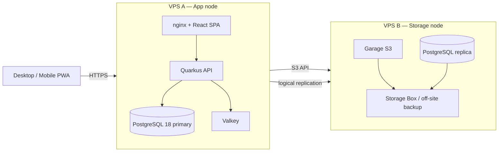

# Step 1 — Single app VPS + S3/backup storage node

This is the **recommended starting deployment**. It keeps the transactional stack
(API + PostgreSQL) on one VPS and moves two things off-box for durability:

1. **Media storage** → Garage S3 on a separate storage VPS.
2. **Database redundancy & backup** → a PostgreSQL logical replica on the same
   storage VPS, streamed from the primary.

The goal of step 1 is **reliability and recoverability**, not zero-downtime HA.
If the app VPS dies, you restore the database from the replica/backup and
re-point DNS — acceptable for a yearly event cycle.



## Prerequisites

- Two VPS (or one VPS + one smaller storage VPS). Suggested sizes:
  - **VPS A (app):** 2–4 vCPU, 4–8 GB RAM.
  - **VPS B (storage):** 2 vCPU, 4 GB RAM, generous disk.
- DNS entries for the app host and the S3 endpoint (e.g. `app.example.com`,
  `s3.example.com`).
- Authentik (or another OIDC provider) reachable from both the browser and the API.

## Node A — application

Copy `.env.example` to `.env` on the app VPS and set the public URLs, then:

```bash
docker compose up -d --build
```

`docker-compose.yml` starts `postgres`, `valkey`, `garage` (optional in step 1),
`inventory-api`, and `inventory-app` behind nginx.

## Node B — storage & backup

On the storage VPS:

```bash
docker compose -f docker-compose.storage.yml up -d
```

This starts Traefik (TLS), Garage S3, Garage WebUI, a monitoring agent, and a
`postgres-replica` that subscribes to the primary via logical replication.

See [`postgres-logical-replication.md`](postgres-logical-replication.md) for the
exact replication-slot and subscription setup between VPS A and VPS B.

## Point the app at S3 and the replica

In `.env` on VPS A, set media to S3 and point backups at VPS B:

```dotenv
MEDIA_MODE=s3
S3_ENDPOINT=https://s3.example.com
S3_BUCKET=inventory
S3_REGION=garage
S3_ACCESS_KEY=...
S3_SECRET_KEY=...
```

Database backups and WAL archiving are shipped off VPS A. A minimal, pragmatic
setup is nightly `pg_dump` plus `wal-g`/`pgbackrest` pushing WAL archives to the
storage box on VPS B (or a Hetzner Storage Box), giving point-in-time recovery.

## Verification checklist

- [ ] `https://app.example.com/q/health/live` returns 200.
- [ ] Signing in through Authentik works; refresh tokens rotate.
- [ ] Uploading an item image stores it in Garage S3 (visible in Garage WebUI).
- [ ] `pg_stat_replication` on VPS A shows the replica connected and streaming.
- [ ] A restore drill: restore the latest dump/WAL onto a scratch DB.
- [ ] Offline test: toggle airplane mode, scan an item, confirm it queues and
      syncs after reconnect.

## Known limits of step 1

- The **app node is a single point of failure** for the API and primary DB.
- Failover is **manual** (restore from replica/backup, re-point DNS).
- Garage runs as a single node — media is backed up, but not highly available.

Move to [Step 2](DEPLOYMENT_STEP2.md) when you need automatic failover, a second
app node, or horizontal scaling across multiple event teams.
