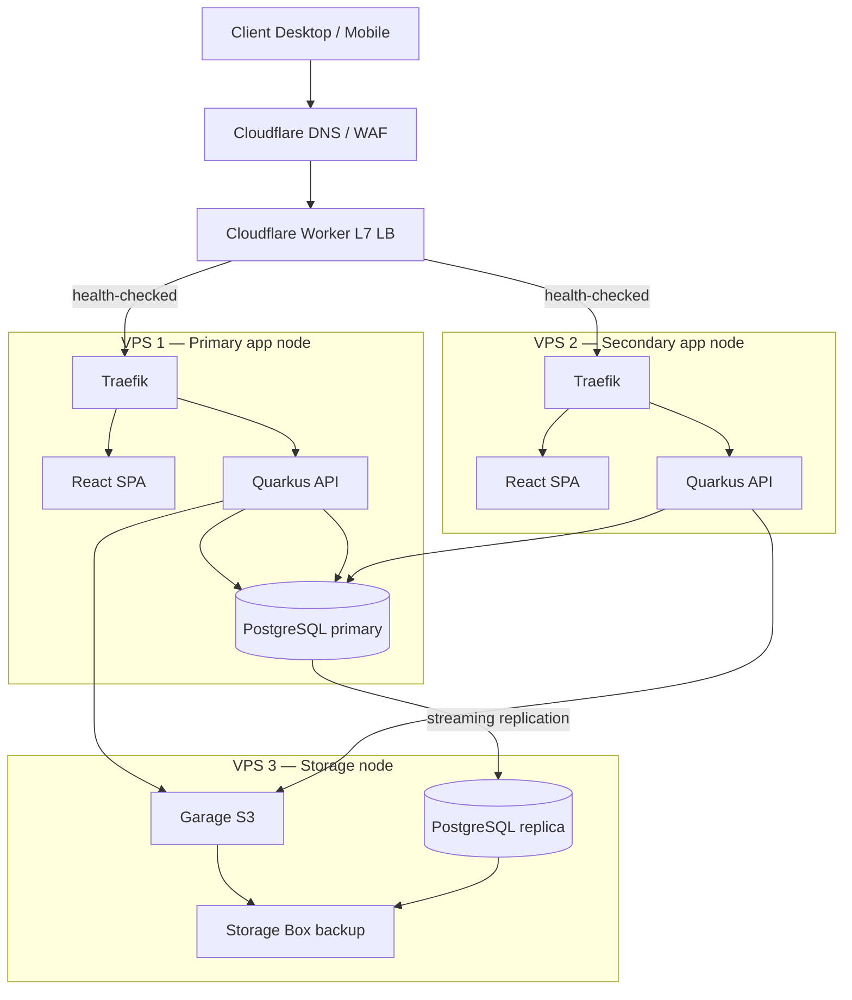

# Step 2 — Multi-node HA (as per `REQUIREMENTS_ARCHITECTURE.md` §5)

Build on **Step 1** once the single-node limit is reached. Step 2 adds a second
application node, health-checked routing, and off-box redundancy for the API,
so a node failure no longer takes the system offline.



## Node layout

| Node | Hardware | Services | Role |
| --- | --- | --- | --- |
| VPS 1 | 4 vCPU, 8–16 GB | Traefik, React SPA, Quarkus API, PostgreSQL primary, OpenObserver | Primary writes |
| VPS 2 | 4 vCPU, 8–16 GB | Traefik, React SPA, Quarkus API | Reads / failover |
| VPS 3 | 2 vCPU, 4 GB | Garage S3, PostgreSQL replica, backup target | Storage & DR |
| Edge | Cloudflare | DNS, WAF, Worker load balancer | Routing |

## Running the cluster

`docker-compose.cluster.yml` defines two API replicas (`inventory-api-1`,
`inventory-api-2`), a shared `postgres` and `valkey`, `garage`, and one static
`inventory-app`. Both API nodes point at the same primary database and the same
Valkey instance, so **rate limiting and live-event fan-out are consistent across
nodes** (`API_RATE_LIMIT_BACKEND=redis`, `EVENT_BACKEND=redis`).

```bash
# On VPS 1 (primary)
docker compose -f docker-compose.cluster.yml up -d postgres valkey garage inventory-api-1 inventory-app

# On VPS 2 (secondary)
docker compose -f docker-compose.cluster.yml up -d inventory-api-2 inventory-app
```

Keep the storage node from Step 1 (`docker-compose.storage.yml`) running on VPS 3
for Garage S3 and the logical replica.

## Health-checked routing (Cloudflare Worker)

The Worker polls `/q/health/live` on both app nodes and routes traffic:

```text
VPS1 healthy → VPS1
VPS1 down    → VPS2 (failover in < a few seconds)
```

A minimal Worker:

```js
export default {
  async fetch(request) {
    const upstreams = [PRIMARY_ORIGIN, SECONDARY_ORIGIN];
    for (const origin of upstreams) {
      try {
        const health = await fetch(`${origin}/q/health/live`);
        if (health.ok) return fetch(request, { redirect: 'manual' }).then(res => fetch(new URL(request.url, origin), request));
      } catch { /* try next origin */ }
    }
    return new Response('Service unavailable', { status: 503 });
  },
};
```

## Backup & disaster recovery

1. **Streaming replication** — PostgreSQL primary on VPS 1 streams to the replica
   on VPS 3 (`wal_level=logical` is already set in the compose files).
2. **WAL archiving** — `wal-g` / `pgbackrest` pushes WAL to the Storage Box
   (RPO < 5 minutes).
3. **Daily dumps** — encrypted `pg_dump` stored off-site.
4. **Garage S3 sync** — nightly sync of the media bucket to the Storage Box.

**Recovery (RTO < 30 min):** bring up a fresh node from the checked-in compose
files, run Flyway migrations, restore the latest dump/WAL, re-point the Worker.

## Honest capacity notes

- The API is designed to be stateless and horizontally scalable; two nodes cover
  the read-heavy QR-scanning workload of an event easily.
- The figures in `REQUIREMENTS_ARCHITECTURE.md` §5.5 ("10,000 req/s, 5,000
  concurrent users") describe a **design ceiling** for this topology, not a
  guarantee. Measure with the OpenTelemetry/OpenObserver stack before relying on
  them.
- Kubernetes (k3s) is **not required** for this scale — see §5.5.2 of the
  architecture document for the triggers that would justify it.
