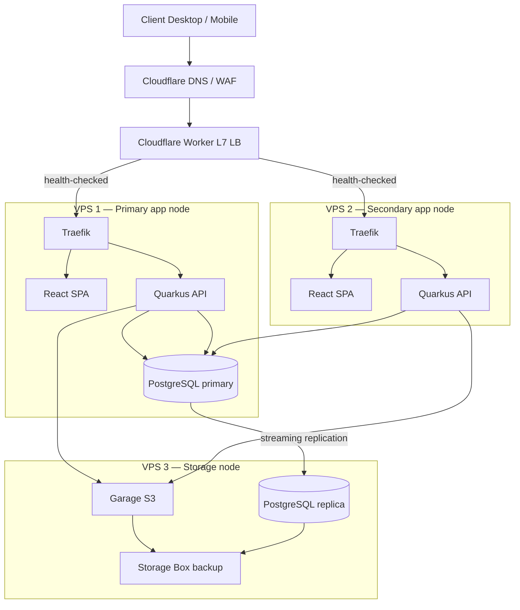

# Step 2 — Multi-node deployment topology

Build on **Step 1** once the single-node limit is reached. Step 2 adds a second
application node, health-checked routing, and off-box redundancy for the API,
so a node failure no longer takes the system offline.


```mermaid
flowchart TD
    User[Client Desktop / Mobile] --> CF[Cloudflare DNS / WAF]
    CF --> CW[Cloudflare Worker L7 LB]

    subgraph VPS1 [VPS 1 — Primary app node]
        T1[Traefik]
        FE1[React SPA]
        BE1[Quarkus API]
        DB1[(PostgreSQL primary)]
        T1 --> FE1
        T1 --> BE1
        BE1 --> DB1
    end

    subgraph VPS2 [VPS 2 — Secondary app node]
        T2[Traefik]
        FE2[React SPA]
        BE2[Quarkus API]
        T2 --> FE2
        T2 --> BE2
    end

    subgraph VPS3 [VPS 3 — Storage node]
        G[Garage S3]
        RP[(PostgreSQL replica)]
        BOX[Storage Box backup]
        G --> BOX
        RP --> BOX
    end

    CW -- health-checked --> T1
    CW -- health-checked --> T2
    DB1 -- streaming replication --> RP
    BE1 --> G
    BE2 --> G
    BE1 --> DB1
    BE2 --> DB1
```

## Node layout

| Node | Hardware | Services | Role |
| --- | --- | --- | --- |
| VPS 1 | 4 vCPU, 8–16 GB | Traefik, React SPA, Quarkus API, PostgreSQL primary, OpenObserver | Primary writes |
| VPS 2 | 4 vCPU, 8–16 GB | Traefik, React SPA, Quarkus API | Reads / failover |
| VPS 3 | 2 vCPU, 4 GB | Garage S3, PostgreSQL replica, backup target | Storage & DR |
| Edge | Cloudflare | DNS, WAF, Worker load balancer | Routing |

## Running the cluster

`docker-compose.cluster.yml` defines two API replicas (`inventory-api-1`,
`inventory-api-2`), a shared `postgres` and `valkey`, `garage`, and one static
`inventory-app`. Both API nodes point at the same primary database and the same
Valkey instance, so **rate limiting and live-event fan-out are consistent across
nodes** (`API_RATE_LIMIT_BACKEND=redis`, `EVENT_BACKEND=redis`).

```bash
# On VPS 1 (primary)
docker compose -f docker-compose.cluster.yml up -d postgres valkey garage inventory-api-1 inventory-app

# On VPS 2 (secondary)
docker compose -f docker-compose.cluster.yml up -d inventory-api-2 inventory-app
```

Keep the storage node from Step 1 (`docker-compose.storage.yml`) running on VPS 3
for Garage S3 and the logical replica.

## Health-checked routing (Cloudflare Worker)

The Worker polls `/q/health/live` on both app nodes and routes traffic:

```text
VPS1 healthy → VPS1
VPS1 down    → VPS2 (failover in < a few seconds)
```

A minimal Worker:

```js
export default {
  async fetch(request) {
    const upstreams = [PRIMARY_ORIGIN, SECONDARY_ORIGIN];
    for (const origin of upstreams) {
      try {
        const health = await fetch(`${origin}/q/health/live`);
        if (health.ok) return fetch(request, { redirect: 'manual' }).then(res => fetch(new URL(request.url, origin), request));
      } catch { /* try next origin */ }
    }
    return new Response('Service unavailable', { status: 503 });
  },
};
```

## Backup & disaster recovery

### Schema initialization

Current databases are disposable. An empty production database runs the single
`V1.0.0__init.sql` baseline and Hibernate validates it. Recreate disposable
databases after baseline changes; the old pre-Flyway baselining and incremental
upgrade procedure is removed. No database reset is performed by this guide.

1. **Streaming replication** — PostgreSQL primary on VPS 1 streams to the replica
   on VPS 3 (`wal_level=logical` is already set in the compose files).
2. **WAL archiving** — `wal-g` / `pgbackrest` pushes WAL to the Storage Box
   (RPO < 5 minutes).
3. **Daily dumps** — encrypted `pg_dump` stored off-site.
4. **Garage S3 sync** — nightly sync of the media bucket to the Storage Box.

**Recovery (RTO < 30 min):** bring up a fresh node from the checked-in compose
files, initialize the canonical schema, restore the latest dump/WAL, re-point the Worker.

## Validation limits

This is a proposed topology, not a verified multi-host deployment. The checked-in
cluster compose describes services on one Docker network; separate hosts require
explicit reachable database, Valkey, media and proxy endpoints. Load capacity,
cross-host routing, fresh PostgreSQL initialization and restore procedures have
not been verified against the current source.
