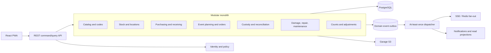
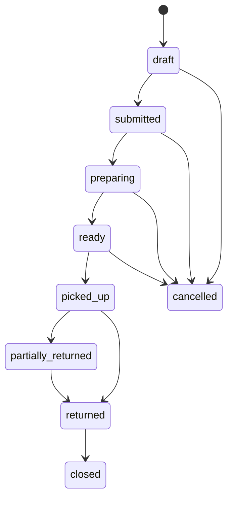

# Event-driven domain architecture

This document completes the target architecture in `REQUIREMENTS_ARCHITECTURE.md` with the operational gaps from `next_steps.md`. It is the implementation contract for the Quarkus backend. The system is a modular monolith: commands and strongly consistent invariants remain inside one PostgreSQL transaction, while committed domain events drive projections, notifications, SSE invalidation, integrations, and reporting.

## System shape



The dependency direction stays `resource -> service -> orm -> model`. A module may invoke another module's service, but it must not mutate another module's tables through its ORM. Cross-module reactions that do not have to complete the initiating command use domain events.

## Bounded contexts and ownership

| Context | Owns | Strong invariants |
|---|---|---|
| Catalog | items, assemblies, inventory codes | unique SKU/code; tracking mode controls allowed workflow; master data is retired, not erased |
| Stock | warehouses, locations, positions, assets, lots, ledger, reservations, transfers | no negative availability; one active reservation per asset; every balance change has a ledger entry |
| Purchasing | vendors, purchase orders, receipts, vendor documents | receipt cannot post twice; accepted + damaged + rejected matches received; posting creates stock atomically |
| Event planning | event occurrences, factions, orders and lines | legal state transition; lifecycle quantities never exceed requested/handed-over quantities |
| Custody | handovers, asset assignments, return reconciliations | serialized custody names the exact asset; an order closes only after every handed-over unit is reconciled |
| Asset lifecycle | damage, repairs, maintenance schedules and records | unsafe/overdue blocked assets cannot be reserved or checked out; write-off is authorized and auditable |
| Counts | count sessions and lines | posted variance creates an adjustment; blind counts do not expose expected quantity to the counter |
| Identity | users and role/faction scope | faction leaders are scoped to their factions; privileged corrections and write-offs are server-enforced |

## Inventory semantics

`tracking_mode` and `inventory_role` are orthogonal:

| Tracking mode | Identity | Quantity source |
|---|---|---|
| `bulk` | product/container code | inventory position |
| `serialized` | one asset code per physical unit | asset state and current location |
| `lot_tracked` | product plus lot/batch | lot-specific inventory position, selected FEFO |

Roles are `consumable`, `returnable`, `repairable`, and `rental`. A serialized item cannot be consumable. A repairable item can enter repair and return to service. Rental distinguishes externally sourced equipment without changing custody semantics.

Bulk availability is always:

```text
available = on_hand - reserved - quarantined - damaged
```

In-transit stock is owned by the source site until dispatch and by neither usable position while moving. Receipt into the destination posts a paired `transfer_in`. Serialized availability is derived from `asset_instances.availability_status`; aggregate counters are projections only.

`stock_transactions` is append-only and authoritative for movements. `inventory_positions` is a lockable materialized balance for fast commands and queries. A command locks the affected position/asset, validates the invariant, appends the ledger transaction, updates the position/asset projection, records a domain event, and commits once.

## Aggregate boundaries

- Item: product definition, tracking policy, default handling and code aliases. Asset instances and lots reference it but have their own optimistic version.
- Inventory position: one item/location/lot balance. Commands use row locking to serialize competing bulk reservations and movements.
- Asset instance: one serialized unit, including location, condition, service state and custodian. Optimistic version detects offline and multi-device conflicts.
- Purchase order: header and lines. A goods receipt references it but is posted as its own idempotent aggregate.
- Faction order: order, lines, reservations and asset assignments. Status changes are serialized with a pessimistic order lock.
- Custody handover: immutable evidence of one checkout or check-in. Corrections append another record; they never rewrite a signed handover.
- Return reconciliation: immutable outcome for a quantity or exact asset. `missing` remains outstanding; `written_off` requires authorization.
- Count session: count scope, lines, recount and approval. Posting creates normal adjustment ledger entries.
- Repair case and maintenance schedule: lifecycle and recurring policy respectively. Maintenance records are immutable results.

## Order execution state

Each order line stores `requested`, `allocated`, `reserved`, `prepared`, `handed_over`, `returned`, `consumed`, `damaged`, `missing`, and `written_off` quantities. Their meanings are intentionally separate:

```text
requested >= allocated >= reserved >= prepared >= handed_over
handed_over = returned + consumed + damaged + missing + written_off + outstanding
```

`missing` is an observed unresolved state and therefore remains outstanding. Return commands submit the current unresolved missing total; only a positive increase appends another `missing` reconciliation, so repeating a check does not duplicate audit rows. A late return appends `returned_late` and clears the missing quantity. Damage can be reconciled at handover while its repair case continues after the order itself is eligible to close.



Preparation writes reservations but does not remove warehouse stock. Pickup writes a checkout handover, converts reservations to custody, moves serialized assets to `in_custody`, and appends `checked_out` transactions. Return writes a check-in handover and one reconciliation outcome per line or asset.

## Command transaction pattern

All stock-affecting commands follow the same sequence:

1. Authenticate and authorize the actor.
2. Deduplicate the client command UUID.
3. Lock the aggregate plus affected position or asset rows.
4. Validate tracking mode, lifecycle state, maintenance blocker and available quantity.
5. Mutate aggregate state and append stock/audit records.
6. Append one or more outbox events in the same transaction.
7. Commit and return the command result.
8. Dispatch events at least once; consumers deduplicate by `eventId`.

Expected conflicts return HTTP 409 with the current server version/state. Validation failures return 400, missing objects 404, and policy failures 403. A failed offline command stays visible and pending; the server never resolves it by last-write-wins.

## Event envelope and outbox

Every event has:

```json
{
  "eventId": "uuid",
  "type": "order.prepared",
  "aggregateType": "faction_order",
  "aggregateId": "uuid",
  "actorId": "uuid",
  "idempotencyKey": "uuid",
  "occurredAt": "server UTC timestamp",
  "payload": {}
}
```

The producer writes `domain_event_outbox` in the business transaction. The dispatcher claims rows with a lease, publishes them through the configured in-memory or Redis event transport, then acknowledges them. A crash after publication and before acknowledgement can redeliver, so consumers must be idempotent. Ten failed attempts move an event to `dead_letter`; operators must be able to inspect and retry it.

Canonical event families:

| Family | Events |
|---|---|
| Catalog | `catalog.changed`, `asset.created`, `asset.state_changed`, `lot.held`, `code.replaced` |
| Purchasing | `purchase_order.ordered`, `goods_receipt.posted`, `vendor_document.attached` |
| Stock | `stock.changed`, `stock.reserved`, `reservation.released`, `transfer.dispatched`, `transfer.received`, `count.posted` |
| Event order | `order.created`, `order.submitted`, `order.prepared`, `order.ready`, `order.picked_up`, `order.partially_returned`, `order.returned`, `order.closed`, `order.cancelled` |
| Custody | `custody.checked_out`, `custody.checked_in`, `return.reconciled`, `asset.missing` |
| Lifecycle | `damage.reported`, `damage.triaged`, `repair.completed`, `maintenance.recorded`, `maintenance.overdue`, `asset.written_off` |

Events carry identifiers and the minimal before/after facts required by consumers, not entire mutable entities. PostgreSQL remains the source of truth; event consumers may re-query when they need the latest view.

## Purchasing and receiving

A purchase order supports partial receipts and expected receipts feed replenishment projections. Posting a goods receipt validates each line against the PO, creates asset instances for serialized lines or lot/position quantities for other lines, quarantines damaged quantities, appends `received`/`damaged` ledger entries, advances PO status, and emits `goods_receipt.posted` atomically.

Vendor documents live in Garage S3. PostgreSQL stores immutable filename, MIME type, size, SHA-256 checksum, object key, uploader, dates, reference/amount metadata, and retention policy. Only permitted HQ roles can read them. Database and object storage restoration are tested as one recovery unit.

## Transfers and counts

Transfers are never custody handovers. Dispatch appends `transfer_out`, changes positions/assets to in-transit, and records who dispatched. Receipt appends `transfer_in`, moves accepted stock to the destination, records discrepancies, and may finish partially.

Counts can target a warehouse, location, category, item, lot, or individual assets. Counters submit observations; a different authorized actor approves material variance. Posting creates `adjusted` ledger entries instead of directly editing balances. Recounts and original observations remain readable.

## Damage, repair, and maintenance

Damage is the incident; repair is the work lifecycle. The repair states are `reported -> triaged -> awaiting_repair -> in_repair -> repaired -> verified -> returned_to_service`, with `written_off` as a terminal alternative. Safety-impacting damage immediately blocks availability.

Maintenance schedules express date, operating-hour, or usage-count intervals and warning windows. Records capture immutable results and certificate references. The reservation and checkout command handlers enforce blocking schedules server-side for both item-wide policies and specific assets.

## Offline protocol

The PWA queues every mutation with command UUID, user, device, operation type, payload, local time, retry count and sync state. Server-side command handling stores a readable `sync_command_audit` result and uses the same UUID for idempotency and event correlation.

For bulk quantities, conflicts return the new available balance and version. For serialized assets, a version/state mismatch identifies the competing command and asset; the command remains unresolved for an HQ operator. Media uploads are staged before their metadata command and are attached only after a successful commit.

## Authorization policy

Canonical roles are `hq_admin`, `warehouse_crew`, `marshal`, `event_planner`, `maintenance_crew`, `faction_leader`, and `read_only`. No role aliases are accepted at runtime.

| Capability | Roles |
|---|---|
| Manage master data | hq_admin, warehouse_crew |
| Manage users and permissions | hq_admin |
| Receive, reserve, prepare, transfer, count | hq_admin, warehouse_crew |
| Execute custody and returns | hq_admin, warehouse_crew, marshal |
| Plan events and orders | hq_admin, event_planner; faction leader for own faction |
| Repair and maintenance | hq_admin, maintenance_crew |
| Write off or approve count variance | hq_admin |
| View vendor documents | permitted HQ roles only |

## Reporting and projections

Operational list APIs may query normalized tables directly. Expensive cross-context reports use rebuildable projections fed by domain events: availability by site, event demand, unresolved returns, missing assets, repair backlog, utilization, maintenance due, consumable usage, purchase history, document index, count accuracy, and write-offs. Projection lag is displayed for planning screens; command validation never relies on an asynchronous projection.

Net deficit is:

```text
demand + safety_stock
- on_hand + reserved + quarantined + damaged
- expected_receipts_before_required_date
- transferable_stock
= net_deficit
```

The planner records manual overrides with actor and reason and can generate a draft purchase order rather than only exporting CSV.

## Deployment and evolution

The initial deployment remains one application VPS plus the storage/backup node. Redis is optional for cross-node event fan-out; the PostgreSQL outbox works in both modes. Scale-out adds stateless API nodes but does not split the modular monolith until measured load or team ownership justifies it.

Schema changes are additive first, application-compatible second, and destructive only after backfill and verification. Flyway is the target production owner of schema evolution. Existing installations must be baselined before changing Hibernate from `update` to `validate`; that cutover is a deployment migration, not an automatic runtime action.

## Implementation map

The current code now contains first-class JPA models for assets, positions, reservations, assignments, custody, reconciliation, purchasing/receiving, vendor documents, transfers, counts, repairs, maintenance schedules, lots, codes, sync audit, and the domain-event outbox. Existing faction-order commands use explicit reservations, custody handovers, and reconciliation records, and existing service events are written to the outbox. Until the asset and position command handlers are delivered, bulk stock reads use database-side grouped ledger totals and serialized quantity-only commands fail closed instead of bypassing asset identity.

The remaining delivery work is application-layer breadth: CRUD/command endpoints for the new aggregates, their frontend workflows, Flyway baseline/backfill scripts, report projections, document authorization, and the full definition-of-done event simulation. These should be delivered in the phase order in `next_steps.md`; the domain boundaries and consistency rules above must not change between phases.
